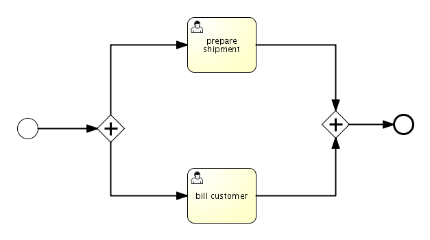
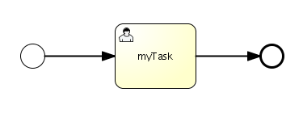
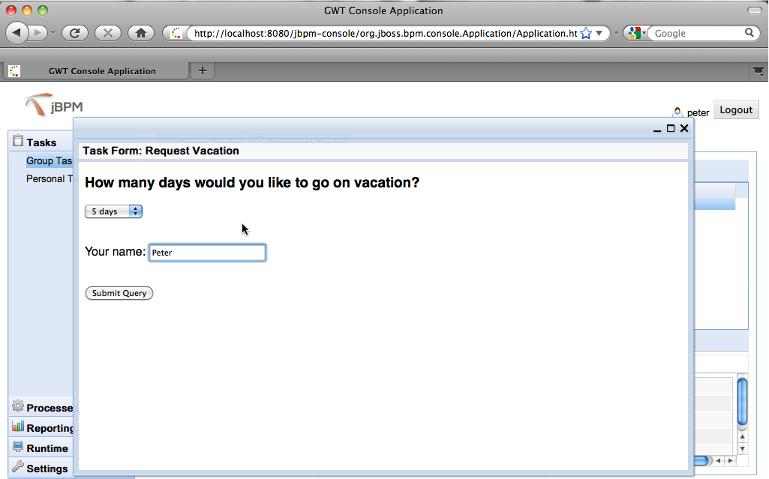
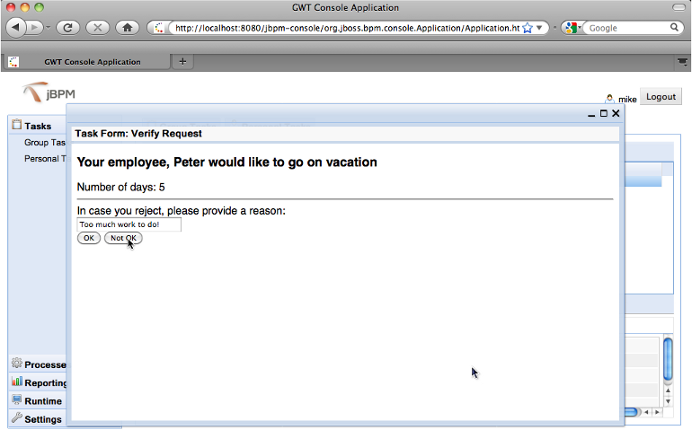

[TOC]


# BPMN 2.0规范详解


## 第 3 章 BPMN 2.0

## 3.1. BPMN 2.0是什么呢？

业务流程模型注解（Business Process Modeling Notation - BPMN）是 业务流程模型的一种标准图形注解。这个标准 是由对象管理组（Object Management Group - OMG）维护的。

基本上，BPMN规范定义了任务看起来怎样的，哪些结构可以 与其他进行连接，等等。这就意味着 意思不会被误解。

标准的早期版本（1.2版以及之前）仅仅限制在模型上， 目标是在所有的利益相关者之间形成通用的理解， 在文档，讨论和实现业务流程之上。 BPMN标准证明了它自己，现在市场上许多建模工具 都使用了BPMN标准中的元素和结构。 实际上，现在的jPDL设计器也使用了 BPMN元素。

BPMN规范的2.0版本，当前已经处于最终阶段了， 已经计划不就就会完成，允许添加精确的技术细节 在BPMN的图形和元素中， 同时制定BPMN元素的执行语法。 通过使用XML语言来指定业务流程的可执行语法， BPMN规范已经演变为业务流程的语言， 可以执行在任何兼容BPMN2的流程引擎中， 同时依然可以使用强大的图形注解。

## 3.2. 历史和目标

jBPM BPMN2的实现是在jBPM 4.0发布之后 在2009年8月，在与社区进行了紧密协作之后启动的。 而后，我们决定了第一个发布版（比如，文档/QA） 涉及一部分BPMN2规范，将在jBPM 4.3发布。

我们的目标是建立一个**原生BPMN2运行引擎** （或者说实现'可执行的BPMN2'）基于流程虚拟机 （Process Virtual Machine - PVM）。 注意，这个版本的主要目标是原生可执行， 不是图形注解 - 但是我们清楚 对于未来的版本是很重要的。

**如果用户已经了解了jBPM，就会发现**

- **配置结构保持不变**
- **API与已经存在的完全一样或者很类似**
- **测试BPMN2流程也可以使用常用的java测试框架**
- **数据库表结构保持不变**


所以，总体来说，我们的主要目标是保持所有在jBPM上好的事情， 加强它们，使用一个标准的流程语言。


## 3.3. JPDL vs BPMN 2.0

第一个问题可能是，很正当的，映入脑海的是， 为什么已经有了jPDL还要实现BPMN2。它们两个语言 的目标都是定义可执行的业务流程。从高层次来看， 两个语言是等效的。主要的区别是 BPMN2是“厂商中立”的，你可以使用标准， 而jPDL是绑定在jBPM上的（虽然会有一些争论 绑定在开源语言厂商比如jPDL 和绑定在闭源产品）。

在jBPM中，两个语言实现都是建立在jBPM流程虚拟机上的 （PVM）。这意味着两个语言共享通用功能 （持久化，事务，配置，也有基本流程结构，等等）。 结果就是，对jBPM核心的优化 会对两个语言有益。依靠PVM，BPMN2实现 建立在基础上，已经在过去证明了它自己， 并拥有了很大的最终用户社区。

当执行语言，把它们相互比较的时候， 下面几点必须纳入考虑：

- BPMN2是基于被BPM工业接受的一个标准。
- BPMN2是与实现无关的。这一点的缺点是集成java技术 jPDL总会更早。 所以，从java开发者的角度，jPDL更简单，感觉更自然 （一些BPEL/WSDL的“层次”也在BPMN中）。
- jPDL的一个目标是XML可读，BPMN2流程在 一定程度上也是可读的，但是工具和更多规范的细节 会要求实现同等级的 生产力。
- java开发者可以很快学会jPDL，因为他们很了解jPDL语言， 会发现实用工具有时候很麻烦， 语言本身也过于复杂了。
- BPMN2包含一个很大的描述结构的集合，在规范中。 然而，对接口代码的绑定在规范中是开放的 （与XPDL相比），即使WSDL通常会被默认使用。 这意味着流程的可移植性丧失了， 当我们把流程移植到一个引擎上，而这个引擎不支持同样的绑定机制。 比如，调用java类通常是jBPM的默认实现 的绑定方式。


很自然的，因为政治原因，BPMN2规范发展的会比较慢。 jPDL就可以快速变化，和新技术进行集成， 当他们发布的时候， 与BPMN2相比可以加快步伐进行演化。 当然，因为两个都建立在同一个PVM上，jPDL中的逻辑 也可以一直到BPMN2上， 作为一个扩展，不会出现很多麻烦。

## 3.4. Bpmn 2.0 执行

BPMN2规范定义了非常丰富的语言，为建模和执行业务流程。 然而，也意味着它非常困难总览BPMN2可能是怎样 为了简化这种情况，我们决定把 BPMN2结构分为三个等级。 区分的方式主要基于Bruce Silver写的 'BPMN method and Style'这本书(<http://www.bpmnstyle.com/>)， Dr. Jim Arlow的培训资料([ http://www.slideshare.net/jimarlow/introductiontobpmn005](http://www.slideshare.net/jimarlow/introductiontobpmn005))， 'How much BPMN do you need'([ http://www.bpm-research.com/2008/03/03/how-much-bpmn-do-you-need/](http://www.bpm-research.com/2008/03/03/how-much-bpmn-do-you-need/))， 和我们自己的经验。

我们定义了三种BPMN2结构分类：

- **基本**：这个分类的结构很直接 并且容易了解。这个分类的结构可以用来为 简单的业务流程建模。
- **高级**：包含更强大或更复杂的结构， 这些都提高了建模和执行语法的学习曲线。 业务流程的主要目标是使用这个 和之前的分类来实现结构。
- **复杂**：这个分类的结构用来实现罕见的情况， 或者它们的语法难以理解。


## 3.5. 配置

在你的应用中使用BPMN 2.0是很简单的：只要把下面一行 加入**jbpm.cfg.xml**文件。

```
<import resource="jbpm.bpmn.cfg.xml" />
      
```

这里的引用会启用BPMN 2.0的流程发布，通过把BPMN 2.0发布器安装到流程引擎中。 注意流程引擎可以同时使用jPDL和BPMN 2.0流程。 这意味着在你的应用里，一些流程可能是jPDL， 其他的可能是BPMN 2.0。

**流程引擎是根据定义文件的后缀来区分流程定义的。 对于BPMN 2.0，使用\*.bpmn.xml后缀 （jPDL使用\*.jpdl.xml后缀）。**

## 3.6. 实例

发布中包含的例子也包含了下面章节中 讨论的每个结构的实例。查看BPMN 2.0的流程实例 和测试用例， 在**org.jbpm.examples.bpmn.\* 包**下。

参考用户指南，第二章（安装），研究一下如何导入实例。 查看章节**'导入实例'**。

## 3.7. 流程根元素

一个BPMN 2.0 XML流程的根是**definitions**元素。 在命名状态，子元素会包含真正的业务流程定义。 每个**process**子元素 可以拥有一个**id（必填）**和 **name（可选）**。一个空的BPMN 2.0业务流程 看起来像下面这样。也要注意把BPMN2.xsd放在classpath下， 来启用XML自动补全。

```
<definitions id="myProcesses"
  xmlns:xsi="http://www.w3.org/2001/XMLSchema-instance"
  xsi:schemaLocation="http://schema.omg.org/spec/BPMN/2.0 BPMN20.xsd"
  xmlns="http://schema.omg.org/spec/BPMN/2.0"
  typeLanguage="http://www.w3.org/2001/XMLSchema"
  expressionLanguage="http://www.w3.org/1999/XPath"
  targetNamespace="http://jbpm.org/example/bpmn2">

  <process id="My business processs" name="myBusinessProcess">

      ...

  </process>
<definitions>
      
```

如果为process元素定义了name，它会被用做流程的**key**。 （比如，启动一个流程可以通过调用executionService.startProcessInstanceByKey("myBusinessProcess"）。 如果没有指定name，id会被用做key。所以只有id定义时， 会允许通过id来启动一个流程实例。所以基本上name和key在使用上是等价的，比如搜索流程定义。 注意key的规则与jPDL一样： 空格和非字母数字的字符会被下划线代替。

## 3.8. 基本结构

### 3.8.1. 事件

与活动和网关一起，事件用来在实际的每个业务流程中。 事件让业务建模工具用很自然的方式描述业务流程，比如 *'当我接收到客户的订单，这个流程就启动'*， *'如果两天内任务没结束，就终止流程'* 或者*'当我收到一封取消邮件，当流程在运行时， 使用子流程处理邮件'*。注意典型的业务 通常使用这种事件驱动的方式。人们不会硬编码顺序创建， 但是他们倾向于使用在他们的环境中发生的事情（比如，事件）。 在BPMN规范中，描述了很多事件类型，为了覆盖可能的事情， 在业务环境中可能出现的情况。

### 3.8.2. 事件：空启动事件

一个启动事件说明了流程的开始（或子流程）。图形形式，它看起来 是一个圆（可能）内部有一个小图标。图标指定了事件的实际类型 会在流程实例创建时被触发。

空启动事件画出来是一个圆，内部没有图标，意思是 这个触发器是未知或者未指定的。jPDL的开始活动基本是一样的语法。 流程实例的流程定义包含一个空启动事件， 可以使用**executionService**的API调用创建。

一个空开始事件像下面这样定义。id是必填的，name是可选的。

```
<startEvent id="start"  name="myStart" />
          
```


### 3.8.3. 事件：空结束事件

结束事件指定了流程实例中一个流程路径的结束。 图形上，它看起来就是一个圆 拥有厚边框（可能） 内部有小图标。 图标指定了结束的时候 会执行哪种操作。

空结束事件画出来是一个圆，拥有厚边框，内部没有图标， 这意味着当流程到达事件时，不会抛出任何信号。 jPDL中的结束事件与空结束事件语义相同。

空结束事件可以像下面一样定义，id是必填的，name是可选的。

```
<endEvent id="end" name="myEnd" />
        
```


下面的例子显示了只使用空开始和结束事件的流程：


这个流程对应的可执行XML像这样 （忽略声明用的*definitions*根元素）

```
  <process id="noneStartEndEvent" name="BPMN2 Example none start and end event">

    <startEvent id="start" />

    <sequenceFlow id="flow1" name="fromStartToEnd"
      sourceRef="start" targetRef="end" />

    <endEvent id="end" name="End" />

  </process>
          
```


现在可以通过调用**startProcessInstanceXXX**操作， 创建一个流程实例。

```
ProcessInstance processInstance = executionService.startProcessInstanceByKey("noneStartEndEvent");
          
```


### 3.8.4. 事件：终止结束事件

终止和[空结束事件](http://www.mossle.com/docs/jbpm4devguide/html/bpmn2.html#noneEndEvent)的区别是 实际中流程的路径是如何处理的（或者使用BPMN 2.0的术语叫做token）。 终止结束事件会结束整个流程实例，而空结束事件只会结束当前流程路径。 他们都不会抛出任何事情 当到达结束事件的时候。

一个终止结束事件可以像下面定义。id是必填的，name是可选的。

```
<endEvent id="terminateEnd" name="myTerminateEnd">
  <terminateEventDefinition/>
</endEvent>
          
```


终止结束事件被描绘成结束事件一样（圆，厚边框）， 内部图标时一个完整的圆。在下面的例子中，完成task1 会结束流程实例，当完成task2时只会结束到达结束事件 的流程路径，只剩下task1打开。


参考jBPM发布包中的实例， 单元测试和业务流程对应XML。

### 3.8.5. 顺序流

顺序流是事件，活动和网关之间的连线，显示为一条实线 带有箭头，在BPMN图形中（jPDL中等效的是transition）。 每个顺序流都有一个**源头**和一个 **目标**引用，包含了 活动，事件或网关的**id**。

```
<sequenceFlow id="myFlow" name="My Flow"
        sourceRef="sourceId" targetRef="targetId" />
        
```


与jPDL的一个重要区别是多外向顺序流的行为。 在jPDL中，只有一个转移会成为外向转移，除非活动是fork （或自定义活动拥有fork行为）。然而，在BPMN中， 多外向顺序流的默认行为是切分进入的token（jBPM中术语叫做execution） 分成token集合，每个顺序流一个。在下面情况中， 在完成第一个任务，就会激活三个任务。


为了避免使用一个顺序流，必须添加condition条件到顺序流中。 在运行时，只有当condition条件结果为true， 顺序流才会被执行。

为了给顺序流添加condition条件，添加一个**conditionExpression** 元素到顺序流中。条件可以放在 **${}**中。

```
<sequenceFlow id=....>
  <conditionExpression xsi:type="tFormalExpression">${amount >= 500}</conditionExpression>
</sequenceFlow>
        
```

注意，当前必须把 **xsi:type="tFormalExpression"**添加到 **conditionExpression**中。一个条件性的顺序流可以看到一个小菱形图片 在顺序流的起点。记住表达式一直可以定义在顺序流上， 但是一些结构不会解释它（比如，并行网关）。

活动（比如用户任务）和网关（比如唯一网关）可以用户默认顺序流。 默认顺序流只会在活动或网关的 所有其他外向顺序流的condition条件为false时才会使用。 默认顺序流图形像是顺序流多了一个斜线标记。


默认顺序流通过指定活动或网关的 **'default' 属性** 来使用。

也要注意，默认顺序流上的表达式会被忽略。

### 3.8.6. 网关

BPMN中的网关是用来控制流程中的流向的。更确切的是， 当一个token（BPMN 2.0中execution的概念注解）到达一个网关， 它会根据网关的类型进行合并或切分。

网关描绘成一个菱形，使用一个内部图标来指定类型 （唯一，广泛，其他）。

所有网关类型，都可以设置**gatewayDirection**。 下面的值可以使用：

- **unspecificed (默认)**：网关可能拥有多个 进入和外出顺序流。
- **mixed**：网关必须拥有多个 进入和外出顺序流。
- **converging**：网关必须拥有多个进入顺序流， 但是只能有一个外出顺序流。
- **diverging**：网关必须拥有一个进入顺序流， 和多个外出顺序流。

比如下面的例子：并行网关的gatewayDirection属性为'converging'， 会拥有json行为。

```
<parallelGateway id="myJoin" name="My synchronizing join" gatewayDirection="converging" />
        
```

**注意**：gatewayDirection属性根据规范是可选的。 这意味着我们不能通过这个属性来 在运行时知道一个网关的行为（比如，一个并行网关， 如果我们用够切分和合并行为）。然而，gatewayDirection属性用在解析时 作为约束条件对进入、外出顺序流。所以使用这个属性 会减低出错的机会，当引用顺序流时， 但不是必填的。

### 3.8.7. 网关：唯一网关

唯一网关表达了一个流程中的**唯一决策**。 会有一个外向顺序流被使用，根据定义在 顺序流中的条件。

对应的jPDL结构，相同的语法是 **decision**活动。唯一网关的 完全技术名称是**'基于数据的唯一网关'**， 但是也经常称为**XOR 网关**。 XOR网关被描绘为一个菱形，内部有一个'X'， 一个空的菱形，没有网关也象征着唯一网关。

下面图形显示了唯一网关的用法：根据amount变量的值， 会选择唯一网关外向的三个外向顺序流 中的一个。


这个流程对应的可执行XML看起来像下面这样。 注意定义在顺序流中的条件。唯一网关会选择一个顺序流， 如果条件执行为true。如果多个条件 执行为true，第一个遇到的就会被使用 （日志信息会显示这种情况）。

```
  <process id="exclusiveGateway" name="BPMN2 Example exclusive gateway">

    <startEvent id="start" />

   <sequenceFlow id="flow1" name="fromStartToExclusiveGateway"
      sourceRef="start" targetRef="decideBasedOnAmountGateway" />

   <exclusiveGateway id="decideBasedOnAmountGateway" name="decideBasedOnAmount" />

   <sequenceFlow id="flow2" name="fromGatewayToEndNotEnough"
      sourceRef="decideBasedOnAmountGateway" targetRef="endNotEnough">
      <conditionExpression xsi:type="tFormalExpression">
        ${amount < 100}
      </conditionExpression>
   </sequenceFlow>

   <sequenceFlow id="flow3" name="fromGatewayToEnEnough"
      sourceRef="decideBasedOnAmountGateway" targetRef="endEnough">
      <conditionExpression xsi:type="tFormalExpression">
        ${amount <= 500 && amount >= 100}
        </conditionExpression>
   </sequenceFlow>

   <sequenceFlow id="flow4" name="fromGatewayToMoreThanEnough"
      sourceRef="decideBasedOnAmountGateway" targetRef="endMoreThanEnough">
      <conditionExpression xsi:type="tFormalExpression">
        ${amount > 500}
      </conditionExpression>
   </sequenceFlow>

   <endEvent id="endNotEnough" name="not enough" />

   <endEvent id="endEnough" name="enough" />

   <endEvent id="endMoreThanEnough" name="more than enough" />

  </process>
        
```

这个流程需要一个变量，这样表达式就可以在运行期间执行。 变量可以被提供，当流程实例执行的时候（类似jPDL）。

```
Map<String, Object> vars = new HashMap<String, Object>();
vars.put("amount", amount);
ProcessInstance processInstance = executionService.startProcessInstanceByKey("exclusiveGateway", vars);
        
```


唯一网关需要所有外向顺序流上都定义条件。 对这种规则一种例外是默认顺序流。 使用**default 属性**来引用一个已存在的 **顺序流的id**。这个顺序流会被使用 当其他外向顺序流的条件都执行为false时。

```
<exclusiveGateway id="decision" name="decideBasedOnAmountAndBankType" default="myFlow"/>

<sequenceFlow id="myFlow" name="fromGatewayToStandard"
    sourceRef="decision" targetRef="standard">
</sequenceFlow>
        
```

唯一网关可以同时实现汇聚和发散功能。这个逻辑很容易理解： 对于每个到达这个网关的分支流程，都会选择一个外向顺序流来继续执行。 下面的图形在BPMN 2.0中是完全合法的 （忽略名称和声明的条件）。


### 3.8.8. 网关：并行网关

并行网关用来切分或同步相关的进入或外出 顺序流。

- 并行网关拥有一个进入顺序流的和多于一个的外出顺序流 叫做**'并行切分**或 **'AND-split'**。所有外出顺序流都会 被并行使用。**注意：像规范中定义的那样， 外出顺序流中的条件都会被忽略。**
- 并行网关拥有多个进入顺序流和一个外出顺序流 叫做**'并行归并'**或 **AND-join**。所有进入顺序流需要 到达这个并行归并，在外向顺序流使用之前。

并行网关像下面这样定义：

```
<parallelGateway id="myParallelGateway" name="My Parallel Gateway" />
        
```

注意，gatewayDirection属性可以被使用， 已获得建模错误，在解析阶段（参考上面）。

下面的图形显示了一个并行网关可以如何使用。在流程启动后， 'prepare shipment' 和 'bill customer'用户任务都会被激活。 并行网关被描绘为一个菱形，内部图标是一个十字， 对切分和归并行为都是一样。



图形对应的XML如下所示：

```
  <process id="parallelGateway" name="BPMN2 example parallel gatewar">

    <startEvent id="Start" />

    <sequenceFlow id="flow1" name="fromStartToSplit"
      sourceRef="Start"
      targetRef="parallelGatewaySplit"  />

    <parallelGateway id="parallelGatewaySplit" name="Split"
      gatewayDirection="diverging"/>

    <sequenceFlow id="flow2a" name="Leg 1"
      sourceRef="parallelGatewaySplit"
      targetRef="prepareShipment" />

    <userTask id="prepareShipment" name="Prepare shipment"
      implementation="other" />

    <sequenceFlow id="flow2b" name="fromPrepareShipmentToJoin"
      sourceRef="prepareShipment"
      targetRef="parallelGatewayJoin"  />

    <sequenceFlow id="flow3a" name="Leg 2"
      sourceRef="parallelGatewaySplit"
      targetRef="billCustomer" />

    <userTask id="billCustomer" name="Bill customer"
      implementation="other" />

    <sequenceFlow id="flow3b" name="fromLeg2ToJoin"
      sourceRef="billCustomer"
      targetRef="parallelGatewayJoin"  />

    <parallelGateway id="parallelGatewayJoin" name="Join"
      gatewayDirection="converging"/>

    <sequenceFlow id="flow4"
      sourceRef="parallelGatewayJoin"
      targetRef="End">
    </sequenceFlow>

    <endEvent id="End" name="End" />

  </process>
        
```

一个并行网关（其实是任何网关）可以同时拥有切分和汇聚行为。 下面的图形在BPMN 2.0中是完全合法的。 在流程启动之后，A和B任务都会激活。当A和B完成时，C,D和E 任务会被激活。


### 3.8.9. 网关：包含网关

一个包含网关 - 也叫做**OR-gateway** - 被用来 进行“条件性”切分或汇聚顺序流。它基本的行为就和一个并行网关一样， 但是它也可以统计条件，在外出顺序流上（切分行为） 和计算，如果这儿有流程离开，可以到达网关（合并行为）。

包含网关显示为一个典型的网关图形，里边有一个圆圈（参考'OR'的语法）。 和唯一网关不同，所有条件表达式被执行（发散或切分行为）。 对于每个表达式结果为true时，一个新的子流程分支就会被创建。 没有定义条件的顺序流会永远被选择（比如。一个子流程 在这种情况下总是会被创建）。

一个收敛的包含网关（合并行为）有一个更困难的执行逻辑。 当一个执行（在BPMN 2.0的语法中叫做Token）到达一个合并包含网关。 就会进行下面的检测（引用规范的文字）：

```
对于每个空的进入顺序流，这里没有Token
在顺序流的图形上面，比如，这里有一个没有直接的路径
（由顺序流组成）从Token到这个顺序流，除非
a) 路径到达了一个包含网关，或
b) 路径到达了一个节点，直接到一个非空的
  进入顺序流的包含网关 "
        
```

简单来说：当一个流程到达了这个网关，所有的激活流程会被检测 它们是否可以到达包含网关，只是统计顺序流 （注意：条件不会被执行！）。当包含网关被使用时， 它通常用在一个切分/汇聚包含网关对中。在其他情况， 流程行为足够简单，只要通过看图就可以理解了。

当然，不难想象情况，当流程切分和汇聚在复杂的组合， 使用大量的结构，其中包括包含网关。 在那些情况，很可能出现实际的流程行为可能 与建模者的期望不符。所以，当使用包含网关时，要注意 通常的最佳实践是让包含网关成对使用。

下面的图形演示了如何使用包含网关。 （例子来自于Bruce Silver的"BPMN method and style"）


我们可以区分下面的情况：

- **现金多于10000，不是国外银行：**只有 "Large deposit" 任务会被激活。
- **现金多于10000，是国外银行：** "Large deposit" 和 "Foreign deposit" 任务会被激活。
- **现金少于10000，是国外银行：** 只有 "Foreign deposit" 任务会被激活。
- **现金少于10000，不是国外银行：** 在这种情况 所有表达式的结果都是false，默认的顺序流会被选择。 在这个例子中国，这意味着"Standard deposit"任务会被激活。

无论在包含网关之后多少任务被激活，右侧的收敛包含网关会等到 左侧的包含网关所有外向顺序流 到达合并网关（有时，只有一个，有时两个）。 看一下**org.jbpm.examples.bpmn.gateway.inclusive.InclusiveGatewayTest** 可以看到在单元测试中是如何反应这个例子的。

这个例子的XML版本看起来像下面：

```
<process id="inclusiveGateway" name="BPMN2 Example inclusive gateway">

    <startEvent id="start" />

   <sequenceFlow id="flow1" sourceRef="start" targetRef="inclusiveGatewaySplit" />

   <inclusiveGateway id="inclusiveGatewaySplit" default="flow3"/>

   <sequenceFlow id="flow2" sourceRef="inclusiveGatewaySplit" targetRef="largeDeposit">
      <conditionExpression xsi:type="tFormalExpression">${cash > 10000}</conditionExpression>
   </sequenceFlow>

   <sequenceFlow id="flow3" sourceRef="inclusiveGatewaySplit" targetRef="standardDeposit" />

   <sequenceFlow id="flow4" sourceRef="inclusiveGatewaySplit" targetRef="foreignDeposit">
      <conditionExpression xsi:type="tFormalExpression">${bank == 'foreign'}</conditionExpression>
   </sequenceFlow>

   <userTask id="largeDeposit" name="Large deposit" />

   <sequenceFlow id="flow5" sourceRef="largeDeposit" targetRef="inclusiveGatewayMerge" />

   <userTask id="standardDeposit" name="Standard deposit" />

   <sequenceFlow id="flow6" sourceRef="standardDeposit" targetRef="inclusiveGatewayMerge" />

   <userTask id="foreignDeposit" name="Foreign deposit" />

   <sequenceFlow id="flow7" sourceRef="foreignDeposit" targetRef="inclusiveGatewayMerge" />

   <inclusiveGateway id="inclusiveGatewayMerge" />

    <sequenceFlow id="flow8" sourceRef="inclusiveGatewayMerge" targetRef="theEnd" />

   <endEvent id="theEnd" />

</process>
        
```


和其他网关类型一样，包含网关类型可以同时拥有合并和切分行为。 在这种情况下，包含网关将先等到所有分支流程到达， 在位每个顺序流进行再次切分之前，这里会有一个表达式执行 为true（获得没有一个表达式）。


### 3.8.10. 任务

一个任务表示工作需要被外部实体完成， 比如人工或自动服务。

重要的是注意BPMN语法的'task'与jPDL语法的区别。 在jPDL中，'task'的概念总是用在人工做一些事情的环境。 的那个流程引擎遇到jPDL中的task，它会创建一个task， 交给一些人的任务列表，然后它会进入等待状态。然而在BPMN 2.0中， 这里有很多任务类型，一些表示等待状态（比如，**User Task** 一些表示自动活动（比如，**Service Task**。 所以小心不要混淆了任务的概念，在切换语言的时候。

任务被描绘成一个圆角矩形，一般内部包含文字。 任务的类型（用户任务，服务任务，脚本任务，等等）显示在矩形的左上角，用小图标区别。 根据任务的类型， 引擎会执行不同的功能。

### 3.8.11. 任务：人工任务

**user task**是典型的'人工任务'， 实际中的每个workflow或BPMN软件中都可以找到。当流程执行到达这样一个user task时， 一个新人工任务就会被创建，交给用户的任务列表。

和[manual task](http://www.mossle.com/docs/jbpm4devguide/html/bpmn2.html#manualTask)的主要区别是 （也与人工工作对应）是流程引擎了解任务。 引擎可以跟踪竞争，分配，时间，其他，这些不是manual task的情况。

user task描绘为一个圆角矩形，在左上角是一个小用户图标。



user task被定义为下面的BPMN 2.0 XML：

```
<userTask id="myTask" name="My task" />
```

根据规范，可以使用多种实现（WebService, WS-humantask，等等）。 通过使用**implementation**属性。 当前，只有标准的jBPM任务机制才可以用，所以这里（还）没有 定义'implementation'属性的功能。

BPMN 2.0规范包含了一些方法把任务分配给用户，组，角色等等。 当前的BPMN 2.0 jBPM实现允许使用一个 **resourceAssignmentExpression**来分配任务， 结合**humanPerformer or PotentialOwner**结构。 这部分希望在未来的版本里能够进一步演化。

**potentialOwner**用来在你希望确定用户，组，角色的时候。 这是一个task的**候选人**。 参考下面的例子。这里的'My task'任务的候选人组是'management'用户组。 也要注意，需要在**流程外部**定义一个资源， 这样任务分配器可以引用到这个资源。 实际上，任何活动都可以引用一个或多个资源元素。 目前，只需要定义这个资源就可以了（因为它是规范中的一个必须的元素）， 但是在以后的发布中会进行加强（比如，资源可以拥有运行时参数）。

```
<resource id="manager" name="manager" />

<process ...>

...

<userTask id="myTask" name="My task">
  <potentialOwner resourceRef="manager" jbpm:type="group">
    <resourceAssignmentExpression>
      <formalExpression>management</formalExpression>
    </resourceAssignmentExpression>
  </potentialOwner>
</userTask>
        
```

注意，我们使用了一个特定的后缀 (**jbpm:type="group"**)，来定义这是一个用户组的分配方式。 如果删除了这个属性，就会默认使用用户组的语法 （在这个例子中也是没问题的）。 现在假设Peter和Mary是management组的成员 (这里使用默认的身份服务)：

```
identityService.createGroup("management");

identityService.createUser("peter", "Peter", "Pan");
identityService.createMembership("peter", "management");

identityService.createUser("mary", "Mary", "Littlelamb");
identityService.createMembership("mary", "management");  
        
```

Peter和Mary都可以在他们的任务列表中看到这条任务 （代码来自实例单元测试）：

```
// Peter and Mary are both part of management, so they both should see the task
List<Task> tasks = taskService.findGroupTasks("peter");
assertEquals(1, tasks.size());
 tasks = taskService.findGroupTasks("mary");
assertEquals(1, tasks.size());

// Mary claims the task
Task task = tasks.get(0);
taskService.takeTask(task.getId(), "mary");
assertNull(taskService.createTaskQuery().candidate("peter").uniqueResult());

taskService.completeTask(task.getId());
assertProcessInstanceEnded(processInstance);
        
```

当分配方式应该是**候选用户**时， 只需要使用**jbpm:type="user"**属性。

```
<userTask id="myTask" name="My User task">
  <potentialOwner resourceRef="employee" jbpm:type="user">
    <resourceAssignmentExpression>
      <formalExpression>peter</formalExpression>
    </resourceAssignmentExpression>
  </potentialOwner>
</userTask>
        
```

在这个例子里，Peter将可以看到任务，因为他是这个任务的候选用户。

```
List<Task> tasks = taskService.createTaskQuery().candidate("peter").list();
        
```


**human performer**用来，当你想把一个任务直接分配给一个人， 组，角色时。这个方法的使用方式 看起来和potential owner很像。

```
<resource id="employee" name="employee" />

<process ...>

...

<userTask id="myTask" name="My User task">
  <humanPerformer resourceRef="employee">
    <resourceAssignmentExpression>
      <formalExpression>mary</formalExpression>
    </resourceAssignmentExpression>
  </humanPerformer>
</userTask>
      
```

在这个例子中，任务会直接分配给Mary。 她可以在自己的任务列表中看到这个任务：

```
List<Task> tasks = taskService.findPersonalTasks("mary");
      
```


因为任务分配已经完成，通过使用 **formalExpression**，它也可以定义表达式 在运行期解析。表达式本身需要放在 **${}**中，这和jBPM一样。 比如，如果流程变量'user'被定义了，然后，它可以用在表达式中。 当然也可以使用更复杂的表达式。

```
<userTask id="myTask" name="My User task">
  <humanPerformer resourceRef="employee">
    <resourceAssignmentExpression>
      <formalExpression>${user}</formalExpression>
    </resourceAssignmentExpression>
  </humanPerformer>
</userTask>
      
```

注意不需要在humanPerformer元素中使用'jbpm:type'，因为只能进行 直接用户分配。如果任务需要被分配给一个角色或一个组， 使用potentialOwner和group类型（当你把任务分配给一个组时， 组中的所有成员都会成为候选用户 - 参考potentialOwner的用法）。

### 3.8.12. 任务：Java服务任务

**Service Task**是一个自动活动，它会调用一些服务， 比如web service，java service等等。当前jBPM引擎 只支持调用java service，但是web service的调用 已经在未来的版本中做了计划。


定义一个服务任务需要好几行XML（这里就可以看到BPEL的影响力）。 当然，在不久的未来，我们希望有工具可以把这部分大量的简化。 一个服务任务需要如下定义：

```xml
<serviceTask id="MyServiceTask" name="My service task"
  implementation="Other" operationRef="myOperation" />    
```

服务任务需要一个必填的**id**和一个可选的 **name**。**implementation**元素 是用来表示调用服务的类型。可选值是WebService, Other或者Unspecified。 因为我们只实现了Java调用， 现在只能选择**Other**。

服务任务将调用一个操作，**operation**的id 会在**operationRef**属性中引用。 这样一个操作就是下面实例的 **interface**的一部分。每个操作都至少有一个 **输入信息**，并且 最多有一个**输出信息**。

```xml
<interface id="myInterface"
    name="org.jbpm.MyJavaServicek">
    <operation id="myOperation2" name="myMethod">
      <inMessageRef>inputMessage</inMessageRef>
      <outMessageRef>outputMessage</outMessageRef>
    </bpmn:operation>
</interface>
```

对于java服务，**接口的名称**用来 指定java类的全类名。**操作的名称** 用来指定将要调用方法名。 输入/输出信息表示着java方法的参数/返回值， 定义如下所示：

```xml
<message id="inputMessage" name="input message" structureRef="myItemDefinition1" />   
```

BPMN中很多元素叫做'item感知'，包括这个消息结构。 这意味着它们会在流程执行过程中保存或读取item。 负责这些元素的数据结构需要使用**ItemDefinition**。 在这个环境下，消息指定了它的数据结构， 通过引用 **structureRef**属性中定义的ItemDefinition。

```
  <itemDefinition id="myItemDefinition1" >
    <jbpm:arg>
      <jbpm:object expr="#{var1}" />
    </jbpm:arg>
  </itemDefinition>

  <itemDefinition id="myItemDefinition2">
    <jbpm:var name="returnVar" />
  </itemDefinition>

        
```

注意，这写不是标准的BPMN 2.0标准（因此都有'jbpm'的前缀）。 实际上，根据标准，ItemDefinition不应该包含多余一个数据结构定义。 实际在输入参数的映射，使用一个数据结构， 在serviceTask的**ioSpecification**章节已经完成了。 然而，当前jBPM BPMN 2.0实现还没有实现那个结构。 所以，这意味着当前使用的上面这种方法， 很可能在不久的未来就会出现变化。

**重要提醒：接口，ItemDefinitions和消息需要定义在 <process>外边。**参考实例 **ServiceTaskTest**的实际流程和单元测试。

### 3.8.13. 任务：脚本任务

脚本任务时一个自动活动，当到达这个任务的时候 流程引擎会执行一个脚本。脚本任务使用方式如下：

```
<scriptTask id="scriptTask" name="Script Task" scriptLanguage="bsh">
  <script><![CDATA[
    for(int i=0; i < input.length; i++){
      System.out.println(input[i] + " x 2 = " + (input[i]*2));
    }]]>
  </script>
</scriptTask>
        
```

脚本任务，除了必填**id**和可选的 **name**之外，还允许指定 **scriptLanguage**和**script**。 因为我们使用了JSR-223（java平台的脚本语言），修改脚本语言就需要：

- 把**scriptLanguage** 属性修改为JSR-223兼容的名称
- 在classpath下添加JSR规范的ScriptEngine实现

上面的XML对应图形如下所示（添加了空开始和结束事件）。


像上面例子中显示的那样，可以在脚本中使用流程变量。 我们现在可以启动一个这个例子的流程，也要提供一些随机生成的输入变量：

```
Map<String, Object> variables = new HashMap<String, Object>();
Integer[] values = { 11, 23, 56, 980, 67543, 8762524 };
variables.put("input", values);
executionService.startProcessInstanceBykey("scriptTaskExample", variables);
        
```

在输出控制台里，我们现在可以看到执行的执行的脚本：

```
11 x 2 = 22
23 x 2 = 46
56 x 2 = 112
980 x 2 = 1960
67543 x 2 = 135086
8762524 x 2 = 17525048
        
```


### 3.8.14. 任务：手工任务


手工任务时一个由外部人员执行的任务，但是没有指定是 一个BPM系统或是一个服务会被调用。在真实世界里，有很多例子： 安装一个电话系统，使用定期邮件发送一封信， 用电话联系客户，等等。

```
<manualTask id="myManualTask" name="Call customer" />
```


手工任务的目标更像 文档/建模提醒的，因为它 对流程引擎的运行没有任何意义，因此，当流程引擎遇到一个手工任务时 会简单略过。

### 3.8.15. 任务：java接收任务

**receive task**是一个任务会等到外部消息的到来。 除了广泛使用的web service用例，规范在其他环境中的使用也是一样的。 web service用例还没有实现， 但是receive task已经可以在java环境中使用了。

receive task显示为一个圆角矩形（和task图形一样） 在左上角有一个小信封的图标。


在java环境中，receive task没有其他属性，除了id和name（可选）， 行为就像是一个等待状态。为了在你的业务流程中使用等待状态， 只需要加入如下几行：

```
<receiveTask id="receiveTask" name="wait" />
        
```

流程执行会在这样一个receive task中等待。流程会使用 熟悉的jBPM **signal methods**来继续执行。 注意，这些可能在未来改变，因为'signal' 在BPMN 2.0中拥有完全不同的含义。

```
Execution execution = processInstance.findActiveExecutionIn("receiveTask");
executionService.signalExecutionById(execution.getId());
        
```


## 3.9. 高级结构

### 3.9.1. 内嵌子流程

子流程的第一目的是实现流程的“继承”，意味着 设计者可以创建多个不同“级别”的细节。顶级视图理解为做 一件事情的最高级别方式，最低的级别 就关注具体细节。

比如下面的图形。在这个模型里，只有最高级的步骤显示出来。 实际的实现"Check credit"步骤隐藏在 **折叠子流程**中，这可能是最完美的级别 细节来讨论业务流程，与最终用户。


子流程的第二种主要功能是子流程"容器"作为 事件的作用域。当一个事件在子流程中触发时，获取事件 在子流程的边界上就会首先获得这个事件。

定义在顶级流程的子流程被称为**内嵌子流程**。 上级流程中的所有流程数据也可以在子流程中使用。 下面的图形演示了 上面模型的展开形式。


这部分的XML内容看起来像是这样：

```
<process id="embeddedSubprocess">

    <startEvent id="theStart" />
    <sequenceFlow id="flow1" sourceRef="theStart" targetRef="receiveOrder" />
    <receiveTask name="Receive order" id="receiveOrder" />
    <sequenceFlow id="flow2" sourceRef="receiveOrder" targetRef="checkCreditSubProcess" />
    <subProcess id="checkCreditSubProcess" name="Credit check">

      ...

    </subProcess>

    <sequenceFlow id="flow9" sourceRef="checkCreditSubProcess" targetRef="theEnd" />
    <endEvent id="theEnd" />

</process>
         
```

注意在子流程内部，事件，活动，任务的定义与顶级流程中是一样的。 （因此在上面的XML例子中是三个"..."） 子流程**只允许有一个空开始事件**。

结论，一个内嵌子流程会像下面这样运行：当一个流程执行到子流程， 一个子分支会被创建。子分支以后还可以创建其他子分支， 比如，当一个并发网关使用在子流程中。 子流程，只会在没有任何活动的分支时才会完成。 这时，上级流程会 继续执行。

比如，在下面的图形中，"Third task" 只会在"First task"和"Second task"都完成时才会到达。 子流程的其中一个任务不会触发子流程向下运行， 因为另一个分支在子流程中还是活动的。


子流程可以拥有多个开始事件。这种情况下，多个并行分支就在流程中存在。 子流程完成的规则没有改变： 子流程只有在所有并行分支都完成时 才会结束。


内嵌子流程也是可以的。这时，流程可以分散成多个不同级别的细节。 这里没有对内嵌级别做任何限制。


实现提醒：按照BPMN2规范，一个没有外向顺序流的活动会隐式结束当前分支。 然而当前，必须特别指定一个结束事件 在子流程中，来结束一个分支， 这会在未来的规范兼容过程中加强。

### 3.9.2. 定时启动事件

定时启动事件用来表示流程需要在指定时间启动。 可以指定一个特殊的时间点（比如，2010年10月10日下午5点）， 但是也可以用一个通常的时间（比如，每个周五的半夜）。

定时启动事件看起来是在圆圈中有一个表的图标。


使用定时启动事件，要添加一个**timerEventDefinition**元素 在开始事件元素下面：

```
<startEvent name="Every Monday morning" id="myStart">
  <timerEventDefinition/>
</startEvent>
        
```

可以使用下面的时间定义：

- **timeDate:** 

  指定一个固定时间， 这时定时器会触发，流程会继续。默认的时间格式是 "dd/MM/yyyy hh:mm:ss"。这是引擎范围的，可以通过设置 配置中的

  **jbpm.duedatetime.format**

  属性来改变。

  ```
  <startEvent id="myStartEvent" >
    <timerEventDefinition>
      <timeDate>10/10/2099 00:00:00</timeDate>
    </timerEventDefinition>
  </startEvent>
              
  ```

  注意，在使用固定事件时，流程只用在一个单独的事件。 在流程实例创建之后，定时启动事件不会再次触发。

- **timeCycle:** 

  指定一个延迟时间段， 相对于流程进入定时器事件时。可以用两种定义方式：

  **时间段表达式：**

  ```
  quantity [business] {second | seconds | minute | minutes |
                       hour | hours | day | days | week |
                       weeks | month | months | year | years}
                  
  ```

  这与jPDL中的定时器时间段定义是完全相同的。注意， BPMN2定时启动事件也可以理解"业务时间"。 这允许，比如定义一个"业务日期"作为周期，从早九点到晚五点。 这样，从下午5点到上午9点的时间就不会被计算， 当事件触发的事件被计算的时候。 请参考jPDL用户手册，获得更多信息，关于如何自定义业务日历。 下面的例子演示了定时启动事件会启动给一个新流程实例 每隔5个小时。

  ```
  <startEvent id="myStartEvent" >
    <timerEventDefinition>
      <timeCycle>5 hours</timeCycle>
    </timerEventDefinition>
  </startEvent>
                   
  ```


  **Cron 表达式：** 虽然时间段表达式已经很好的覆盖了 延迟定义，有时，它们不太好用。 当，比如，一个流程实例应该在每个周五晚上23点执行， cron表达式允许一个更自然的方式来定义这种重复的行为的发生。

  下面的例子演示了定时启动事件会在 每周五的23点启动一个新的流程实例。

  ```
  <startEvent id="myStartEvent" >
    <timerEventDefinition>
      <timeCycle>0 0 23 ? * FRI</timeCycle>
  </timerEventDefinition>
  </startEvent>
                  
  ```


jBPM中实现的定时启动事件也拥有如下的特性：

- 声明了定时启动事件的流程定义，也可以当做一个无启动事件启动。 这就是说，比如调用 executionService.startProcessInstanceByKey(key)也是可以的。
- 定时启动事件的内部实现是一个定时任务。这意味着 必须配置**job executor**，定时启动事件才能工作。 这种实现的优点是，定时启动事件的触发是事务性的 （比如，如果定时启动事件后的一个服务任务失败了， 事务就会回滚，定时启动事件就会稍后执行） 并且可以应付服务器崩溃。（比如，当服务器备份时， 定时启动事件会由job executor获取， 就像什么也没有发生一样）。
- 当一个拥有定时启动事件的流程定义发布新版本时， 旧版本的定时启动事件的任务会被从系统中删除。这意味着 **只有最新版本的流程定义会被使用** 来创建一个流程实例。


### 3.9.3. 中间事件

中间事件用来表示在流程执行过程中发生的事件（比如， 在流程启动之后，在它完成之前）。中间事件看起来就像 一个有着双边线的圆圈，圆圈中的图标表示了事件的类型。

这儿有好多种中间事件类型，比如定时器事件，触发事件，传播事件，等等。 中间事件既可以抛出也可以捕获：

- **抛出：**当一个流程到达事件中， 它会立刻触发一个对应的触发器（一个激活，一个错误，等等）。 抛出事件用图形表示起来就是使用黑色填充的图标。
- **捕获：**当一个流程到达事件中， 它会等待一个对应的触发器发生（一个错误，一个定时器，等等）。 捕获事件用图形表示起来就是没有使用黑色填充的图标（比如，内部是白色的）。


### 3.9.4. 内部捕获事件：定时器

内部定时器事件用来表示一个流程的**延迟**。 直接的用例是收集数据， 只在没有人工作的晚上执行大量的逻辑，等等。

注意，一个内部定时器只能是一个捕获事件（抛出一个定时器事件时没有意义的）。 下面的图形中演示了内部定时器事件的图形形式。


定义一个内部定时器事件，在XML里像是这样：

```
<intermediateCatchEvent id="myTimer" name="Wait for an hour">
  <timerEventDefinition>
    <timeCycle>1 hour</timeCycle>
  </timerEventDefinition>
</intermediateCatchEvent>
        
```

有两种方法可以来指定延迟，使用**timeCycle 或 a timeDate**。在上面例子中，使用的是 timeCycle 。

下面的延迟定义也是可以用的（这与启动定时器是相同的）。

- **timeDate:** 

  指定一个固定时间， 这时定时器会触发，流程会继续。默认的时间格式是 "dd/MM/yyyy hh:mm:ss"。这是引擎范围的，可以通过设置 配置中的

  **jbpm.duedatetime.format**

  属性来改变。

  ```
  <intermediateCatchEvent id="myTimer" >
    <timerEventDefinition>
      <timeDate>10/10/2099 00:00:00</timeDate>
    </timerEventDefinition>
  </intermediateCatchEvent>
              
  ```

- **timeCycle:** 

  指定一个延迟时间段， 相对于流程进入定时器事件时。可以用两种定义方式：

  **时间段表达式：**

  ```
  quantity [business] {second | seconds | minute | minutes |
                       hour | hours | day | days | week |
                       weeks | month | months | year | years}
                  
  ```

  这与jPDL中的定时器时间段定义是完全相同的。注意， BPMN2的内部定时器事件也可以理解"业务时间"。 这允许，比如定义一个"业务日期"作为周期，从早九点到晚五点。 定时器会从下午四点开始中间等待两个小时，然后会在第二个工作日的上午十点触发。 请参考jPDL用户手册，获得更多信息， 关于如何自定义业务日历。

  ```
  <intermediateCatchEvent id="intermediateTimer" >
    <timerEventDefinition>
      <timeCycle>5 hours</timeCycle>
    </timerEventDefinition>
  </intermediateCatchEvent>
                   
  ```


  **Cron 表达式：** 虽然时间段表达式已经很好的覆盖了 延迟定义，有时，它们不太好用。 当，比如，流程需要延迟到周五晚上23点，这样流程可以在周末执行， 时间段表达式就难以使用了 （你需要一些东西，像"#{calculated_value} 秒"， 你可以先计算这个值）。

  [Cron 表达式](http://en.wikipedia.org/wiki/CRON_expression) 允许我们定义延迟，这种方式很多人都知道（因为CRON表达式 在Unix中用来定义任务）。注意一个cron表达式 通常用来定义重复执行。在这个环境下，就是 **第一个满足cron表达式的时间点** 用来设置定时器事件的持续时间（所以不会重复执行）。下面的例子 展示了一个内部定时器事件是如何执行流程 在下一个星期五晚上23点执行。

  ```
  <intermediateCatchEvent id="intermediateTimer" >
    <timerEventDefinition>
      <timeCycle>0 0 23 ? * FRI</timeCycle>
        </timerEventDefinition>
  </intermediateCatchEvent>
                   
  ```


## 3.10. 完全的实例（包括控制台任务表单）

**前提条件**：为了运行实例，我们假设 已经在JBoss server中安装了jBPM控制台。如果没有， 请先执行'demo.setup.jboss'安装脚本。

我们实现的业务流程实现起来像下面这样：


你可能已经看过这个例子了，因为我们也在发布包中的 实例中使用jPDL实现过它了。

业务流程很简单：一个员工可以启动一个新流程， 申请一定时间的假期。在请求任务完成之后， 经理会在任务列表中看到审核任务。 经理可以决定批准或驳回这个申请。 根据outcome（那是外向顺序流上的小菱形 - 这意味着在顺序流上有条件表达式）， 会发送一个驳回信息或者流程结束。注意，实际上我们这里使用了简写： 不是在'verify request'任务的外向顺序流上设置表达式， 我们可以在用户任务之后使用一个唯一网关来控制流程的流向。 也要注意，因为我们还没有实现泳道（可能在下一个版本会实现）， 所以很难看到谁在业务流程中。

流程的XML版本看起来像下面这样：

```
<process id="vacationRequestProcess" name="BPMN2 Example process using task forms">

    <startEvent id="start" />

    <sequenceFlow id="flow1" name="fromStartToRequestVacation"
      sourceRef="start" targetRef="requestVacation" />

    <userTask id="requestVacation" name="Request Vacation"
      implementation="other">
     <potentialOwner resourceRef="user" jbpm:type="group">
        <resourceAssignmentExpression>
          <formalExpression>user</formalExpression>
        </resourceAssignmentExpression>
      </potentialOwner>
      <rendering id="requestForm">
        <jbpm:form>org/jbpm/examples/bpmn/usertask/taskform/request_vacation.ftl</jbpm:form>
      </rendering>
    </userTask>

    <sequenceFlow id="flow2"
      name="fromRequestVacationToVerifyRequest" sourceRef="requestVacation"
      targetRef="verifyRequest" />

    <userTask id="verifyRequest" name="Verify Request"
      implementation="other">
      <potentialOwner resourceRef="user" jbpm:type="group">
        <resourceAssignmentExpression>
          <formalExpression>manager</formalExpression>
        </resourceAssignmentExpression>
      </potentialOwner>
      <rendering id="verifyForm">
        <jbpm:form>org/jbpm/examples/bpmn/usertask/taskform/verify_request.ftl</jbpm:form>
      </rendering>
    </userTask>

    <sequenceFlow id="flow3" name="fromVerifyRequestToEnd"
      sourceRef="verifyRequest" targetRef="theEnd">
      <conditionExpression xsi:type="tFormalExpression">
        ${verificationResult == 'OK'}
      </conditionExpression>
    </sequenceFlow>

    <sequenceFlow id="flow4"
      name="fromVerifyRequestToSendRejectionMessage" sourceRef="verifyRequest"
      targetRef="sendRejectionMessage">
      <conditionExpression xsi:type="tFormalExpression">
        ${verificationResult == 'Not OK'}
      </conditionExpression>
    </sequenceFlow>

    <scriptTask id="sendRejectionMessage" name="Send rejection Message"
      scriptLanguage="bsh">
      <script>
        <![CDATA[System.out.println("Vacation request refused!");]]>
      </script>
    </scriptTask>

    <sequenceFlow id="flow5"
      name="fromSendRejectionMessageToEnd" sourceRef="sendRejectionMessage"
      targetRef="theEnd" />

    <endEvent id="theEnd" name="End" />
</process>
      
```

**注意**：当你在安装demo时，自己都已经安装了。 也要注意，我们这里使用了脚本任务，为了快速的编写一些输出， 而不是发送真实的信息（图形显示了一个service task）。 也要注意，我们这里在任务分配中做了一些简略 （会在下一个版本进行修复）。

在这个实现使用的结构中覆盖了之前章节中的所有内容。 也要注意我们这里使用了**任务表单功能**， 这是一个自定义jBPM扩展， 可以为用户任务**渲染**元素。

```
<userTask id="verifyRequest" name="Verify Request"
       implementation="other">
  <potentialOwner resourceRef="user" jbpm:type="group">
    <resourceAssignmentExpression>
      <formalExpression>user</formalExpression>
    </resourceAssignmentExpression>
  </potentialOwner>
  <rendering id="verifyForm">
    <jbpm:form>org/jbpm/examples/bpmn/usertask/taskform/verify_request.ftl</jbpm:form>
  </rendering>
</userTask>
      
```

BPMN 2.0里任务表单的机制与jPDL里完全一样。 表单自身是一个[Freemarker](http://freemarker.org/)模板文件， 需要放在发布中。比如，这个 'verify_request.ftl' 看起来像下面这样：

```
<html>
  <body>

    <form action="${form.action}" method="POST" enctype="multipart/form-data">

      <h3>Your employee, ${employee_name} would like to go on vacation</h3>
      Number of days: ${number_of_days}<br/>

      <hr>

      In case you reject, please provide a reason:<br/>
      <input type="textarea" name="reason"/><br/>

      <input type="submit" name="verificationResult" value="OK">
      <input type="submit" name="verificationResult" value="Not OK">

    </form>
  </body>
</html>
      
```

注意，**流程变量可以使用 ${my_process_variable}来访问。**也要注意输入控件的名称。 （比如，输入文本框，提交表单）可以用来 **定义新流程变量**。 比如，下面的输入文本会被保存为 流程变量'reason'。

```
<input type="textarea" name="reason"/>
      
```

注意这里有两个提交按钮（这是当然的，如果你看到'OK'和'Not OK'两个顺序流 从'request vacation'任务里出去了。通过点击其中一个按钮， 流程变量'verificationResult'会被保存起来。 它可以用来执行外出的顺序流：

```
<sequenceFlow id="flow3" name="fromVerifyRequestToEnd"
      sourceRef="verifyRequest" targetRef="theEnd">
  <conditionExpression xsi:type="tFormalExpression">
    ${verificationResult == 'OK'}
  </conditionExpression>
</sequenceFlow>
      
```


流程现在可以发布了。你可以使用ant的发布任务来做这些事情（参考实例）， 或者你可以指定你的jBPM配置到控制台的数据库。 为了用编程的方式发布你的流程，你需要把任务表单添加到你的发布中：

```
NewDeployment deployment = repositoryService.createDeployment();
deployment.addResourceFromClasspath("org/jbpm/examples/bpmn/usertask/taskform/vacationrequest.bpmn.xml");
deployment.addResourceFromClasspath("org/jbpm/examples/bpmn/usertask/taskform/request_vacation.ftl");
deployment.addResourceFromClasspath("org/jbpm/examples/bpmn/usertask/taskform/verify_request.ftl");
deployment.deploy();
      
```

你现在可以嵌入（或在单独的服务器中）这个业务流程，使用熟悉的jBPM API操作。 比如，流程实例现在可以使用 key来启动（比如，BPMN 2.0的流程id）：

```
ProcessInstance pi = executionService.startProcessInstanceByKey("vacationRequestProcess");
      
```

任务列表可以这样获得：

```
Task requestTasktask = taskService.createTaskQuery().candidate("peter").uniqueResult();
      
```


当像jBPM控制器数据库发布时，你应该看到我们的新业务流程了。


在你启动一个新流程后，一个新任务应该在员工的任务列表中了。 当点击'view'以后，任务表单会被显示出来， 在这里填写未来会在流程中使用的变量。



在任务结束之后，经理会在他的任务列表中看到新的审核任务。 他现在可以通过或驳回请假申请，基于员工的输入。



因为数据库表结构没有变化，我们只是把BPMN 2.0添加到了jBPM PVM上面， 所有已存的报表都可以用于我们的新BPMN 2.0流程中。


------

| [上一页](http://www.mossle.com/docs/jbpm4devguide/html/incubation.html) |                                                              | [下一页](http://www.mossle.com/docs/jbpm4devguide/html/migrationfromjbpm3.html) |
| ------------------------------------------------------------ | ------------------------------------------------------------ | ------------------------------------------------------------ |
| 第 2 章 孵化器                                               | [起始页](http://www.mossle.com/docs/jbpm4devguide/html/index.html) | 第 4 章 从jBPM3转换到jBPM4                                   |


<http://www.mossle.com/docs/jbpm4devguide/html/bpmn2.html>