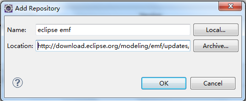

[TOC]


# Eclipse的Activiti-designer插件安装

2015年08月18日 16:04:52 [Hgihness](https://me.csdn.net/u012359995) 阅读数 5849


 版权声明：本文为博主原创文章，未经博主允许不得转载。（如有问题请邮件至634790417@qq.com，本人不经常上CSDN博客） https://blog.csdn.net/u012359995/article/details/47753293

Eclipse的Activiti-designer插件有在线和离线两种安装方式

## 一、在线安装

在eclipse的help下选择安装新的插件， 

点击Add，在 Name （自定义）和 Location输入如下信息 
设计器在线地址为：<http://activiti.org/designer/update/> 


点击下一步（Next），可能会出现以下错误 


意思是缺少eclipse emf （建模框架），返回下载安装一个即可。 
地址为： 
<http://download.eclipse.org/modeling/emf/updates/releases/> 


下载完后再按刚才的步骤即可成功安装Activiti-designer 
验证：Window——Preferences—— 即可看到Activiti的设置界面 


## 二、离线

假如公司开发环境无法连接外网，只能用离线方式安装。 
先到 <http://activiti.org/designer/archived/> 直接下载最新的离线版本 
同样也可能需要emf插件，网上资料说只需下面三个jar即可，

```
org.eclipse.emf.transaction_1.4.0.v20100331-1738.jar
org.eclipse.emf.validation_1.7.0.201306111341.jar
org.eclipse.emf.workspace_1.5.1.v20120328-0001.jar123
```

在这里下载jar包（或者网上搜索） 
<http://download.csdn.net/detail/u012359995/9019855> 
把下载好的这三个jar包放到eclipse的plugin文件夹下。

将下载好的activiti-designer-5.18.0.zip解压，直接复制安装或者用link方式安装都可以，方法网上搜索，这里不详述了，复制好后，到eclipse的configuration目录下删除org.eclipse.update目录中的所有文件，并修改config.ini配置文件中 
`org.eclipse.update.reconcile=false` 
false改为true（插件显示成功后再改回false） 
重启eclipse验证activiti- designer插件是否安装成功。 


<https://blog.csdn.net/javahighness/article/details/47753293>