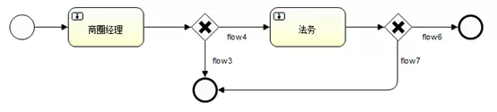
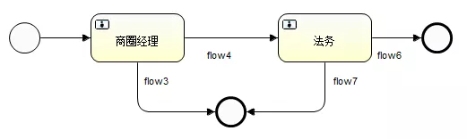
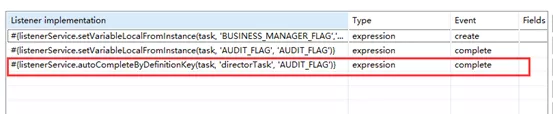
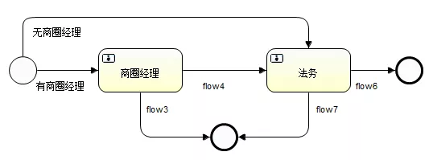
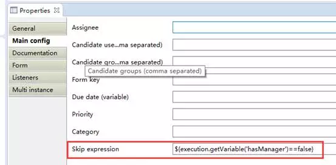
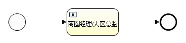
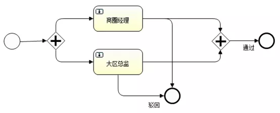

[TOC]


# Activiti 使用小技巧

- 何莉莉

阅读数：1282019 年 9 月 20 日 16:27

> 三方合同系统自从签前审核项目开始，一直有跟工作流打交道，最近合同变更项目也开始对接工作流。在这个过程中，面对复杂多变的业务场景，为了解决各种出其不意的业务需求，我对 activiti 进行了更多的探索和发现，本文的初衷是将我发现的一些小技巧分享给大家，希望能给大家以后使用 activiti、对接工作流平台一些参考。

## 技巧一：排他网可以省略

排他网关，也叫异或（XOR）网关，用来在流程中实现决策。当流程执行到这个网关，所有外出顺序流都会被处理一遍，其中条件为 true 的顺序流会被选中，让流程经由这个顺序流继续执行。

我们来看一下面这个流程：商圈经理审核，排他网关决策，通过的话就走顺序流 4（flow4），否则走顺序流 3（flow3）；法务后面也有一个排他网关，通过走 flow6, 驳回走 flow7。



这个流程定义没问题，但是当我们遇到比较多判断的时候，流程中如果加入很多排他网关，那么流程图会比较长，例如会出现在页面上展示不全的问题。有没有办法简化一下？

我们回顾一下排他网关的决策原理：一个排他网关会对应着一个以上的顺序流，每个顺序流都有个 conditionExpression 条件，返回 boolean 类型的决策结果（直白地说，就是会走条件为 true 的那条线），排他网关会从上而下选择第一个条件为 true 的顺序流。所以，本质上排它网关的决策是顺序流的决策。

如果没有配 conditionExpression，顺序流默认是 true。这就是为什么，上图中，流程开始不需要条件就到达商圈经理任务，商圈经理任务不需要任何条件就能走到第一个排他网关。既然顺序流可以起决策作用，我们是不是可以考虑，给用户任务后面跟着的那些顺序流加上 conditionExpression，以达到控制流程走向的目的？答案是肯定的！

这就是我们探索的结轮：排他网关其实可以省略掉，直接在用户任务后面接决策条件，同样可以达到决策流程走向的效果。

但是要说明的一点，排他网关的作用是可以使流程更清晰，能够具体、直观地看出流程走到这个节点，有一个路径的判断、选择过程，它的直观是无可替代的。所以，我们并不是推荐大家一定要把排他网关省略掉，而是仅供一个参考，到底要不要省掉，请具体问题具体分析。我们一般是在流程中排他网关比较多导致流程图很长、影响了页面展示并且决策条件单一的情况下会考虑省略它。

上面的流程图可以简化如下，此时 flow3、flow4 都是带条件的（conditionExpression）：



该流程定义 xml 如下：

```xml
<process id="myProcess" name="My  process" isExecutable="true">
    <startEvent id="startevent1" name="Start"></startEvent>
    <userTask id="usertask1" name="商圈经理" activiti:skipExpression="${execution.getVariable('hasManager')==false}"></userTask>
    <endEvent id="endevent1" name="End"></endEvent>
    <endEvent id="endevent2" name="End"></endEvent>
    <userTask id="usertask2" name="法务"></userTask>
    <sequenceFlow id="flow2" name="flow4" sourceRef="usertask1" targetRef="usertask2">
        <conditionExpression xsi:type="tFormalExpression"><![CDATA[${FLAG==true}]]></conditionExpression>
    </sequenceFlow>
    <sequenceFlow id="flow3" name="flow3" sourceRef="usertask1" targetRef="endevent1">
        <conditionExpression xsi:type="tFormalExpression"><![CDATA[${FLAG==false}]]></conditionExpression>
    </sequenceFlow>
    <sequenceFlow id="flow4" name="flow6" sourceRef="usertask2" targetRef="endevent2">
        <conditionExpression xsi:type="tFormalExpression"><![CDATA[${FLAG==true}]]></conditionExpression>
    </sequenceFlow>
    <sequenceFlow id="flow5" name="flow7" sourceRef="usertask2" targetRef="endevent1">
        <conditionExpression xsi:type="tFormalExpression"><![CDATA[${FLAG==false}]]></conditionExpression>
    </sequenceFlow>
    <sequenceFlow id="flow6" sourceRef="startevent1" targetRef="usertask1"></sequenceFlow>
</process>
```

## 技巧二：跳过用户任务的简单实现

跳过用户任务，意思是比如上面的流程，如果流程发起人没有商圈经理，那要跳过商圈经理这个审核节点，直接到法务审核。针对这个业务需求，我们可以再流程图上加一个”排他网关”（自从知道排他网关可以省略之后，我再也不画排他网关了），如下图：



这个流程看起来也没什么问题，是能满足需求的，不足之处就是丑了的。要是法务那个任务也“没有法务可以跳过”，那就又要多两条线了。实际业务里面，我们就遇到了一个流程三个用户任务，其中两个可以跳过的，幸好掌握了技巧一省略了排他网关，否则这个流程也会相当长。问题来了，这个流程还能不能再简化，有没有办法把这些线也去掉呢？

笔者发现，用户任务的配置里面有一个叫“skip expression”的配置项，“跳过表达式”，听起来正是我们想要的。

跳过表达式，当表达式条件为 true，就跳过当前任务，进入该任务之后的流程。在 activiti 实现里面，就不会创建该用户任务了。



有了这个跳过表达式，上面的流程图就可以简化成这样：


流程图跟上面第二个图一样，唯一不同的是，商圈经理这个任务加了跳过表达式。流程定义上的区别是，商圈经理任务多了配置：

复制代码

```
activiti:skipExpression="${execution.getVariable('hasManager')==false}"
```

流程定义如下：

```xml
<process id="myProcess" name="My  process" isExecutable="true">
   <startEvent id="startevent1" name="Start"></startEvent>
   <userTask id="usertask1" name=" 商圈经理 " activiti:skipExpression="${execution.getVariable('hasManager')==false}"></userTask>
   <endEvent id="endevent1" name="End"></endEvent>
   <endEvent id="endevent2" name="End"></endEvent>
   <userTask id="usertask2" name=" 法务 "></userTask>
   <sequenceFlow id="flow2" name="flow4" sourceRef="usertask1" targetRef="usertask2">
       <conditionExpression xsi:type="tFormalExpression"><![CDATA[${FLAG==true}]]></conditionExpression>
   </sequenceFlow>
   <sequenceFlow id="flow3" name="flow3" sourceRef="usertask1" targetRef="endevent1">
       <conditionExpression xsi:type="tFormalExpression"><![CDATA[${FLAG==false}]]></conditionExpression>
   </sequenceFlow>
   <sequenceFlow id="flow4" name="flow6" sourceRef="usertask2" targetRef="endevent2">
       <conditionExpression xsi:type="tFormalExpression"><![CDATA[${FLAG==true}]]></conditionExpression>
   </sequenceFlow>
   <sequenceFlow id="flow5" name="flow7" sourceRef="usertask2" targetRef="endevent1">
       <conditionExpression xsi:type="tFormalExpression"><![CDATA[${FLAG==false}]]></conditionExpression>
   </sequenceFlow>
   <sequenceFlow id="flow6" sourceRef="startevent1" targetRef="usertask1"></sequenceFlow>
</process>

```

## 技巧三：A 或 B 岗位的用户都可以处理的用户任务

首先，说明一下三方合同对接工作流平台，关于用户身份的处理机制。目前对接工作流平台，我们没有使用 activiti 用户组（group）的概念，原因是，第一目前工作流平台暂不支持用户组，没有存 UC 的用户数据；

其次，是业务中用户身份是多样的，很多时候判断一个用户到底有没有审核某任务的权限，我们有可能是根据用户权限点来控制、也有可能是根据用户角色来控制、还有可能是二者的结合，不确定 activiti 的 group 能不能满足多样化的业务需求。

所以，权衡了工作流平台的现状以及业务的复杂性，我们没有使用 activiti 的 group 机制来控制用户任务，而是采用的是折衷的、较为简单的方式，将用户任务的审核人信息作为该任务的一个属性，如 IDENTITY_FLAG，用户的待办、已办任务就通过该值进行查询。

基于以上的背景，我们在业务中遇到了一个问题。业务需求是这样的，一个任务，商圈经理或者总监都可以审，只要有一个人审核通过，流程就可以继续往下走了，大概是下面这样：



这个需求可以用“一个任务，多种身份”的方式来处理，但是这不是我们想要的。我们始终希望一个用户任务，只对应一类身份的审核人，这样对我们的待办、已办数据的处理更方便。

经过一番探究，后来我们采用了并行网关加监听的方案解决了这个问题。并行网关的作用是，将单条线路任务拆分成多个路径，等到多条路径都平行完成之后，再合并起来。那么我们就可能利用并行网关，将任务拆分成并行的路径，只要流程经过第一个并行网关之后，就会同时出现两组用户待办任务，满足了需求：商圈经理和总监都可能审核。

流程定义如下：

但是，有一个问题，当一个任务通过，该路径会到达后面那个并行网关，然而另一个任务还没有处理，流程会卡住。为了满足需求，我们要想办法把另一个任务处理掉，让其中一个任务通过，流程就能继续往下走。在此，我们采用了监听机制，两个任务互相监听对方是否完成，有的话，就把当前任务 complete 掉。



如上流程，如果商圈经理通过了该任务，监听方法就把大区总监的任务也通过，然后流程就可以顺利到达下一个节点。下面是商圈经理任务的 listener 的配置：监听 directorTask（大区总监任务），在监听方法里面判断，审核结果（AUDIT_FLAG）为通过时，完成本任务；驳回就不用了，因为整个流程已结束。


该流程定义 xml 如下：

```xml
<process id="managerOrDirector" name=" 商圈经理或总监审核 " isExecutable="true">
   <startEvent id="startevent1" name=" 开始 "></startEvent>
   <userTask id="managerTask" name=" 商圈经理 ">
     <extensionElements>
       <activiti:taskListener event="create" expression="#{listenerService.setVariableLocalFromInstance(task,  'BUSINESS_MANAGER_FLAG','IDENTITY_FLAG')}"></activiti:taskListener>
       <activiti:taskListener event="complete" expression="#{listenerService.setVariableLocalFromInstance(task,  'AUDIT_FLAG', 'AUDIT_FLAG')}"></activiti:taskListener>
       <activiti:taskListener event="complete" expression="#{listenerService.autoCompleteByDefinitionKey(task,  'directorTask', 'AUDIT_FLAG')}"></activiti:taskListener>
     </extensionElements>
   </userTask>
   <userTask id="directorTask" name=" 大区总监 ">
     <extensionElements>
       <activiti:taskListener event="create" expression="#{listenerService.setVariableLocalFromInstance(task,  'DIRECTOR_FLAG','IDENTITY_FLAG')}"></activiti:taskListener>
       <activiti:taskListener event="complete" expression="#{listenerService.setVariableLocalFromInstance(task,  'AUDIT_FLAG', 'AUDIT_FLAG')}"></activiti:taskListener>
       <activiti:taskListener event="complete" expression="#{listenerService.autoCompleteByDefinitionKey(task,  'managerTask', 'AUDIT_FLAG')}"></activiti:taskListener>
     </extensionElements>
   </userTask>
   <endEvent id="endevent1" name=" 驳回 "></endEvent>
   <endEvent id="endevent2" name=" 通过 "></endEvent>
   <parallelGateway id="parallelgateway1" name="Parallel  Gateway"></parallelGateway>
   <parallelGateway id="parallelgateway2" name="Parallel  Gateway"></parallelGateway>
   <sequenceFlow id="flow1" sourceRef="startevent1" targetRef="parallelgateway1"></sequenceFlow>
   <sequenceFlow id="flow2" sourceRef="parallelgateway1" targetRef="managerTask"></sequenceFlow>
   <sequenceFlow id="flow3" sourceRef="parallelgateway1" targetRef="directorTask"></sequenceFlow>
   <sequenceFlow id="flow4" sourceRef="managerTask" targetRef="parallelgateway2">
     <conditionExpression xsi:type="tFormalExpression"><![CDATA[${AUDIT_FLAG==true}]]></conditionExpression>
   </sequenceFlow>
   <sequenceFlow id="flow5" sourceRef="directorTask" targetRef="parallelgateway2">
     <conditionExpression xsi:type="tFormalExpression"><![CDATA[${AUDIT_FLAG==true}]]></conditionExpression>
   </sequenceFlow>
   <sequenceFlow id="flow6" name=" 通过 " sourceRef="parallelgateway2" targetRef="endevent2"></sequenceFlow>
   <sequenceFlow id="flow7" sourceRef="managerTask" targetRef="endevent1">
     <conditionExpression xsi:type="tFormalExpression"><![CDATA[${AUDIT_FLAG==false}]]></conditionExpression>
   </sequenceFlow>
   <sequenceFlow id="flow8" name=" 驳回 " sourceRef="directorTask" targetRef="endevent1">
     <conditionExpression xsi:type="tFormalExpression"><![CDATA[${AUDIT_FLAG==false}]]></conditionExpression>
   </sequenceFlow>
 </process>

```

**本文转载自公众号贝壳产品技术（ID：gh_9afeb423f390）。**

**原文链接：**

https://mp.weixin.qq.com/s/YqOcpmVkXgXJSpZFHoBABw


https://www.infoq.cn/article/I2mtwKbOAx2OveQRlZLZ