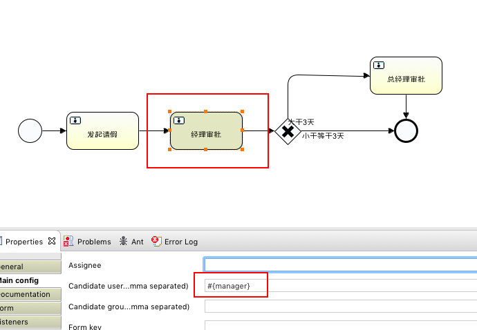

[TOC]


# activiti 入门Demo


关注

2016.12.06 09:35* 字数 402 阅读 1391评论 2喜欢 3

### BPMN

BPMN(Business Process Modeling Notation)是一个重要的工作流建模语言的规范。它利用标准的图元去描述真实的业务发生过程，保证相同的流程在不同的流程引擎得到的执行结果一致。

本demo中业务流程：用户发起请假，然后经理审批，如果请假时间比较短，请假完成，流程结束；如果请假超过3天，转给总经理审批，然后才能请假完成。

用到的BPMN图


业务流程图

### activiti配置

```
    <dependency>
      <groupId>org.activiti</groupId>
      <artifactId>activiti-engine</artifactId>
      <version>${activiti-version}</version>
    </dependency>
    <dependency>
      <groupId>org.activiti</groupId>
      <artifactId>activiti-spring</artifactId>
      <version>${activiti-version}</version>
    </dependency>
```

### 创建数据库

本demo在本地运行，首先需要在本地数据库创建schema(此处为activiti-demo)。
然后运行以下代码，创建activiti引擎需要的25张表(acitivti提供了创建这些表需要的sql,也可以手动创建)

```
        ProcessEngineConfiguration processEngineConfiguration = ProcessEngineConfiguration.createStandaloneProcessEngineConfiguration();

        processEngineConfiguration.setJdbcDriver("com.mysql.jdbc.Driver");
        processEngineConfiguration.setJdbcUrl("jdbc:mysql://localhost:3306/activiti-demo?useUnicode=true&characterEncoding=utf8");
        processEngineConfiguration.setJdbcUsername("root");
        processEngineConfiguration.setJdbcPassword("root");

        processEngineConfiguration.setDatabaseSchemaUpdate(ProcessEngineConfiguration.DB_SCHEMA_UPDATE_TRUE);
        ProcessEngine processEngine = processEngineConfiguration.buildProcessEngine();
        System.out.println("processEngine"+processEngine);
```

### 部署一个工作流程

```
    ProcessEngine processEngine = ProcessEngines.getDefaultProcessEngine();

    @Test
    public void startDeployment(){
        Deployment deployment = processEngine.getRepositoryService()
                .createDeployment()
                .addClasspathResource("diagrams/VariableUsersDemo.bpmn")
                .addClasspathResource("diagrams/VariableUsersDemo.png")
                .deploy();
        System.out.println("Deploy deploy ID: " + deployment.getId());


    }
    
```

png文件可以不添加，只是用作用户查看流程。

### 开始一个流程实例

```
        public void startProcessInstance(){

        String deployKey = "variableProcess";

        Map<String,Object> variables = new HashMap<>();

        variables.put("user","jianke");
        variables.put("manager","caohao");
        variables.put("boss","zhangqi");

        RuntimeService runtimeService = processEngine.getRuntimeService();
        ProcessInstance processInstance = runtimeService.startProcessInstanceByKey(deployKey, variables);
         String processInstanceID = processInstance.getId();
        System.out.println("流程实例ID: " + processInstanceID);


    }
```

variables保存一些该流程需要的变量，此处用来保存了一些人员信息，即何人发起，需要何人进行审批。
user,manager,boss这些字段是在流程图中设置的。



BPMN中设置人员信息

### 给该实例附加请假信息

```
        TaskService service = processEngine.getTaskService();
        List<Task> list = service.createTaskQuery().processInstanceId(processInstanceID).taskCandidateUser("jianke")
                .list();
        for(Task task:list){
            System.out.println("Task ID : " + task.getId() + "   " + task.getName());
            service.claim(task.getId(),"jianke"); //确定请假任务
            Leave leave = new Leave();
            leave.setName("jianke");
            leave.setContent("Go to Sleep");
            leave.setCreateTime(new Date());
            leave.setDays(5);
            service.setVariable(task.getId(), "info", leave); //添加请假信息
            service.complete(task.getId()); //完成请假，提交审批
        }
```

### 经理审批

```
        List<Task> list = service.createTaskQuery().processInstanceId(processInstanceID).taskCandidateUser("caohao")
                .list();   //搜索等待主管处理的任务
        for(Task task:list){
            System.out.println("Task ID : " + task.getId() + "   " + task.getName());
            service.claim(task.getId(), "caohao"); //主管接受任务
            Leave leave = (Leave)service.getVariable(task.getId(),"info");

            Map<String,Object> object = new HashMap<>();
            object.put("days", leave.getDays());
            service.complete(task.getId(), object);  //主管审批，并附带请假天数信息，交给引擎处理是否需要总经理审批
            System.out.println("complete!");
        }
```

在BPMN中添加是否总经理审批的判断：


BPMN中添加判断逻辑

### 总经理审批

```
            //操作流程同经理审批
        TaskService service = processEngine.getTaskService();
        List<Task> list = service.createTaskQuery().processInstanceId(processInstanceID).taskCandidateUser("zhangqi")
                .list();
        for(Task task:list){
            System.out.println("Task ID : " + task.getId() + "   " + task.getName());
            service.claim(task.getId(), "zhangqi");
            
              service.complete(task.getId());
            System.out.println("complete!");
        }
```

### 请假流程完成通知

```
public class endListener implements ExecutionListener {

    @Override
    public void notify(DelegateExecution delegateTask){
         //在此处进行请假完成后的操作，比较通知请假人，记录档案等
         
         
        System.out.println("Task End!");
    }

}
```

给结束节点添加通知的方法，在BPMN图中添加：


BPMN中添加通知

附上原码地址，大家一起学习探讨：
[https://github.com/qixiaojian/activiti-demo.git](https://link.jianshu.com/?t=https://github.com/qixiaojian/activiti-demo.git)


<https://www.jianshu.com/p/164aa1cb7e6b>