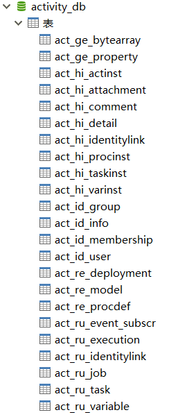

# activiti工作流框架——数据库表结构说明

 

 

activity一共23张表



23张表.png

------

表的命名第一部分都是以 ACT_开头的。

表的命名第二部分是一个两个字符用例表的标识

------

## act_ge_*：

‘ge’代表general（一般）。普通数据，各种情况都使用的数据。

- act_ge_bytearray：二进制数据表，用来保存部署文件的大文本数据

  ```
  
  1.ID_:资源文件编号，自增长
  2.REV_INT:版本号
  3.NAME_:资源文件名称
  4.DEPLOYMENT_ID_:来自于父表act_re_deployment的主键
  5.BYTES_:大文本类型，存储文本字节流
  ```

- act_ge_property：属性数据表，存储这整个流程引擎级别的数据。在初始化表结构时，会默认插入三条记录。

  ```
  1.NAME_:属性名称
  2.VALUE_:属性值
  3.REV_INT:版本号
  ```


------

## act_hi_*：

’hi’代表 history（历史）。就是这些表包含着历史的相关数据，如结束的流程实例、变量、任务、等等。

- act_hi_actinst：历史节点表

  ```
  1.ID_ : 标识
  2.PROC_DEF_ID_ :流程定义id
  3.PROC_INST_ID_ : 流程实例id
  4.EXECUTION_ID_ : 执行实例
  5.ACT_ID_ : 节点id
  6.ACT_NAME_ : 节点名称
  7.ACT_TYPE_ : 节点类型
  8.ASSIGNEE_ : 节点任务分配人
  9.START_TIME_ : 开始时间
  10.END_TIME_ : 结束时间
  11.DURATION : 经过时长
  ```

- act_hi_attachment：历史附件表

- act_hi_comment：历史意见表

  ```
  1.ID_ :标识
  2.TYPE_ : 意见记录类型 为comment 时 为处理意见
  3.TIME_ : 记录时间
  4.USER_ID_ :
  5.TASK_ID_ ： 对应任务的id
  6.PROC_INST_ID_ : 对应的流程实例的id
  7.ACTION_ ： 为AddComment 时为处理意见
  8.MESSAGE_ : 处理意见
  9.FULL_MSG_ :
  ```

- act_hi_detail：历史详情表，启动流程或者在任务complete之后,记录历史流程变量

  ```
  1.ID_ : 标识
  2.TYPE_ : variableUpdate 和 formProperty 两种值
  3.PROC_INST_ID_ : 对应流程实例id
  4.EXECUTION_ID_ : 对应执行实例id
  5.TASK_ID_ : 对应任务id
  6.ACT_INST_ID : 对应节点id
  7.NAME_ : 历史流程变量名称，或者表单属性的名称
  8.VAR_TYPE_ : 定义类型
  9.REV_ : 版本
  10.TIME_ : 导入时间
  11.BYTEARRAY_ID_
  12.DOUBLE_ : 如果定义的变量或者表单属性的类型为double，他的值存在这里
  13.LONG_ : 如果定义的变量或者表单属性的类型为LONG ,他的值存在这里
  14.TEXT_ :　　如果定义的变量或者表单属性的类型为string，值存在这里
  15.TEXT2_:
  ```

- act_hi_identitylink：历史流程人员表

- act_hi_procinst： 历史流程实例表

  ```
  1.ID_ : 唯一标识
  2.PROC_INST_ID_ : 流程ＩＤ
  3.BUSINESS_KEY_ : 业务编号
  4.PROC_DEF_ID_ ： 流程定义id
  5.START_TIME_ : 流程开始时间
  6.ENT__TIME : 结束时间
  7.DURATION_ : 流程经过时间
  8.START_USER_ID_ : 开启流程用户id
  9.START_ACT_ID_ : 开始节点
  10.END_ACT_ID_： 结束节点
  11.SUPER_PROCESS_INSTANCE_ID_ : 父流程流程id
  12.DELETE_REASON_ : 从运行中任务表中删除原因
  ```

- act_hi_taskinst： 历史任务实例表

  ```
  1.ID_ ： 标识
  2.PROC_DEF_ID_ ： 流程定义id
  3.TASK_DEF_KEY_ : 任务定义id
  4.PROC_INST_ID_ :　流程实例ｉｄ
  5.EXECUTION_ID_ : 执行实例id
  6.PARENT_TASK_ID_ : 父任务id
  7.NAME_ : 任务名称
  8.DESCRIPTION_ : 说明
  9.OWNER_ :　拥有人（发起人）
  10.ASSIGNEE_ : 分配到任务的人
  11.START__TIME_ : 开始任务时间
  12.END_TIME_ : 结束任务时间
  13.DURATION_ : 时长
  14.DELETE_REASON_ :从运行时任务表中删除的原因
  15.PRIORITY_ : 紧急程度
  16.DUE_DATE_ :
  ```

- act_hi_varinst：历史变量表

------

## act_id_*：

’id’代表 identity（身份）。这些表包含着标识的信息，如用户、用户组、等等。

- act_id_group:用户组信息表，用来存储用户组信息。

  ```
  1.ID_：用户组名*
  2.REV_INT:版本号
  3.NAME_:用户组描述信息*
  4.TYPE_:用户组类型
  ```

- act_id_info：用户扩展信息表

- act_id_membership：用户与用户组对应信息表，用来保存用户的分组信息

  ```
  1.USER_ID_:用户名
  2.GROUP_ID_:用户组名
  ```

- act_id_user：用户信息表

  ```
  1.ID_:用户名
  2.REV_INT:版本号
  3.FIRST_:用户名称
  4.LAST_:用户姓氏
  5.EMAIL_:邮箱
  6.PWD_:密码
  ```


------

## act_re_*：

’re’代表 repository（仓库）。带此前缀的表包含的是静态信息，如，流程定义、流程的资源（图片、规则，等）。

- act_re_deployment:部署信息表,用来存储部署时需要持久化保存下来的信息

  ```
  1.ID_:部署编号，自增长
  2.NAME_:部署包的名称
  3.DEPLOY_TIME_:部署时间
  ```

- act_re_model 流程设计模型部署表

- act_re_procdef:业务流程定义数据表

  ```
  1.ID_:流程ID，由“流程编号：流程版本号：自增长ID”组成
  2.CATEGORY_:流程命名空间（该编号就是流程文件targetNamespace的属性值）
  3.NAME_:流程名称（该编号就是流程文件process元素的name属性值）
  4.KEY_:流程编号（该编号就是流程文件process元素的id属性值）
  5.VERSION_:流程版本号（由程序控制，新增即为1，修改后依次加1来完成的）
  6.DEPLOYMENT_ID_:部署编号
  7.RESOURCE_NAME_:资源文件名称
  8.DGRM_RESOURCE_NAME_:图片资源文件名称
  9.HAS_START_FROM_KEY_:是否有Start From Key
  ```


*注：此表和ACT_RE_DEPLOYMENT是多对一的关系，即，一个部署的bar包里可能包含多个流程定义文件，每个流程定义文件都会有一条记录在ACT_REPROCDEF表内，每个流程定义的数据，都会对于ACT_GE_BYTEARRAY表内的一个资源文件和PNG图片文件。和ACT_GE_BYTEARRAY的关联是通过程序用ACT_GE_BYTEARRAY.NAME与ACT_RE_PROCDEF.NAME_完成的，在数据库表结构中没有体现。*

------

## act_ru_*：

’ru’代表 runtime（运行时）。就是这个运行时的表存储着流程变量、用户任务、变量、作业，等中的运行时的数据。 activiti 只存储流程实例执行期间的运行时数据，当流程实例结束时，将删除这些记录。这就使这些运行时的表保持 的小且快。

- act_ru_event_subscr

- act_ru_execution：运行时流程执行实例表

  ```
  1.ID_：主键，这个主键有可能和PROC_INST_ID_相同，相同的情况表示这条记录为主实例记录。
  2.REV_：版本，表示数据库表更新次数。
  3.PROC_INST_ID_：流程实例编号，一个流程实例不管有多少条分支实例，这个ID都是一致的。
  4.BUSINESS_KEY_：业务编号，业务主键，主流程才会使用业务主键，另外这个业务主键字段在表中有唯一约束。
  5.PARENT_ID_：找到该执行实例的父级，最终会找到整个流程的执行实例
  6.PROC_DEF_ID_：流程定义ID
  7.SUPER_EXEC_： 引用的执行模板，这个如果存在表示这个实例记录为一个外部子流程记录，对应主流程的主键ID。
  8.ACT_ID_： 节点id，表示流程运行到哪个节点
  9.IS_ACTIVE_： 是否活动流程实例
  10.IS_CONCURRENT_：是否并发。上图同步节点后为并发，如果是并发多实例也是为1。
  11.IS_SCOPE_： 主实例为1，子实例为0。
  12.TENANT_ID_ : 这个字段表示租户ID。可以应对多租户的设计。
  13.IS_EVENT_SCOPE: 没有使用到事件的情况下，一般都为0。
  14.SUSPENSION_STATE_：是否暂停。
  ```

- act_ru_identitylink：运行时流程人员表，主要存储任务节点与参与者的相关信息

  ```
  1.ID_： 标识
  2.REV_： 版本
  3.GROUP_ID_： 组织id
  4.TYPE_： 类型
  5.USER_ID_： 用户id
  6.TASK_ID_： 任务id
  ```

- act_ru_job

- act_ru_task：运行时任务节点表

  ```
  1.ID_：
  2.REV_：
  3.EXECUTION_ID_： 执行实例的id
  4.PROC_INST_ID_： 流程实例的id
  5.PROC_DEF_ID_： 流程定义的id,对应act_re_procdef 的id_
  6.NAME_： 任务名称，对应 ***task 的name
  7.PARENT_TASK_ID_ : 对应父任务
  8.DESCRIPTION_：
  9.TASK_DEF_KEY_： ***task 的id
  10.OWNER_ : 发起人
  11.ASSIGNEE_： 分配到任务的人
  12.DELEGATION_ : 委托人
  13.PRIORITY_： 紧急程度
  14.CREATE_TIME_： 发起时间
  15.DUE_TIME_：审批时长
  ```

- act_ru_variable：运行时流程变量数据表

  ```
  1.ID_：标识
  2.REV_：版本号
  3.TYPE_：数据类型
  4.NAME_：变量名
  5.EXECUTION_ID_： 执行实例id
  6.PROC_INST_ID_： 流程实例id
  7.TASK_ID_： 任务id
  8.BYTEARRAY_ID_：
  9.DOUBLE_：若数据类型为double ,保存数据在此列
  10.LONG_： 若数据类型为Long保存数据到此列
  11.TEXT_： string 保存到此列
  12.TEXT2_：
  ```


------

## *结论及总结:*

- *流程文件部署主要涉及到3个表，分别是：ACT_GE_BYTEARRAY、ACT_RE_DEPLOYMENT、ACT_RE_PROCDEF。主要完成“部署包”-->“流程定义文件”-->“所有包内文件”的解析部署关系。从表结构中可以看出，流程定义的元素需要每次从数据库加载并解析，因为流程定义的元素没有转化成数据库表来完成，当然流程元素解析后是放在缓存中的，具体的还需要后面详细研究。 *
- *流程定义中的java类文件不保存在数据库里 。 *
- *组织机构的管理相对较弱，如果要纳入单点登录体系内还需要改造完成，具体改造方法有待研究。 *
- *运行时对象的执行与数据库记录之间的关系需要继续研究 *
- *历史数据的保存及作用需要继续研究。*


<https://www.jianshu.com/p/f9fd1cc02eae>