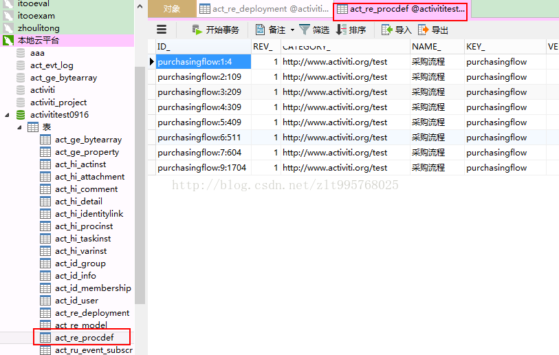
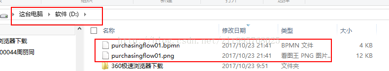

[TOC]


# activiti流程资源文件下载保存到本地

## 需求

用户或者开发人员，有时候需要对绘制好的流程文件进行查看

参考数据库



## 方案

根据流程标识，查找流程定义表，然后读取到跟这个流程有关的文件，然后保存到本地或者给出界面显示，目前只做保存到本地

代码

```java
//流程定义资源文件查询
@Test
public  void queryProcessDefinitionResource() throws IOException{
	//得到repositoryService
	RepositoryService repositoryService = processEngine.getRepositoryService();
	
	//根据流程定义id查询部署id
	String processDefinitionId = "purchasingflow:1:4";
	ProcessDefinition processDefinition = repositoryService
			.createProcessDefinitionQuery()
			.processDefinitionId(processDefinitionId).singleResult();
	//部署id
	String deploymentId = processDefinition.getDeploymentId();
	
	//bpmn文件
	//bpmn资源文件名称
	String resourceName_bpmn = processDefinition.getResourceName();
	//bpmn资源文件输入流
	InputStream inputStream_bpmn = repositoryService.getResourceAsStream(deploymentId, resourceName_bpmn);
	
	//png文件
	//png文件名称
	String resourceName_png = processDefinition.getDiagramResourceName();
	//png资源文件输入流
	InputStream inputStream_png = repositoryService.getResourceAsStream(deploymentId, resourceName_png);
	
	//构造输入流
	File file_bpmn = new File("d:/" + resourceName_bpmn);
	File file_png = new File("d:/" + resourceName_png);
	
	FileOutputStream fileOutputStream_bpmn = new FileOutputStream(file_bpmn);
	FileOutputStream fileOutputStream_png = new FileOutputStream(file_png);
	
	//流复制
	byte[] b = new byte[1024];
	int len = -1;
	while((len = inputStream_bpmn.read(b,0,1024)) != -1){
		fileOutputStream_bpmn.write(b,0,len);
	}
	
	while((len = inputStream_png.read(b,0,1024)) != -1){
		fileOutputStream_png.write(b,0,len);
	}
	
	//关闭流
	inputStream_bpmn.close();
	inputStream_png.close();
	fileOutputStream_bpmn.close();
	fileOutputStream_png.close();
}
```

 

效果图




<https://blog.csdn.net/zlt995768025/article/details/78327075>