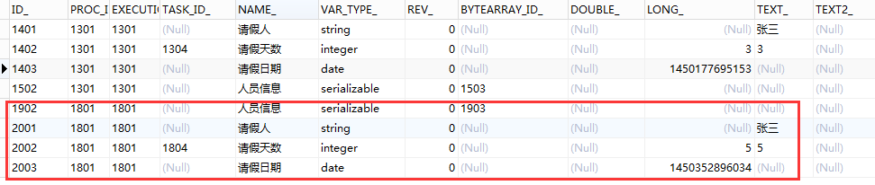

[TOC]


# activiti进阶-流程执行历史记录

2015年12月20日 12:15:11 [周江霄](https://me.csdn.net/zjx86320) 阅读数 33714

​    之前的几篇文章，为大家简单的介绍了部署流程定义、启动流程实例、查看和办理个人任务以及如何设置和获取流程变量，这一系列的活动组成了一个完整的执行流程，那么一个执行完的流程我们如何查看相关的定义呢，这篇博文就为大家简单的介绍一下流程执行的历史记录查询。

## **一、查询历史流程实例**

```
	/**查询历史流程实例*/
	@Test
	public void findHisProcessInstance(){	
		List<HistoricProcessInstance> list = processEngine.getHistoryService()
				.createHistoricProcessInstanceQuery()
				.processDefinitionId("testVariables:2:1704")//流程定义ID
				.list();
		
		if(list != null && list.size()>0){
			for(HistoricProcessInstance hi:list){
				System.out.println(hi.getId()+"	  "+hi.getStartTime()+"   "+hi.getEndTime());
			}
		}
	}
```

​     查询历史流程实例，就是

查找按照某个流程定义的规则一共执行了多少次流程，

对应的数据库表：act_hi_procinst

 


​     从表中我们可以看到，我们可以通过流程实例ID和流程部署ID得到对象的历史流程实例，从而获得该实例的开始时间和结束时间及其他一些属性定义。


## **二、查询历史活动**

```
	/**查询历史活动
	 * 问题：HistoricActivityInstance对应哪个表
	 * 问题：HistoricActivityInstance和HistoricTaskInstance有什么区别*/
	@Test 
	public void findHisActivitiList(){
		String processInstanceId = "1801";
		List<HistoricActivityInstance> list = processEngine.getHistoryService()
				.createHistoricActivityInstanceQuery()
				.processInstanceId(processInstanceId)
				.list();
		if(list != null && list.size()>0){
			for(HistoricActivityInstance hai : list){
				System.out.println(hai.getId()+"  "+hai.getActivityName());
			}
		}
	}
```

​      查询历史活动，就是查询某一次

流程的执行一共经历了多少个活动，这里我们使用流程定义ID来查询，对应的数据库表为:act_hi_actinst


## **三、查询历史任务**

```
	/**查询历史任务	
	 * 问题：HistoricTaskInstance对应哪个表*/
	@Test
	public void findHisTaskList(){
		String processInstanceId = "1801";
		List<HistoricTaskInstance> list = processEngine.getHistoryService()
				.createHistoricTaskInstanceQuery()
				.processInstanceId(processInstanceId)
				.list();
		if(list!=null && list.size()>0){
			for(HistoricTaskInstance hti:list){
				System.out.println(hti.getId()+"    "+hti.getName()+"   "+hti.getClaimTime());
			}
		}
	}
```

​     查询历史任务，就是查询摸一次流程的执行一共经历了多少个任务，对应表：act_hi_taskinst

 


##      **四、查询历史流程变量**


```
	/**查询历史流程变量*/
	@Test
	public void findHisVariablesList(){
		String processInstanceId = "1801";
		List<HistoricVariableInstance> list = processEngine.getHistoryService()
				.createHistoricVariableInstanceQuery()
				.processInstanceId(processInstanceId)
				.list();
		if(list != null && list.size()>0){
			for(HistoricVariableInstance hvi:list){
				System.out.println(hvi.getId()+"    "+hvi.getVariableName()+"	"+hvi.getValue());
			}
		}
	}
```

​     查询历史流程变量，就是查询

某一次流程的执行一共设置的流程变量，对应表：act_hi_varinst

 


## **总结：**

​     由于数据库中保存着历史信息以及正在运行的流程实例信息，在实际项目中对已完成任务的查看频率远不及对待办和运行中的任务的查看，所以activiti采用分开管理，把正在运行的交给RuntimeService管理，而历史数据交给HistoryService来管理。


<https://blog.csdn.net/zjx86320/article/details/50363544>