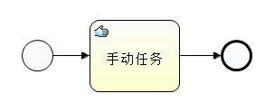

# activiti手动任务（Manual Task）

2018-05-05 13:23:27

 

 

## 前言：

手工任务就是一个自动执行的过程。手动任务几乎不在程序中做什么事情，只是在流程的历史中留下一点痕迹，表明流程是走过某些节点的。而且这个任务是无法用taskservice查询到的。

 

## **Activiti官方说明：**

手动任务定义了 BPM引擎之外的任务。用来对那些需要人来完成的工作进行建模，引擎不需要知道他是系统还是 UI接口。
对引擎而言，手动任务是作为直接通过的活动处理的，流程执行到此会自动继续流程的执行。所以这个流程其实没有什么好说的。就是一个直接通过的任务。可以使用它来自动执行一些可以直接通过的任务。

流程设计：



7.流程源码：

```html
<?xml version="1.0" encoding="UTF-8"?>
<definitions xmlns="http://www.omg.org/spec/BPMN/20100524/MODEL" xmlns:xsi="http://www.w3.org/2001/XMLSchema-instance" xmlns:xsd="http://www.w3.org/2001/XMLSchema" xmlns:activiti="http://activiti.org/bpmn" xmlns:bpmndi="http://www.omg.org/spec/BPMN/20100524/DI" xmlns:omgdc="http://www.omg.org/spec/DD/20100524/DC" xmlns:omgdi="http://www.omg.org/spec/DD/20100524/DI" typeLanguage="http://www.w3.org/2001/XMLSchema" expressionLanguage="http://www.w3.org/1999/XPath" targetNamespace="http://www.activiti.org/processdef">
  <process id="ManualTaskTest01" isExecutable="true">
    <startEvent id="sid-8D52A572-DD68-4640-BCEE-AA46FD19F535"></startEvent>
    <manualTask id="sid-B57FA289-A98B-45B8-8550-211ED155778E" name="手动任务">
      <extensionElements>
        <activiti:executionListener event="start" class="manualTask.TestRunningTask"></activiti:executionListener>
      </extensionElements>
    </manualTask>
    <endEvent id="sid-DF898F06-5F35-4C64-B84D-6A405ADECA91"></endEvent>
    <sequenceFlow id="sid-BD48A7F5-D206-4E76-AB78-0437FBDC5834" sourceRef="sid-B57FA289-A98B-45B8-8550-211ED155778E" targetRef="sid-DF898F06-5F35-4C64-B84D-6A405ADECA91"></sequenceFlow>
    <sequenceFlow id="sid-6F9CC662-16AB-4058-BA4A-2A0D3D99C185" sourceRef="sid-8D52A572-DD68-4640-BCEE-AA46FD19F535" targetRef="sid-B57FA289-A98B-45B8-8550-211ED155778E"></sequenceFlow>
  </process>
  <bpmndi:BPMNDiagram id="BPMNDiagram_ManualTaskTest01">
    <bpmndi:BPMNPlane bpmnElement="ManualTaskTest01" id="BPMNPlane_ManualTaskTest01">
      <bpmndi:BPMNShape bpmnElement="sid-8D52A572-DD68-4640-BCEE-AA46FD19F535" id="BPMNShape_sid-8D52A572-DD68-4640-BCEE-AA46FD19F535">
        <omgdc:Bounds height="35.0" width="35.0" x="300.0" y="99.0"></omgdc:Bounds>
      </bpmndi:BPMNShape>
      <bpmndi:BPMNShape bpmnElement="sid-B57FA289-A98B-45B8-8550-211ED155778E" id="BPMNShape_sid-B57FA289-A98B-45B8-8550-211ED155778E">
        <omgdc:Bounds height="80.0" width="100.0" x="375.0" y="77.0"></omgdc:Bounds>
      </bpmndi:BPMNShape>
      <bpmndi:BPMNShape bpmnElement="sid-DF898F06-5F35-4C64-B84D-6A405ADECA91" id="BPMNShape_sid-DF898F06-5F35-4C64-B84D-6A405ADECA91">
        <omgdc:Bounds height="35.0" width="35.0" x="520.0" y="99.0"></omgdc:Bounds>
      </bpmndi:BPMNShape>
      <bpmndi:BPMNEdge bpmnElement="sid-BD48A7F5-D206-4E76-AB78-0437FBDC5834" id="BPMNEdge_sid-BD48A7F5-D206-4E76-AB78-0437FBDC5834">
        <omgdi:waypoint x="475.0" y="117.0"></omgdi:waypoint>
        <omgdi:waypoint x="520.0" y="116.0"></omgdi:waypoint>
      </bpmndi:BPMNEdge>
      <bpmndi:BPMNEdge bpmnElement="sid-6F9CC662-16AB-4058-BA4A-2A0D3D99C185" id="BPMNEdge_sid-6F9CC662-16AB-4058-BA4A-2A0D3D99C185">
        <omgdi:waypoint x="335.0" y="116.0"></omgdi:waypoint>
        <omgdi:waypoint x="375.0" y="117.0"></omgdi:waypoint>
      </bpmndi:BPMNEdge>
    </bpmndi:BPMNPlane>
  </bpmndi:BPMNDiagram>
</definitions>
```

**8.主程序：**

```java
package manualTask;
 
import java.util.List;
 
import org.activiti.engine.ProcessEngine;
import org.activiti.engine.ProcessEngines;
import org.activiti.engine.RepositoryService;
import org.activiti.engine.TaskService;
import org.activiti.engine.runtime.ProcessInstance;
import org.activiti.engine.task.Task;
 
public class ManualTaskTest01 {
	/** 完成我的任务  */
	public static void main(String[] args) throws InterruptedException {
		ProcessEngine processEngine = ProcessEngines.getDefaultProcessEngine();
		RepositoryService repositoryService = processEngine.getRepositoryService();
		repositoryService.createDeployment()
						 .addClasspathResource("diagrams/ManualTask/ManualTaskTest01.bpmn")
						 .deploy();
		System.out.println("流程部署成功!");// 流程定义ID
		// 流程定义的key
		String processDefinitionKey = "ManualTaskTest01";// 绘制的流程图ID
		ProcessInstance pi = processEngine.getRuntimeService()// 与正在执行的流程实例和执行对象相关的Service
				.startProcessInstanceByKey(processDefinitionKey);// 使用流程定义的key启动流程实例，key对应helloworld.bpmn文件中id的属性值。使用key值启动好处：默认是按照最新版本的流程定义启动
		String procesInstanceId = pi.getId();
		System.out.println("启动了一个ID为" + procesInstanceId + "的流程实例" );
		
		TaskService taskService = processEngine.getTaskService();
		while(processEngine.getRuntimeService()
				.createProcessInstanceQuery()
				.processInstanceId(procesInstanceId)
				.singleResult()!=null){//如果流程实例没有结束就一直查询当前实例的用户任务
			// 查询当前到达的任务（多线）
			List<Task> tasks = taskService.createTaskQuery()
										  .processInstanceId(procesInstanceId)
										  .list();
			if(tasks!=null && tasks.size()>0){
				for (Task t : tasks) {
					System.out.println("当前存在任务：" + t.getName());
				}
			}
		}
		System.out.println("ID为 " + procesInstanceId + "的流程实例执行完成!");
	}
}
```

**9.手动任务监听类：**

```java
//手动任务监听类
package manualTask;
 
import org.activiti.engine.delegate.DelegateExecution;
import org.activiti.engine.delegate.JavaDelegate;
 
public class TestRunningTask implements JavaDelegate {
	// 重写委托的提交方法
	@Override
	public void execute(DelegateExecution execution) throws Exception {
		System.out.println("TestRunningTask开始运行!");
	}
}
```

**10.运行结果：**

```undefined
流程部署成功!
TestRunningTask开始运行!
启动了一个ID为225005的流程实例
ID为 225005的流程实例执行完成!
```


<https://blog.csdn.net/weixin_42068560/article/details/80088871>