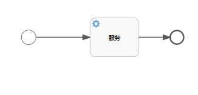
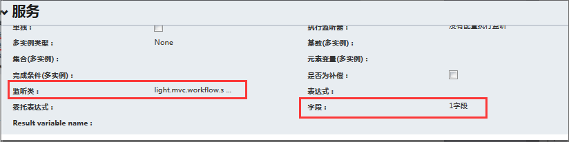
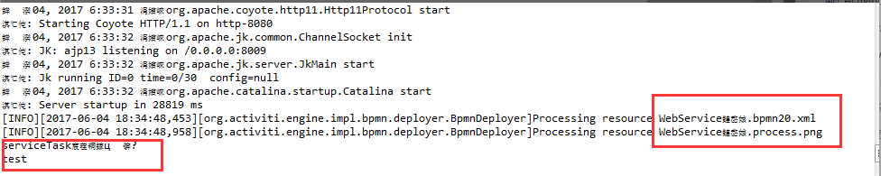
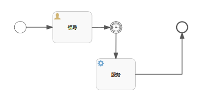

[TOC]


# activiti服务任务（serviceTask）

 

## 应用场景：

当客户有这么一个需求：下一个任务我需要自动执行一些操作，并且这个节点不需要任何的人工干涉，也就是说这个节点是自动化的。那么，这个当前面一个经办人员把任务发送下去的时候，自然而然的下一个节点就会开始马上执行。这个时候。我们就需要使用Activiti工作流的ServiceTask任务。

 

ServiceTask任务的实现，其实不复杂。

## **实现步骤：**

（1）设计流程

（2）编写委托类

（3）把委托类设置到流程的监听类上面

 

## **设计流程：**

 

 

 

## **编写委托类：**

```java
package light.mvc.workflow.serviceTask;

import org.activiti.engine.delegate.DelegateExecution;
import org.activiti.engine.delegate.Expression;
import org.activiti.engine.delegate.JavaDelegate;


/**
 *
 * 项目名称：lightmvc
 * 类名称：ServiceTask
 * 类描述：
 * 创建人：邓家海
 * 创建时间：2017年6月4日 下午6:18:11
 * 修改人：deng
 * 修改时间：2017年6月4日 下午6:18:11
 * 修改备注：
 * @version
 *
 */
public class ServiceTask implements JavaDelegate {
    //流程变量
    private Expression text1;

    //重写委托的提交方法
    @Override
    public void execute(DelegateExecution execution) throws Exception {
        System.out.println("serviceTask已经执行已经执行！");

        String value1 = (String) text1.getValue(execution);

        System.out.println(value1);

        execution.setVariable("var1",
            new StringBuffer(value1).reverse().toString());
    }
}

```


## **把委托类设置到流程的监听类上面：**

 

 

## **流程代码：**

```xml
<?xml version="1.0" encoding="UTF-8"?>
<definitions xmlns="http://www.omg.org/spec/BPMN/20100524/MODEL" xmlns:xsi="http://www.w3.org/2001/XMLSchema-instance" xmlns:xsd="http://www.w3.org/2001/XMLSchema" xmlns:activiti="http://activiti.org/bpmn" xmlns:bpmndi="http://www.omg.org/spec/BPMN/20100524/DI" xmlns:omgdc="http://www.omg.org/spec/DD/20100524/DC" xmlns:omgdi="http://www.omg.org/spec/DD/20100524/DI" typeLanguage="http://www.w3.org/2001/XMLSchema" expressionLanguage="http://www.w3.org/1999/XPath" targetNamespace="http://www.activiti.org/processdef">
  <process id="process" isExecutable="true">
    <startEvent id="sid-F6C5FFC5-63CA-453D-8C11-2DA040793DE9"></startEvent>
    <serviceTask id="sid-77E58C69-38B7-4DE5-BD73-D0B6CEDD48D4" name="服务" activiti:class="light.mvc.workflow.serviceTask.ServiceTask">
      <extensionElements>
        <activiti:field name="text1">
          <activiti:string><![CDATA[test]]></activiti:string>
        </activiti:field>
      </extensionElements>
    </serviceTask>
    <endEvent id="sid-DB39A39C-1BCC-4F45-B909-9A4319632B42"></endEvent>
    <sequenceFlow id="sid-567FAFA0-954C-4BC1-AC05-4610A75001B2" sourceRef="sid-77E58C69-38B7-4DE5-BD73-D0B6CEDD48D4" targetRef="sid-DB39A39C-1BCC-4F45-B909-9A4319632B42"></sequenceFlow>
    <sequenceFlow id="sid-44C871F5-454A-4D4E-8E6F-C0FAA38C7E38" sourceRef="sid-F6C5FFC5-63CA-453D-8C11-2DA040793DE9" targetRef="sid-77E58C69-38B7-4DE5-BD73-D0B6CEDD48D4"></sequenceFlow>
  </process>
  <bpmndi:BPMNDiagram id="BPMNDiagram_process">
    <bpmndi:BPMNPlane bpmnElement="process" id="BPMNPlane_process">
      <bpmndi:BPMNShape bpmnElement="sid-F6C5FFC5-63CA-453D-8C11-2DA040793DE9" id="BPMNShape_sid-F6C5FFC5-63CA-453D-8C11-2DA040793DE9">
        <omgdc:Bounds height="30.0" width="30.0" x="172.75" y="99.0"></omgdc:Bounds>
      </bpmndi:BPMNShape>
      <bpmndi:BPMNShape bpmnElement="sid-77E58C69-38B7-4DE5-BD73-D0B6CEDD48D4" id="BPMNShape_sid-77E58C69-38B7-4DE5-BD73-D0B6CEDD48D4">
        <omgdc:Bounds height="80.0" width="100.0" x="315.0" y="60.0"></omgdc:Bounds>
      </bpmndi:BPMNShape>
      <bpmndi:BPMNShape bpmnElement="sid-DB39A39C-1BCC-4F45-B909-9A4319632B42" id="BPMNShape_sid-DB39A39C-1BCC-4F45-B909-9A4319632B42">
        <omgdc:Bounds height="28.0" width="28.0" x="480.0" y="100.0"></omgdc:Bounds>
      </bpmndi:BPMNShape>
      <bpmndi:BPMNEdge bpmnElement="sid-567FAFA0-954C-4BC1-AC05-4610A75001B2" id="BPMNEdge_sid-567FAFA0-954C-4BC1-AC05-4610A75001B2">
        <omgdi:waypoint x="415.0" y="100.0"></omgdi:waypoint>
        <omgdi:waypoint x="447.5" y="100.0"></omgdi:waypoint>
        <omgdi:waypoint x="447.5" y="114.0"></omgdi:waypoint>
        <omgdi:waypoint x="480.0" y="114.0"></omgdi:waypoint>
      </bpmndi:BPMNEdge>
      <bpmndi:BPMNEdge bpmnElement="sid-44C871F5-454A-4D4E-8E6F-C0FAA38C7E38" id="BPMNEdge_sid-44C871F5-454A-4D4E-8E6F-C0FAA38C7E38">
        <omgdi:waypoint x="202.75" y="114.0"></omgdi:waypoint>
        <omgdi:waypoint x="258.875" y="114.0"></omgdi:waypoint>
        <omgdi:waypoint x="258.875" y="100.0"></omgdi:waypoint>
        <omgdi:waypoint x="315.0" y="100.0"></omgdi:waypoint>
      </bpmndi:BPMNEdge>
    </bpmndi:BPMNPlane>
  </bpmndi:BPMNDiagram>
</definitions>
```

   

然后执行流程（我的控制台乱码，没时间处理，不影响）：

 

 

 

## **升级：**

假如客户说，我并不想马上去执行这个任务，我只是想在某一个时间之后才去执行这个任务。那么上面的要求显然又不能满足需求了。我们又要怎么去升级改进呢？其实也很简单。我们前面已经实现了定时边界任务。我们只需要增加一个定时边界来处理就可以了。



 

 

 **Activiti交流QQ群：634320089** 

关于定时边界处理前面已经能做介绍，这里不再重复累赘！


<https://www.cnblogs.com/dengjiahai/p/6942376.html>