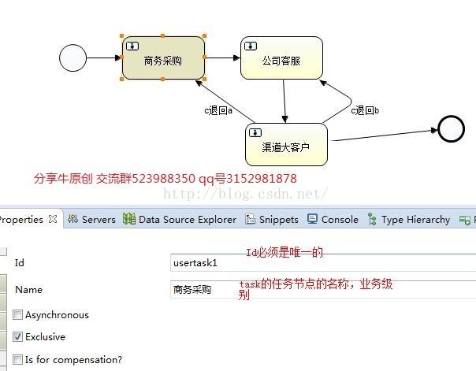
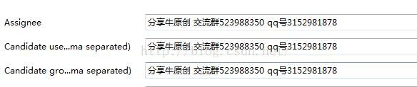
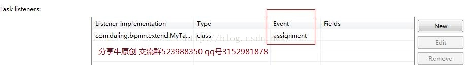
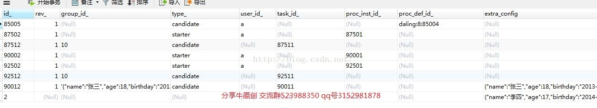

[TOC]


# activiti 任务节点 处理人设置

2016年04月23日 10:37:50


### 1.1.1. **前言**

**分享牛原创(尊重原创 转载对的时候第一行请注明，转载出处来自分享牛http://blog.csdn.net/qq_30739519)**

我们在使用activiti 工作流引擎的时候，最常用的肯定是任务节点，因为在OA系统、审批系统、办公自动化系统中核心的处理就是流程的运转，流程的运转依赖于人员如何设置，人员的设置是非常重要的一个环节，所以说如果能让activiti 工作流引擎运转的核心，就必须要支持强大的人员组织架构设计。下面我们先说一下activiti 工作流引擎自身支持的可以直接使用的地方。我们来看一下，人员如何设置。

### 1.1.2. **处理人分配方式**

处理人分配的方式有六种设置方式，可以让我们很轻松的结合业务来设置任务节点的处理人，如下图所示：

 

任务处理人的设置如下图所示：

 



 

 

下面，我们就看一下每一种方式的具体操作：

### 1.1.3. **act_ru_identitylink**

因为处理人除了直接设置指定人处理的方式，act_ru_identitylink表没有数据，其他的方式都是在这个表有记录的，所以还是很有必要说一下这个表结构，表结构如下图所示：

 

act_ru_identitylink表结构说明：

task_id 对应act_ru_task中的主键id_

type_:对应类别有starter流程实例的发起者、candidate：节点的候选人

group_id:候选组的id主键，

user_id:对应人的id_主键

rev_:版本号

**其中group_id、user_id不一定是activiti工作流引擎中人员组织关系，有可能使我们自定义的人员架构关系，这一点重点说明一下，因为后面的文章，我们会讲解如何扩展工作流人员架构**

### 1.1.4. **第一种方式assignee**

这种方式就是就是指定的具体处理人，xml配置信息对应如下所示：

```
<userTask id="usertask1" name="商务采购" activiti:assignee="分享牛原创" >
      <extensionElements>
</userTask>
```

**当我们运行的时候可以看到act_ru_task表中assignee_字段使我们设置的值**

### 1.1.5. **第二种方式assignee 变量方式**

这种方式就是就是指定的具体处理人，xml配置信息对应如下所示： 

```
<userTask id="usertask1" name="商务采购" activiti:assignee="${分享牛原创}" >
      <extensionElements>
  </userTask>
```


**运行的时候把当**"\${分享牛原创}"分享牛原创变量传递进去，也就是把${}里面的变量传递进去就可以，**我们运行的时候可以看到act_ru_task表中assignee_字段使我们设置的值，注意这个变量传递一定要在流程还没有到达这个任务节点的时候传递，否则当流程到达这个节点的时候，在传递变量就不行了。因为当前的节点设置的是下一个节点的变量值信息。**

### 1.1.6. **第三种方式 candidate 后候选组的方式**

这种方式就是就是指定多个人去处理，xml配置信息对应如下所示：  

```
<userTask id="usertask1" name="商务采购"  activiti:candidateUsers="分享牛原创">
</userTask>
```

**候选组使用的时候，多个就是，分割。比如我们需要设定当前的任务处理人是a、b、c三个人处理，那我们怎么设置呢？设置的时候，我们就设置为a,b,c即可。**

**当流程运转到当前的节点的时候a、b、c三个人都可以查询到代办信息，然后对应的操作。**

数据库的变化就是放在act_ru_identitylink中多了三条记录分别对应同一个任务id。可以参考上面说的act_ru_identitylink描述。

 

### 1.1.7. **第三中方式 candidate后候选组的方式 候选组是一个集合**

这种方式就是就是指定多个人去处理，xml配置信息对应如下所示：

```
<userTask id="usertask1" name="商务采购"  activiti:candidateUsers="${分享牛原创}">
</userTask>
```


设置的时候我们可以指定一个集合，这个集合变量，我们在程序运行的时候，也是，分割的形式，进行传递值，不过需要注意，这种方式必须是一个集合对象，而不是一个字符串类型。

看下面的两种方式赋值：

第一种方式：

​           String candidateUsers="a,b,c";

task.setVariable("分享牛原创", candidateUsers);

这种方式是错误的，程序运行的时候会报错，报错信息就是没有*分享牛原创这个集合。*

正确的方式如下：

String [] candidateUsers={"a","b","c"};

task.setVariable("分享牛原创", Arrays.*asList*(candidateUsers));

数据库的变化就是放在act_ru_identitylink中多了三条记录分别对应同一个任务id。可以参考上面说的act_ru_identitylink描述。

 

### 1.1.8. **第四种方式 角色的方式**

这种方式就是就是指定多角色去处理，xml配置信息对应如下所示：

```
 <userTask id="usertask1" name="商务采购" activiti:candidateGroups="分享牛原创">
</userTask>
```


**角色使用的时候，多个就是，分割。比如我们需要设定当前的任务处理角色是a、b、c三个角色处理，那我们怎么设置呢？设置的时候，我们就设置为a,b,c即可。**

**当流程运转到当前的节点的时候a、b、c三个角色都可以查询到代办信息，然后对应的操作。**

数据库的变化就是放在act_ru_identitylink中多了三条记录分别对应同一个任务id。可以参考上面说的act_ru_identitylink描述。

### 1.1.9. **第五种方式 角色的方式 变量方式**

这种方式就是就是指定多角色去处理，xml配置信息对应如下所示：

```
 <userTask id="usertask1" name="商务采购" activiti:candidateGroups="分享牛原创">

</userTask>
```


 设置的时候我们可以指定一个集合，这个集合变量，我们在程序运行的时候，也是，分割的形式，进行传递值，不过需要注意，这种方式必须是一个集合对象，而不是一个字符串类型。

看下面的两种方式赋值：

第一种方式：

​           String candidateUsers="a,b,c";

task.setVariable("分享牛原创", candidateUsers);

这种方式是错误的，程序运行的时候会报错，报错信息就是没有*分享牛原创这个集合。*

正确的方式如下：

String [] candidateUsers={"a","b","c"};

task.setVariable("分享牛原创", Arrays.*asList*(candidateUsers));

 

### 1.1.10. **第六种方式 监听器方式**

监听器方式，我们可以动态的控制，在这个监听器中，我们可以从数据库中查询出来对应的人或者角色中的人，变量的方式设置进去，达到灵活多用。

具体的监听器的配置如下：

具体的xml如下：

```xml
 <userTask id="usertask1" name="商务采购" >
      <extensionElements>
        <activiti:taskListener event="assignment" class="com.daling.bpmn.extend.MyTaskListener"></activiti:taskListener>
      </extensionElements>
 </userTask>
```

具体的监听实现类如下：

```java
public class MyTaskListener implements TaskListener {
    @Override
    public void notify(DelegateTask task) {
        String [] candidateUsers={"a","b","c"};
        task.setVariable("分享牛原创", Arrays.asList(candidateUsers));
    }
}
```


### 1.1.11. **总结**

 activiti 任务节点处理人的设置总结如下：

1.指定具体的处理人，可以使用变量方式设置人。也可以直接在模板中定义。

2.候选组，可以在模版中定义，不灵活。灵活的做法，可以指定一个变量赋值。

3.角色，可以在模版中定义，不灵活。灵活的做法，可以指定一个变量赋值。

4.可以使用任务监听器的方式进行赋值操作。

5.变量的方式比较灵活，模板中直接定义不灵活，因为处理节点的人或者角色可能变化。

### 1.1.12. **遗留点**

上面的几种方式我们总结了一下，第一就是指定人、组、角色，这典型是个一维的数据结构，但是实际的项目中，我们的人员关系，一般是，人、角色、部门，这是一个二维结构，很显然上面这种方式就不行了，因为程序是没有办法，同时去区到底是是角色还是部门，而且我们可能还要对角色、部门求交集、并集的需求以及更加复杂的运算，所以我们还是需要扩展工作流中人员设置这一块的。后续的章节详细的讲解。

**分享牛，分享、我们是快乐的。**


<https://blog.csdn.net/qq_30739519/article/details/51225067>