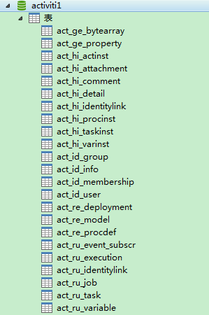
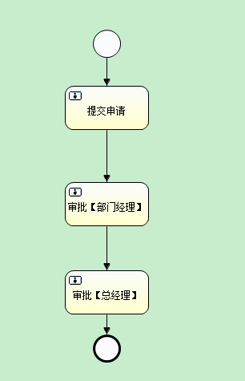

# 工作流学习——Activiti整体认识二步曲

2015年06月22日 17:47:32 [fightingKing](https://me.csdn.net/zwk626542417) 阅读数 22515

# **一、前言**

​     *在上一篇文章中我们将工作流的相关概念、**activiti**的前世今生、**activiti**与**jbpm**的比较进行学习，这篇文章我们正式进行**activiti**的学习，**activiti**的整个学习我们主要通过例子的形式来理解。今天我们主要是准备下**activiti**的环境，在数据库中创建**activiti**默认的**23**张表以及activiti核心对象ProcessEngine最后是一个**activiti**的简单**demo**。*

# **二、环境准备**

​    **相关软件及版本：**

 

​    *jdk**版本：**Jdk**1.8*

​    IDE:eclipse

​    *数据库：**mysql*

​    Activiti:5.13

 

​    ***eclipse******中安装流程设计器插件：***

 

​    eclipse打开help->install new software，单击add： 

​    Name: Activiti BPMN2.0 designer 

​    Location:http://activiti.org/designer/update/ 

进行安装即可。

 

​    ***引入******jar******包：***

 

​    *${Activiti_HOME}/install/activiti-5.13/libs（**activiti**相关包）**+mysql**对应驱动包（mysql-connector-java.jar）*

 

​    *jar**包引入完毕后，我们环境就准备的差不多了，往下我们就该创建我们**activiti**数据库默认的表了。*

 

# ***三、创建******activiti******表***

 

​    *在**activiti**中，相对于前身**jbpm**基础上又额外多了**5**张表，所有现在的**activiti**框架默认提供了**23**张表。所以第一步我们就来创建这**23**张表。*

 

## ***方法******1******：使用代码来创建******activiti******工作流的表***

```
方法1：使用代码来创建activiti工作流的表
 
// 使用代码创建工作流需要的23张表
@Test
public void createTable() {
	// 工作流引擎的全部配置
	ProcessEngineConfiguration processEngineConfiguration = ProcessEngineConfiguration
			.createStandaloneProcessEngineConfiguration();
 
	// 链接数据的配置
	processEngineConfiguration.setJdbcDriver("com.mysql.jdbc.Driver");
	processEngineConfiguration
			.setJdbcUrl("jdbc:mysql://localhost:3306/activiti1?createDatabaseIfNotExist=true&useUnicode=true&characterEncoding=utf8");
	processEngineConfiguration.setJdbcUsername("root");
	processEngineConfiguration.setJdbcPassword("123456");
 
	/*
	 * public static final String DB_SCHEMA_UPDATE_FALSE = "false";
	 * 不能自动创建表，需要表存在 public static final String DB_SCHEMA_UPDATE_CREATE_DROP
	 * = "create-drop"; 先删除表再创建表 public static final String
	 * DB_SCHEMA_UPDATE_TRUE = "true";如果表不存在，自动创建表
	 */
	//如果表不存在，自动创建表
	processEngineConfiguration
			.setDatabaseSchemaUpdate(processEngineConfiguration.DB_SCHEMA_UPDATE_TRUE);
	// 工作流的核心对象，ProcessEnginee对象
	ProcessEngine processEngine = processEngineConfiguration
			.buildProcessEngine();
	System.out.println(processEngine);
 
 
} 
```

​    代码执行完毕，我们通过navicat查看数据库会发现，创建了一个新的数据库activiti1，并且还有23张表。



 

 

## ***方式******2******：使用配置文件来创建******activiti******的表***

 

​    *在类路径下创建**Activiti.cfg.xml**文件，文件内容为：*


```
<beans xmlns="http://www.springframework.org/schema/beans"
	xmlns:context="http://www.springframework.org/schema/context" xmlns:tx="http://www.springframework.org/schema/tx"
	xmlns:xsi="http://www.w3.org/2001/XMLSchema-instance"
	xsi:schemaLocation="http://www.springframework.org/schema/beans http://www.springframework.org/schema/beans/spring-beans.xsd
http://www.springframework.org/schema/context http://www.springframework.org/schema/context/spring-context-2.5.xsd
http://www.springframework.org/schema/tx http://www.springframework.org/schema/tx/spring-tx-3.0.xsd">
 
 
	<bean id="processEngineConfiguration"
		class="org.activiti.engine.impl.cfg.StandaloneProcessEngineConfiguration">
		<!-- 连接数据的配置 -->
		<property name="jdbcDriver" value="com.mysql.jdbc.Driver"></property>
		<property name="jdbcUrl"
			value="jdbc:mysql://localhost:3306/activiti1?createDatabaseIfNotExist=true&useUnicode=true&characterEncoding=utf8"></property>
		<property name="jdbcUsername" value="root"></property>
		<property name="jdbcPassword" value="123456"></property>
		<!-- 没有表创建表 -->
		<property name="databaseSchemaUpdate" value="true"></property>
	</bean>
 
</beans> 
```


​    通过代码来加载配置文件中内容：

```
/**
 * 使用配置文件来创建数据库中的表
 */
@Test
public void createTable_2() {
	//通过让工作流引擎的全部配置对象来执行配置文件中的内容来创建流程引擎对象
	ProcessEngine processEngine = ProcessEngineConfiguration
			.createProcessEngineConfigurationFromResource(
					"activiti.cfg.xml").buildProcessEngine();
	System.out.println("processEngine" + processEngine);
} 
```

运行产生的结果与第一种是一样的，其中这一种通过配置文件的方式是用的是比第一种多的。

 

## 连接数据库url写法：

 

​    无论是通过代码还是通过*xml**文件来创建工作流的表，里面都涉及到一个知识点就是**mysql**的**url**的写法，我们进行下小结：*

 

​    \#autoReconnect当数据库连接丢失时是否自动连接，取值true/false 缺省为false

​    \#maxReconnects如果autoReconnect为true,此参数为重试次数，缺省为3次 

​    \#initialTimeout如果autoReconnect为true,此参数为重新连接前等待的秒数缺省为2

​    \#maxRows设置查询时返回的行数，0表示全部缺省为0

​    \#useUnicode是否使用unicode输出，true/false缺省为false

​    \#characterEncoding如果useUnicode,该参数制定encoding类型，建议使用utf8缺省为无

​    \#createDatabaseIfNotExist当JDBC连接指定数据库,如果此数据库不存在,此参数值为true时，则自动创建此数据库

​    *下面是一个**url**的例子：*

```
jdbc:mysql://localhost:3306/ourmysql?
createDatabaseIfNotExist=true&
amp;useUnicode=true&
amp;characterEncoding=utf8&
amp;autoReconnect=true&
amp;useLocalSessionState=true 
```


# **四、核心对象ProcessEngine**

 

​    数据库里的表创建完毕，接下来我们讲述activiti*里面的核心对象ProcessEngine。*

 

​    *ProcessEngine类，一般称为流程引擎类，没错，这个流程引擎就是我们上一篇文章中提到的流程引擎，它是**activiti**中最核心的类，并且这个类是线程安全的，所有的线程和请求都可以使用同一个ProcessEngine对象，其它常用类几乎也都是由它而来的。*

 

## **得到ProcessEngine对象**：

 

​    **方式1：使用classpath根目录下的默认配置文件jbpm.cfg.xml创建一个单例的ProcessEngine**

 


```
ProcessEngineprocessEngine = ProcessEngines.getDefaultProcessEngine();
```

​    方式2*：指定其他位置**:**配置文件，如src根目录config包下的my-jbpm-cfg.xml。*

 

```
ProcessEngineprocessEngine = ProcessEngineConfiguration
.createProcessEngineConfigurationFromResource("config/my-jbpm-cfg.xml").buildProcessEngine();
```


***得到各个******Service***

 

​    **RepositoryService**

 

​    RepositoryService是管理流程定义的仓库服务的接口。

 


```
RepositoryServicerepositoryService = processEngine.getRepositoryService();
```

​    

**RuntimeService**


 

​    RuntimeService是activiti的流程执行服务类。可以从这个服务类中获取很多关于流程执行相关的信息，如执行管理，包括启动、推进、删除流程实例等操作。

 


```
RuntimeServiceruntimeService = processEngine.getRuntimeService();
```

​    

**TaskService**


 

​    TaskService是activiti的任务服务类。可以从这个类中获取任务的信息。

 


```
TaskServicetaskservice = processEngine.getTaskService();
```

​    

**HistoryService**


 

​    HistoryService 是activiti的查询历史信息的类。在一个流程执行完成后，这个对象为我们提供查询历史信息。

 


```
HistoryServicehistoryService = processEngine.getHistoryService();
```

​    到这里关于activiti核心对象ProcessEngine先介绍这么多，下面看我们的小的

helloworld

的

demo

。


# *五、Demo流程*

 

## **第一步流程设计画出业务流程**

我们通过流程设计器就可以拖拖拽拽出我们的流程，同时设置相关属性，保存后会生成两个文件，分别是helloworld.bpmn和helloworld.png.

这是我们的流程图：



 

## **第二步 部署流程定义**

```java
/**
 * 部署流程定义
 */
@Test
public void deploymentProcessDefinition() {
	//创建核心引擎对象
	ProcessEngine processEngine = ProcessEngines.getDefaultProcessEngine();
	Deployment deployment = processEngine.getRepositoryService()// 与流程定义和部署对象相关的service
			.createDeployment()// 创建一个部署对象
			.name("helloworld入门程序")// 添加部署的名称
			.addClasspathResource("diagrams/helloworld.bpmn")// classpath的资源中加载，一次只能加载
																// 一个文件
			.addClasspathResource("diagrams/helloworld.png")// classpath的资源中加载，一次只能加载
															// 一个文件
			.deploy();// 完成部署
	System.out.println("部署ID:" + deployment.getId());
	System.out.println("部署名称：" + deployment.getName());
} 
```

运行结果：

​    部署ID:1

​    部署名称：helloworld入门程序

## 第三步 启动流程实例

```java
/**
 * 启动流程实例
 */
@Test
public void startProcessInstance() {
	// 流程定义的key
	String processDefinitionKey = "HelloWorld";
	ProcessInstance pi = processEngine.getRuntimeService()// 于正在执行的流程实例和执行对象相关的Service
			.startProcessInstanceByKey(processDefinitionKey);// 使用流程定义的key启动流程实例，key对应hellworld.bpmn文件中id的属性值，使用key值启动，默认是按照最新版本的流程定义启动
	System.out.println("流程实例ID:" + pi.getId());// 流程实例ID 101
	System.out.println("流程定义ID:" + pi.getProcessDefinitionId()); // 流程定义ID HelloWorld:1:4

```

运行结果为 

```
    流程实例ID:101
    流程定义ID:HelloWorld:1:4
```

 

## *第四步查询当前办理人的个人任务*

```
	/**
	 * 查询当前人的个人任务
	 */
	@Test
	public void findMyPersonTask() {
		String assignee = "张三";
		List<Task> list = processEngine.getTaskService()// 与正在执行的认为管理相关的Service
				.createTaskQuery()// 创建任务查询对象
				.taskAssignee(assignee)// 指定个人认为查询，指定办理人
				.list();
 
		if (list != null && list.size() > 0) {
			for (Task task:list) {
				System.out.println("任务ID:"+task.getId());
				System.out.println("任务名称:"+task.getName());
				System.out.println("任务的创建时间"+task);
				System.out.println("任务的办理人:"+task.getAssignee());
				System.out.println("流程实例ID:"+task.getProcessInstanceId());
				System.out.println("执行对象ID:"+task.getExecutionId());
				System.out.println("流程定义ID:"+task.getProcessDefinitionId());
				System.out.println("#################################");
			}
		}
	} 
```

运行结果：

```
    任务ID:104

    任务名称:提交申请

    任务的创建时间Task[id=104,name=提交申请]

    任务的办理人:张三

    流程实例ID:101

    执行对象ID:101

    流程定义ID:HelloWorld:1:4

    #################################

```

 

 

## 第五步 *完成任务*


```
/**
 * 完成我的任务
 */
@Test
public void completeMyPersonTask(){
	//任务Id
	String taskId="104";
	processEngine.getTaskService()//与正在执行的认为管理相关的Service
			.complete(taskId);
	System.out.println("完成任务:任务ID:"+taskId);
 
} 
```

运行结果：

 

```
    完成任务:任务ID:104
```

 

 

​    到这里我们就完成了一个简单的helloworld*，从画一个流程图、到部署流程定义、启动流程实例、查询当前办理人的任务、完成当前的任务，从第二步开始每一步在数据库中都会有相应的记录进行添加、删除、更新，我们运行产生的结果也都是从数据库中查出来的记录，关于每一步对应与数据库中怎样的变化，我们会在后续的文章继续介绍。*


# 六、后记

 

​    *我们本篇文章主要讲述了**activiti**的环境准备包含各个软件的版本和安装流程设计器，接下来我们讲解了两种方式来创建**activiti**的**23**张表，还夹杂着一个数据库连接**url**的写法，接下来是**activiti**核心对象**ProcessEngine**，以及通过**ProcessEngine**获取相关的**Service,**最后通过一个特别简单的小**demo**来让大家对部署流程定义、启动流程实例、查询当前任务、完成当前任务这些步骤有一个感性的认识，详细的内容我们会在后续文章继续介绍。*


<https://blog.csdn.net/zwk626542417/article/details/46594505>