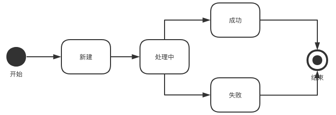
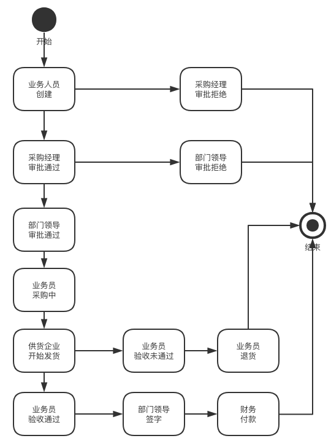
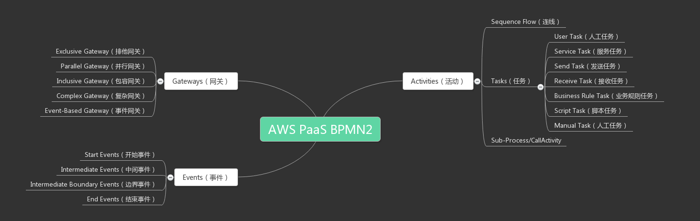
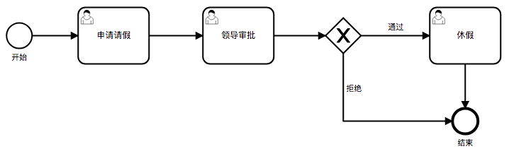
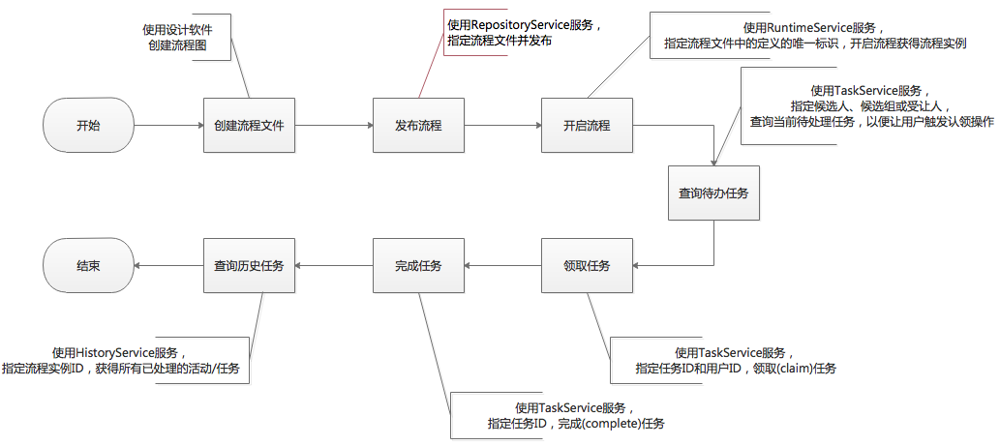

[TOC]


# 工作流引擎Activiti快速入门

2019-02-24

Activiti是一个用Java编写的开源工作流引擎，可以执行BPMN 2.0中描述的业务流程。Activiti是Alfresco的Alfresco Process Services (APS)的基础，而Alfresco是Activiti项目的主要赞助商。

本文旨在帮助读者理解Activiti的工作机制，使其可以迅速上手该框架。本文将从这几个方面简单介绍了Activiti工作流引擎：

1、为什么要使用工作流引擎

2、BPMN2.0规范简介

3、开源BPMN项目对比

4、Activiti核心API

5、常见API调用步骤

## 1. 为什么要使用工作流引擎

假定我们有一个支付订单状态需要维护，它的状态图如下：



它的状态跃迁自左向右，清晰名了，而且没有**处理角色**的概念，此时我们使用代码控制好状态流转即可，无需使用框架。

再来看另外一个场景，假定我们有一个企业内部采购订单，它的状态图如下：



这个采购订单的状态复杂多变，状态的转换不稳定性很强，随时有可能增加新的状态；而且不同状态的处理人也是不同的，存在权限管理功能，若此时我们仍然使用一个状态字段来维持状态变更，无疑会困难重重。

工作流引擎就是为了解决这类问题而生的，我们可以观察当前实体(如支付订单、采购订单)是否具有如下特性，由此来确定是否需要引入工作流引擎。

1. 状态的个数及其稳定性，个数多且不稳定，适合使用工作流引擎。
2. 每个状态的处理人，处理人角色多且不稳定，适合使用工作流引擎。

**工作流引擎**实际上是放大了状态管理的功能，它根据既有流程图（基于BPMN2规范）的指示，指定每一次状态跃迁的处理角色，在状态变更时持久化评论、表单、附件等数据，保存了完整处理轨迹。

> **工作流引擎 vs 规则引擎**
>
> 1. 工作流更像是管理状态跃迁的，规则引擎不关心状态跃迁，它关注的是处理过程中复杂条件的组合。
> 2. 工作流引擎中包含“人”的任务，天生包含处理人角色控制；规则引擎不关心“人”的任务，不做特殊区分。
> 3. 工作流引擎是宏观控制、规则引擎是微观控制。
>    常有人拿这两块内容做对比，笔者理解他们的侧重完全不同，没有太大的可比性。

## 2. BPMN2.0规范简介

业务流程模型和标记法（BPMN, Business Process Model and Notation）是一套图形化表示法，用于以图形的方式详细说明各种业务流程。

它最初由业务流程管理倡议组织（BPMI, Business Process Management Initiative）开发，名称为”Business Process Modeling Notation”，即“业务流程建模标记法”。BPMI于2005年与对象管理组织（OMG, Object Management Group）合并。2011年1月OMG发布2.0版本（时至今日，没人会用1.0版本了），同时改为现在的名称。

BPMN2.0规范的实现，实质上是一个按照特定规范编写的XML文件，使用特定的BPMN设计器，即可以图形化的形式查看和编辑该文件。Activiti以代码的形式实现了这套图形化表示法，使任务的流转依赖图形，而非具体的实现代码。

> **UML vs BPMN**
> UML和BPMN之间唯一的正式关系是OMG维护两个开放标准。
> UML(统一建模语言)作为一种可视化的建模语言，其中的活动图也适用于流程建模，但其支持深度不够。
> BPMN诞生时间晚于UML，据称从某种意义上讲，UML Activity Diagrams是BPMN的一个子集，也是BPMN的历史前身。



如上图所示，BPMN2.0规范包含了三个部分Gateway(网关)、Event(事件)、Activities(活动)。

下面我们通过一个简单的流程定义文件来理解BPMN2.0规范。读者也可以访问这个[在线设计站点](https://demo.bpmn.io/)来加速理解。



上图是通过BPMN设计器设计出来的简单流程，使用文本编辑器打开这个后缀为bpmn的文件，得到如下内容（[点击链接查看完整文件](http://ypk1226.com/images/2019/03/diagram.bpmn)）。可以发现BPMN2.0规范包含了三个部分在文件中都有体现：

1. **Gateway(网关)**：exclusiveGateway-排他网关，在做判断时使用，除了排他网关还有几个其它类型的网关。
2. **Event(事件)**：startEvent-开始事件、endEvent-结束事件，规范要求一个完整流程图必须包含这两个部分。
3. **Activities(活动)**：task-任务、sequenceFlow-连接线，活动是流程的主体部分，内部包含的类型相对较多。

```
<?xml version="1.0" encoding="UTF-8"?>
<bpmn:definitions xmlns:xsi="http://www.w3.org/2001/XMLSchema-instance" xmlns:bpmn="http://www.omg.org/spec/BPMN/20100524/MODEL" xmlns:bpmndi="http://www.omg.org/spec/BPMN/20100524/DI" xmlns:dc="http://www.omg.org/spec/DD/20100524/DC" xmlns:di="http://www.omg.org/spec/DD/20100524/DI" id="Definitions_0pbqtyh" targetNamespace="http://bpmn.io/schema/bpmn" exporter="bpmn-js (https://demo.bpmn.io)" exporterVersion="3.2.1">
  <bpmn:process id="Process_0dechmy" isExecutable="false">
    <bpmn:startEvent id="StartEvent_1jlefdo" name="开始">
      <bpmn:outgoing>SequenceFlow_10f0wz2</bpmn:outgoing>
    </bpmn:startEvent>
    <bpmn:sequenceFlow id="SequenceFlow_10f0wz2" sourceRef="StartEvent_1jlefdo" targetRef="Task_19nyecg" />
    <bpmn:sequenceFlow id="SequenceFlow_0jyecs7" sourceRef="Task_19nyecg" targetRef="Task_144tinh" />
    <bpmn:exclusiveGateway id="ExclusiveGateway_0etavhv">
      <bpmn:incoming>SequenceFlow_14jzbq9</bpmn:incoming>
      <bpmn:outgoing>SequenceFlow_1kxhbdq</bpmn:outgoing>
      <bpmn:outgoing>SequenceFlow_18w6f66</bpmn:outgoing>
    </bpmn:exclusiveGateway>
    <bpmn:sequenceFlow id="SequenceFlow_14jzbq9" sourceRef="Task_144tinh" targetRef="ExclusiveGateway_0etavhv" />
    <bpmn:sequenceFlow id="SequenceFlow_1kxhbdq" name="通过" sourceRef="ExclusiveGateway_0etavhv" targetRef="Task_1m6ft2w" />
    <bpmn:endEvent id="EndEvent_1xqrowc" name="结束">
      <bpmn:incoming>SequenceFlow_1i6l681</bpmn:incoming>
      <bpmn:incoming>SequenceFlow_18w6f66</bpmn:incoming>
    </bpmn:endEvent>
    <bpmn:sequenceFlow id="SequenceFlow_1i6l681" sourceRef="Task_1m6ft2w" targetRef="EndEvent_1xqrowc" />
    <bpmn:sequenceFlow id="SequenceFlow_18w6f66" name="拒绝" sourceRef="ExclusiveGateway_0etavhv" targetRef="EndEvent_1xqrowc" />
    <bpmn:userTask id="Task_19nyecg" name="申请请假">
      <bpmn:incoming>SequenceFlow_10f0wz2</bpmn:incoming>
      <bpmn:outgoing>SequenceFlow_0jyecs7</bpmn:outgoing>
    </bpmn:userTask>
    <bpmn:userTask id="Task_144tinh" name="领导审批">
      <bpmn:incoming>SequenceFlow_0jyecs7</bpmn:incoming>
      <bpmn:outgoing>SequenceFlow_14jzbq9</bpmn:outgoing>
    </bpmn:userTask>
    <bpmn:userTask id="Task_1m6ft2w" name="休假">
      <bpmn:incoming>SequenceFlow_1kxhbdq</bpmn:incoming>
      <bpmn:outgoing>SequenceFlow_1i6l681</bpmn:outgoing>
    </bpmn:userTask>
  </bpmn:process>
  <bpmndi:BPMNDiagram id="BPMNDiagram_1">
    <!-- 篇幅问题，省略了图形坐标相关的内容 -->
  </bpmndi:BPMNDiagram>
</bpmn:definitions>
```

## 3. 开源BPMN项目对比

BPMN2.0规范目前已成为流程处理事实上的标准，实现该规范的常见开源项目有这三个：jBPM，Activiti，Camunda。

他们实现的功能比较相似，源头上它们存在递进关系：jBPM –> Activiti –> Camunda。jBPM是最早诞生的，Activiti的发起人是从jBPM项目中脱离出来的，Camunda BPM的发起人是从Activiti项目中脱离出来的。之所以存在三个同源项目，是由于开发者们对工作流引擎的期望存在分歧。

从技术组成来看，Activiti最大的优势是采用了PVM（流程虚拟机），支持除了BPMN2.0规范之外的流程格式，与外部服务有良好的集成能力，延续了jBPM3、jBPM4良好的社区支持，服务接口清晰，链式API更为优雅；劣势是持久化层没有遵循JPA规范。

jBPM最大的优势是采用了Apache Mina异步通信技术，采用JPA/JTA持久化方面的标准，以功能齐全的Guvnor作为流程仓库，有RedHat的专业化支持；但其劣势也很明显，对自身技术依赖过紧且目前仅支持BPMN2。

至于Camunda BPM 7战略目标是“开发者友好”，jBPM则致力于“零代码”的思想，而Camunda BPM与Activiti的区别零碎且不明显。

| 项目名称    | 企业     | 开始时间 | 开源方式           | 部署方式             |
| ----------- | -------- | -------- | ------------------ | -------------------- |
| jBPM        | Red Hat  | 2006     | 社区版和企业版相同 | 支持嵌入式和独立部署 |
| Activiti    | Alfresco | 2010     | 社区版和企业版不同 | 支持嵌入式和独立部署 |
| Camunda BPM | Camunda  | 2012     | 社区版和企业版不同 | 支持嵌入式和独立部署 |

事实上三者的区别非常多，但随时时间的推移和版本迅速迭代，很多功能存在重叠，现在很难说哪个项目更强一些。当然，Camunda BPM出现时间最晚，社区也比较有活力，有文章([5 Reasons to switch from Activiti to Camunda](http://www.bpm-guide.de/2016/10/19/5-reasons-to-switch-from-activiti-to-camunda/))声称其比Activiti更具优势。

Activiti的发展历史：

2010年3月，jBPM的两位主要开发人员Tom Baeyens和Joram Barrez 离开了Red Hat，并成为了Alfresco员工的Activiti 。Activiti基于他们使用jBPM的工作流程经验，但它是一个新的代码库，不基于任何以前的jBPM 代码。

Activiti的第一个版本是5.0，表明该产品是他们通过jBPM 1到4获得的经验的延续。

2016年10月，Barrez，Rademakers（Activiti in Action的作者）和其他贡献者离开了Alfresco。离职的开发人员分叉了Activiti代码，开始了一个名为[Flowable](https://en.wikipedia.org/wiki/Flowable)的新项目。

2017年2月，Activiti的新商业版本发布并更名为Alfresco Process Services。

2017年5月，Activiti发布了6.0.0版本，对ad-hoc子流程和新的应用程序用户界面提供了新的支持。

2017年7月，Activiti发布了7.x版本, 向微服务架构迈进，进行大规模设计升级；可以与Spring Cloud生态轻松集成。

## 4. Activiti核心API

Activiti中包含了几个核心的Service接口，它们是开发者调用Activiti API的入口。

| 名称                | 说明                                                         |
| ------------------- | ------------------------------------------------------------ |
| `ProcessEngine`     | 流程引擎，可以获得其他所有的Service。                        |
| `RepositoryService` | Repository中存储了流程定义文件、部署和支持数据等信息；RepositoryService提供了对repository的存取服务。 |
| `RuntimeService`    | 提供启动流程、查询流程实例、设置获取流程实例变量等功能。     |
| `TaskService`       | 提供运行时任务查询、领取、完成、删除以及变量设置等功能。     |
| `HistoryService`    | 用于获取正在运行或已经完成的流程实例的信息。                 |
| `FormService`       | 提供定制任务表单和存储表单数据的功能，注意存储表单数据可选的功能，也可以向自建数据表中提交数据。 |
| `IdentityService`   | 提供对内建账户体系的管理功能，注意它是可选的服务，可以是用外部账户体系。 |
| `ManagementService` | 较少使用，与流程管理无关，主要用于Activiti系统的日常维护。   |

完成一次流程的处理，常见步骤以及他们使用的Service如下图所示：



现在再来介绍一些常见概念，在这些概念共同配合协作下，工作流引擎得以发挥出巨大威力：

#### 4.1 流程 & 流程实例

流程由遵守BPMN2.0规范的xml文件指定，定义流程即完成流程文件的设计。

流程发布后，使用RuntimeService可以开启一个流程实例，每个流程可以开启N次流程实例，且实例之间的数据相互隔离。

#### 4.2 用户任务

用户任务是BPMN2.0规范中Activities(活动)组件下的重要组成部分，在Activiti中对应Task类；区别于其他类型的任务，用户任务需要进行领取操作，不会自动执行，且领取从待处理任务列表中移除，其他候选人不可见。

#### 4.3 用户 & 角色

Activiti中内建了一个简单的账户体系，用户和角色是多对多的关系；IdentityService中提供了对用户、角色操作的API。

另外，用户、角色与任务的联系，仅仅通过userId或groupId，不要求必须使用内建账户体系；由于内建的过于简单，开发者完全可以使用自有的账户体系。

#### 4.4 受让人、候选人、候选组

对用户任务做领取操作(claim)，即指定了该任务的受让人，每个任务只能有一个受让人，不能多次领取（但可以再次转让）。

任务的候选人和候选组支持配置多个，目的是指定处理该任务的人，不在候选列表中的人不允许处理该任务。另外，候选人、候选组可以流程文件中指定，也可以在监听事件中动态指定。

#### 4.5 变量

Activiti支持以key/value的形式，对变量做持久化处理。变量通常有两个重要作用：

1、存储一些跟流程相关的业务数据，例如处理任务时提交的表单数据

2、流程定义文件中，可以通过UEL表达式获取存储的变量，例如，在互斥网关中选择正确的传出顺序流。

> **UEL表达式**
>
> UEL是java EE6规范的一部分，UEL（Unified Expression Language）即统一表达式语言，Activiti支持两个UEL表达式：UEL-value和UEL-method。

从类别上讲，变量可以分为三类：

| 名称         | 是否持久化 | 方法名                    | 说明                                                         |
| ------------ | ---------- | ------------------------- | ------------------------------------------------------------ |
| 流程变量     | 是         | setVariable               | 跟随流程实例，当前流程实例共享流程变量。                     |
| 本地变量     | 是         | setVariableLocal          | 跟随活动节点，不同节点之间不共享变量。                       |
| 流程瞬时变量 | 否         | setTransientVariable      | 跟随流程实例，只能在下一个“等待状态”之前访问它，“等待状态”表示当前流程实例中数据持久化的点。 |
| 流程本地变量 | 否         | setTransientVariableLocal | 跟随活动节点，只能在下一个“等待状态”之前访问它，“等待状态”表示当前流程实例中数据持久化的点。 |

> **注意**
>
> TaskService的setVariableLocal方法签名如下
> `void setVariable(String executionId, String variableName, Object value)`
> 该方法传入了任务的executionId作为参数，但它存储的仍然是**流程变量**；流程变量还是本地变量是通过方法名称确定的，与使用RuntimeService还是TaskService没有关系。

#### 4.6 表单

用户处理任务时，通常需要填写备注说明等表单数据，Activiti的FormService对此提供了支持，表单实现如下三种可选的方式：

| 名称     | 开启方式                                                     | 数据存储位置                              |      |
| -------- | ------------------------------------------------------------ | ----------------------------------------- | ---- |
| 动态表单 | 流程定义文件中的activiti:formProperty属性                    | 与变量一样，以key/value的形式存储在变量表 |      |
| 外置表单 | 流程定义文件中的activiti:formkey属性                         | 与变量一样，以key/value的形式存储在变量表 |      |
| 普通表单 | 脱离Activiti掌控，开发人员自行创建表单和数据表，并使表单和任务关联即可 | 任意位置                                  |      |

三种方式中，**动态表单**由于无法指定样式，使用场景不多；**外置表单**的赋值和提交都依托Activiti引擎。

在此，笔者建议使用第三种方式**普通表单**，它的页面渲染赋值都由个人掌控，Activiti仅负责流程流转相关工作，页面渲染部分保持独立会使结构更清晰。

#### 4.7 监听器

任务执行时，开发者常常需要触发一些自定义的动作，如动态分配候选人、任务结束时发送通知等；Activiti为开发者提供了两种方式来满足此类需求。

##### 4.7.1 执行监听器（Execution listener）

执行侦听器意味着侦听一组有限的流程执行操作，如start、end和take，开发者可以在启动或结束之前添加一些特定的业务逻辑。执行监听器需要实现`ExecutionListener`或`TaskListener`。

在流程文件中使用activiti:executionListener标签，指定具体的监听类，如下：

```
<!-- 1. 执行监听器的三种指定方式 -->
<activiti:executionListener class="org.activiti.examples.bpmn.executionlistener.ExampleExecutionListenerOne" event="start" />
<activiti:executionListener expression="${myPojo.myMethod(execution.event)}" event="start" />
<activiti:executionListener delegateExpression="${testExecutionListener}" event="start">
<!-- 2. 任务监听器的三种指定方式 -->
<activiti:taskListener event="create" class="org.activiti.MyTaskCreateListener" />
<activiti:taskListener event="create" expression="${myObject.callMethod(task, task.eventName)}" />
<activiti:taskListener event="create" delegateExpression="${myTaskListenerBean}" />
```


##### 4.7.2 事件监听器（Event Listener）

事件监听器可以监听Activiti引擎抛出的一组大型事件，这些事件级别较低，类型非常丰富，触发次数也较多。

创建ProcessEngine时，可以通过eventListeners属性指定事件监听器（也可以运行时通过RuntimeService.addEventListener的方式添加），事件监听器需要实现ActivitiEventListener接口；每当流程实例产生变化时，监听器都能得到通知消息，点击[事件类型列表](https://www.activiti.org/userguide/#eventDispatcherEventTypes)查看所有通知类型。

使用这种方式引入的监听器，可以与流程定义文件解耦，是流程文件不再依赖Java代码。另外，事件监听器也支持在流程定义文件中声明，格式如下：

```
<activiti:eventListener class="org.activiti.engine.test.MyEventListener" />
<activiti:eventListener delegateExpression="${testEventListener}" events="JOB_EXECUTION_SUCCESS,JOB_EXECUTION_FAILURE" />
```

> **执行监听器 vs 事件监听器**
>
> 二者都可以对活动节点进行监听，执行监听器粒度较大，事件监听器粒度较小。出于便于维护的目的，笔者建议使用事件监听器，将事件监听和流程文件分开管理。

## 5. 常见API调用步骤

> **注意**
> 本节示例代码，全部是基于Activiti 6.0.0版本的。

### 5.1 画流程图

流程图本质是一个符合BPMN2.0规范的xml文件，由拖拽式的设计软件完成，这里推荐几个：

[BPMN2 Modeler](https://www.eclipse.org/bpmn2-modeler/):Eclipse插件。

[BPMN diagram](https://demo.bpmn.io/):一个在线编辑器。

[Yaoqiang BPMN Editor](https://sourceforge.net/projects/bpmn/):Java编写的客户端。

### 5.2 部署流程

```
Deployment deployment = repositoryService.createDeployment().addZipInputStream(zip).deploy();
```

如果Activiti和Spring集成后，`activiti-spring`提供了启动服务时自动部署流程的功能，它将在启动时检查流程文件是否有更新，以此决定是否再次部署。

### 5.3 开启流程

```
ProcessInstance processInstance = runtimeService.startProcessInstanceByKey(processDefinitionKey, businessKey, variables);
```

`processDefinitionKey`：流程定义文件中定义的文件唯一标识。
`businessKey`：参数为外部业务实体的唯一标识，比如采购订单的订单编号。
`variables`：以Map的形式传入一组流程实例。

### 5.3 查询待办任务

```
List<Task> list1 = taskService.createTaskQuery().taskCandidateOrAssigned(userId).list();
List<Task> list2 = taskService.createTaskQuery().taskCandidateGroup(groupId).list();
List<Task> list3 = taskService.createTaskQuery().or().taskCandidateOrAssigned(userId).taskCandidateGroup(groupId).endOr().list();
```

`taskCandidateOrAssigned`: 查询候选人或受让人是指定userId的任务
`taskCandidateGroup`：查询候选组是指定groupId的任务
`or和endOr`：查询候选人或受让人是指定userId、或选组是指定groupId的任务；在or和endOr之间的条件，将被“或”分割。

注意使用taskService查询得到的Task，都是未完成的，任务一旦完成就不能再通过taskService查询了，应改用`HistoryService`。

### 5.3 认领并处理任务

```
taskService.claim(taskId, userId);
```

指定用户认领指定任务，即指定了该任务的受让人(Assignee）。

认领后该任务再使用taskService的`taskCandidateUser`查询就查询不到了，只能根据`taskAssignee`进行查询；这就是所谓对受让人之外的其他人不可见。

### 5.3 查询历史数据

```
List<HistoricActivityInstance> list1 = historyService.createHistoricActivityInstanceQuery().processInstanceId(processInstanceId).orderByHistoricActivityInstanceId().list();
List<HistoricTaskInstance> list2  = historyService.createHistoricTaskInstanceQuery().processInstanceId(processInstanceId).orderByHistoricActivityInstanceId().list();
```

`createHistoricActivityInstanceQuery`: 查询流程下所有的活动，可以在这个查询中获得一个流程实例的完整轨迹。有别于BPMN2.0规范中的Activities，它既包含了任务(Task)、也包含了网关(Gateway)。
`createHistoricTaskInstanceQuery`: 查询流程下所有的任务，可以在这个查询中获得一个流程实例中所有的任务。

## 6. 小结

笔者在刚刚学习Activiti时，在一些基础原理上困惑了一段时间，事实上只要理解了工作流引擎的大致工作流程，再回过头来熟悉Activiti提供的API，无疑会容易理解许多，这也是笔者写这篇入门贴的初衷。

另外，本文示例代码片段大多摘自官方示例，对于想要直接看Example的读者，可以查看前辈**咖啡兔**的[kft-activiti-demo](https://github.com/henryyan/kft-activiti-demo)或[官方示例](https://github.com/Activiti/activiti-examples)。

## 参考的文章

[Activiti User Guide](https://www.activiti.org/userguide/)
[AWS BPMN2 Process参考指南](https://docs.awspaas.com/reference-guide/aws-paas-process-reference-guide/index.html)
[BPMN FAQ – What Is the Relationship Between BPMN and UML?](http://blog.goodelearning.com/subject-areas/bpmn/bpmn-faq-relationship-bpmn-uml/)
[BPMN (Business process modeling and notation) vs UML](https://stackoverflow.com/questions/25471548/bpmn-business-process-modeling-and-notation-vs-uml)
[Comparing and Contrasting Open Source BPM Projects](https://medium.com/capital-one-tech/comparing-and-contrasting-open-source-bpm-projects-196833f23391)
[Camunda BPM 7 compared to JBoss jBPM 6](https://camunda.com/learn/whitepapers/camunda-bpm-vs-jboss/)
[Activiti 7 Kick Off Roadmap](https://salaboy.com/2017/07/05/activiti-7-kick-off-roadmap/)
[Activiti中三种不同的表单及其应用](https://blog.csdn.net/hj7jay/article/details/50855510)
[Event Handlers Vs ExecutionListener](https://community.alfresco.com/thread/225988-event-handlers-vs-executionlistener)
[activiti和jbpm工作流引擎哪个比较好?](https://www.zhihu.com/question/52166998)


- [activiti](javascript:void(0))


- [workflow](http://ypk1226.com/categories/workflow//)


扫一扫，分享到微信


<http://ypk1226.com/2019/02/24/workflow/activiti-1/>