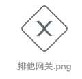
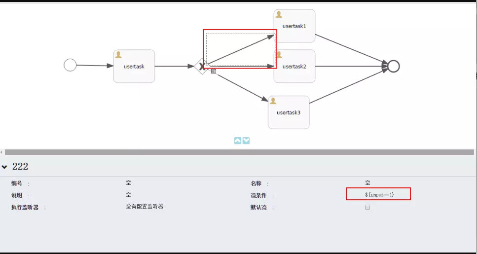
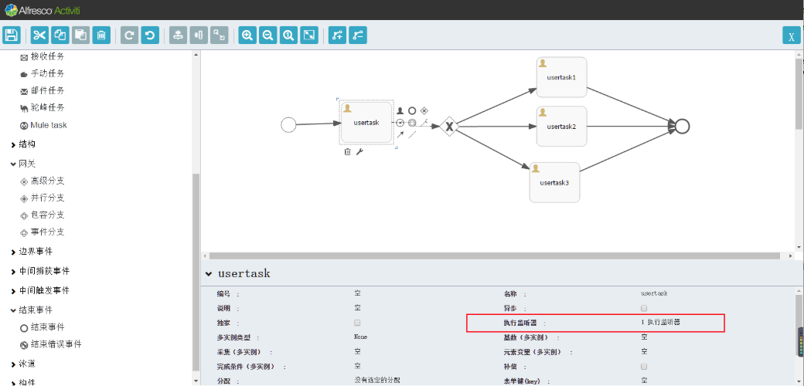
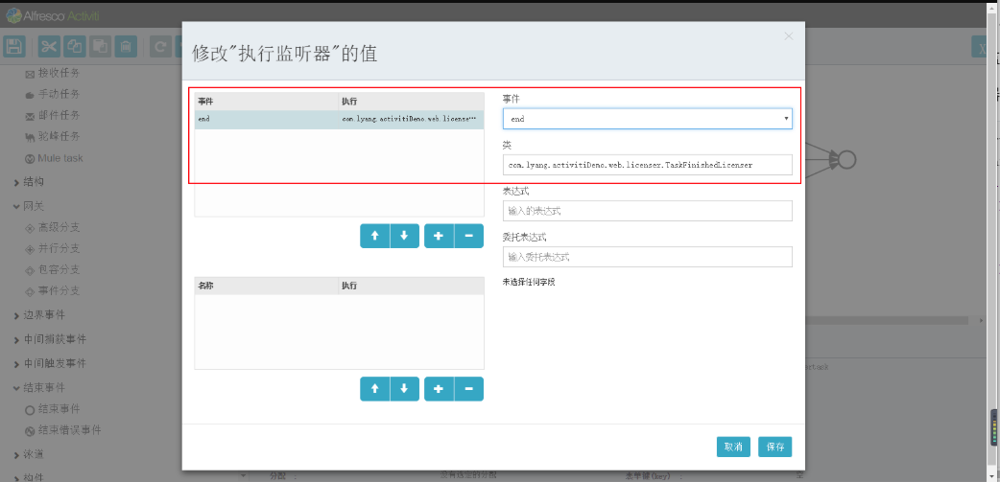
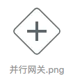
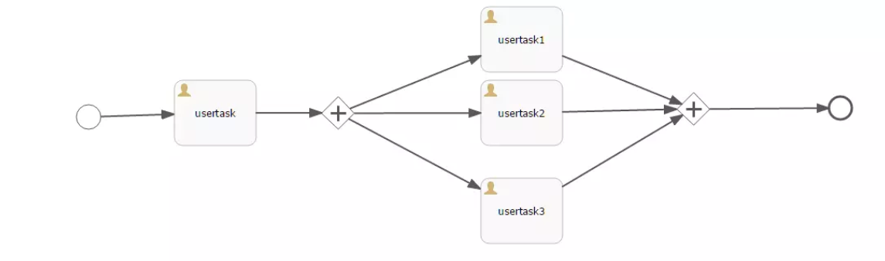

[TOC]


# 说一说activiti中的排他网关和并行网关

0.5522016.10.11 23:20:41字数 890阅读 12979

activiti工作流中我们经常用到的网关有两种：

## 1. Exclusive Gateway 排他网关



> 排他网关（也叫异或（XOR）网关，或更技术性的叫法 基于数据的排他网关）， 用来在流程中实现决策。 当流程执行到这个网关，所有外出顺序流都会被处理一遍。 其中条件
> 解析为true的顺序流（或者没有设置条件，概念上在顺序流上定义了一个'true'） 会被选
> 中，让流程继续运行。

> **注意这里的外出顺序流 与 BPMN 2.0 通常的概念是不同的。通常情况下，所有条件结果> 为true的顺序流 都会被选中，以并行方式执行，但排他网关只会选择一条顺序流执行。就是说，虽然多个顺序流的条件结果为true， 那么XML中的第一个顺序流（也只有这一条）会被选中，并用来继续运行流程。 如果没有选中任何顺序流，会抛出一个异常**

排他网关定义非常直接，在xml里面就一句

```xml
<exclusiveGateway id="exclusiveGw" name="Exclusive Gateway" />

<sequenceFlow id="flow2" sourceRef="exclusiveGw" targetRef="theTask1">
  <conditionExpression xsi:type="tFormalExpression">${input == 1}</conditionExpression>
</sequenceFlow>

<sequenceFlow id="flow3" sourceRef="exclusiveGw" targetRef="theTask2">
  <conditionExpression xsi:type="tFormalExpression">${input == 2}</conditionExpression>
</sequenceFlow>

<sequenceFlow id="flow4" sourceRef="exclusiveGw" targetRef="theTask3">
  <conditionExpression xsi:type="tFormalExpression">${input == 3}</conditionExpression>
</sequenceFlow>
```



排他网关示意图.png

上图是使用activiti modeler在线设计时候的截图

排他网关有点像java里面 if ... else if ... 每一个分支线上都要指定一个条件，可以有多条分支线，分支线的的变量需要在网关之前就设置到流程变量中。

** 举个栗子，可以在我上面图里面usertask这个节点添加一个执行监听器 **



添加执行监听器.png



添加执行监听器.png

执行监听器代码

```java
@Service("taskFinishedLicenser")
@Transactional(propagation = Propagation.NOT_SUPPORTED)
public class TaskFinishedLicenser implements ExecutionListener {
    private static final long serialVersionUID = 2105979050046650949L;

    @Override
    public void notify(DelegateExecution execution){
        try{
            //set global flow varible
            execution.getEngineServices().getRuntimeService().setVariableLocal(execution.getProcessInstanceId(),"input",1);
        }catch(Exception e){
            execution.getEngineServices().getRuntimeService().setVariableLocal(execution.getProcessInstanceId(),"input",2);
            logger.error(e.getMessage());
        }
    }
}
```

设置了流程变量后，分支条件获取的时候就可以读取到变量了。

## 2. Parallel Gateway 并行网关



并行网关.png

> 网关也可以表示流程中的并发情况。最简单的并发网关是 并行网关，它允许将流程分成
> 多条分支，也可以把多条分支 汇聚到一起。
> 并行网关的功能是基于进入和外出的顺序流的：
>
> - 分支： 并行后的所有外出顺序流，为每个顺序流都创建一个并发分支。
> - 汇聚： 所有到达并行网关，在此等待的进入分支， 直到所有进入顺序流的分支都到达以后， 流程就会通过汇聚网关。

> 注意，如果同一个并行网关有多个进入和多个外出顺序流， 它就同时具有分支和汇聚功
> 能。这时，网关会先汇聚所有进入的顺序流，然后再切分成多个并行分支。
>
> ##### **与其他网关的主要区别是，并行网关不会解析条件。 即使顺序流中定义了条件，也会被忽略。**

这里需要强调的是，** 并行网关一定是成对出现的，有分支也要有汇聚 **

** 一个分支执行完毕后，需要等待其他分支全部执行完流程才会走到下一个节点 **

还有一个有意思的点是，流程开始执行后，点击流程监控发现，执行到并行网关中间的节点时，当前执行节点是显示在并行网关节点上，并不会显示到中间具体的一个节点，所以activiti是把两个并行节点间的所有任务节点，看作是一个事务。



并行网关.png

```xml
<startEvent id="theStart" />
<sequenceFlow id="flow1" sourceRef="theStart" targetRef="fork" />

<parallelGateway id="fork" />
<sequenceFlow sourceRef="fork" targetRef="receivePayment" />
<sequenceFlow sourceRef="fork" targetRef="shipOrder" />

<userTask id="receivePayment" name="Receive Payment" />  
<sequenceFlow sourceRef="receivePayment" targetRef="join" />

<userTask id="shipOrder" name="Ship Order" /> 
<sequenceFlow sourceRef="shipOrder" targetRef="join" />

<parallelGateway id="join" />
<sequenceFlow sourceRef="join" targetRef="archiveOrder" />

<userTask id="archiveOrder" name="Archive Order" /> 
<sequenceFlow sourceRef="archiveOrder" targetRef="theEnd" />

<endEvent id="theEnd" />
```


https://www.jianshu.com/p/51d9052c3799