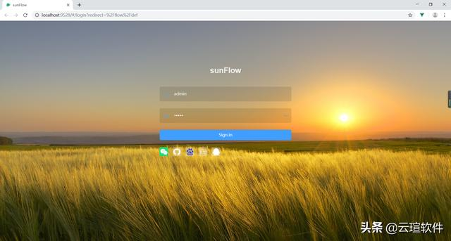
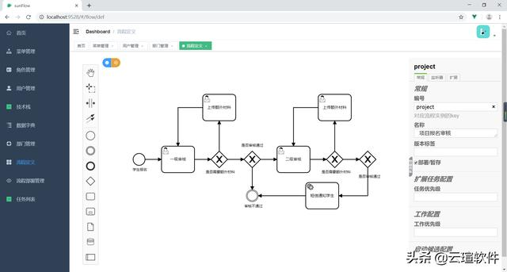
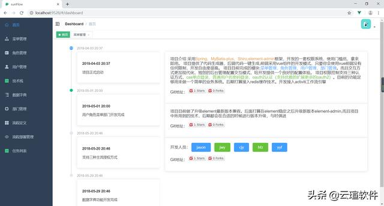
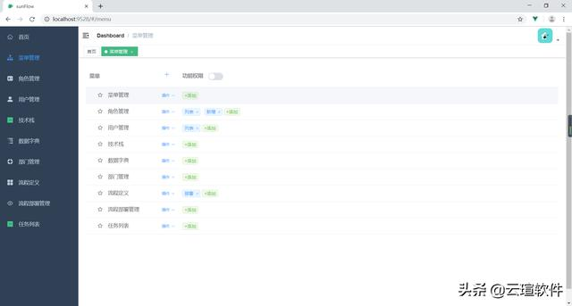
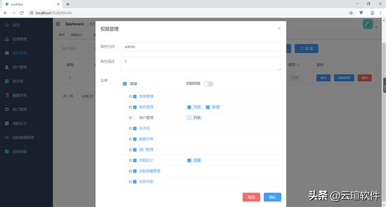
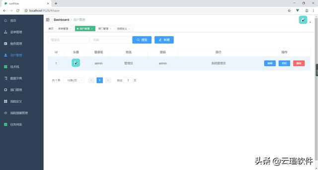

# 基于camunda开发的工作流web系统

云瑄软件 2019-07-08 09:09:02

# sunFlow

# 介绍

sunFlow基于是基于camunda开发的工作流web系统。设计理念是易用，简单，美观，高效。 尤其注重对开发友好； 项目设计之初就考虑了前后端分离的vue开发模式。角色和路由之间的绑定跟角色和数据权限之间是不耦合的。前端开发只需要开发路由组件， 后端开发只需要开发 数据api接口。从菜单配置界面上分前端做的是左边的部分，后端是开发右边的部分，当然如果你不用工作流只用后台权限管理本框架也是一个绝佳的选择。

# 软件架构

软件架构说明：目前项目分三个模块，camunda（工作流相关服务），upms-server(后台权限管理模块)，webApp(前端模块) camunda模块用到camunda-7.1,spring-boot 2.0，工作流绘制工具使用的是bpmn-js进行的汉化。 upms-server模块使用spring-boot 2.0用于通过提供api的方式给前端调用来管理系统权限。 webApp模块为前端模块，系统所有的页面功能都集中在该模块中。前后端完全分离。使用的技术为vue 2.0 ,element-admin模板; 系统数据库采用mysql，缓存采用redis， vue代码规范：格式为eslint

# 系统截图

登录页面

绘制流程

首页

菜单管理

角色权限

用户管理

# 安装教程

1. 执行doc下面的sql脚本到mysql数据库中，配置项目的数据链接
2. 后端启动spring-boot项目Application#main
3. 前端运行cd webapp ; npm install ; npm run dev

项目地址：https://gitee.com/cangjingge/sunFlow

<https://www.toutiao.com/a6711093172195295758/?tt_from=android_share&utm_campaign=client_share×tamp=1562594240&app=news_article&utm_medium=toutiao_android&req_id=201907082157200100170382284151EB0&group_id=6711093172195295758>