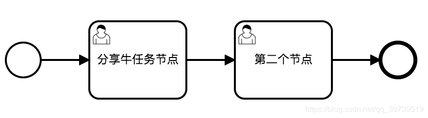
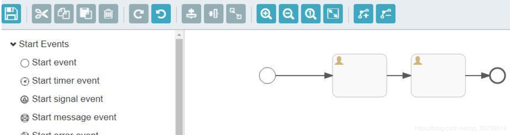

[TOC]


# flowable camunda activiti 功能对比

2019年01月28日 22:13:18

​    

flowable camunda activiti 三个框架都是从jbpm框架诞生出来的，先是有jbpm4,然后出来了一个activiti5,activiti5发展一段时间，又出来了一个Camunda。activiti5发展了4年，紧接着出来了一个flowable。本文重点对flowable camunda两个框架的功能对比。对比的camunda版本是7.10.0，flowable框架的版本是6.4.1.

# 设计器对比

camunda有一个eclipse插件设计器，还有一个独立的modler设计器，有基于BS的，也有基于CS的。用于绘制BPMN/CMMN/DMN引擎需要的流程文档。

flowable只有个eclipse插件设计器，目前只能绘制5版本的流程，6版本新增加的节点以及属性无法绘制。本质上就是activiti5 eclipse插件，只是换了一个图标；在线web设计器基于angularjs1.x版本开发的。

camunda设计器如下：



flowable设计器如下：



## 小结

camunda设计器既可以面向业务人员，又可以面向开发人员。

flowable设计器仅面向专业开发人员。

# 支持的数据库对比

## camunda支持的数据库

- MySQL 5.6 / 5.7
- MariaDB 10.0 / 10.2 / 10.3
- Oracle 10g / 11g / 12c
- IBM DB2 9.7 /10.1 / 10.5 / 11.1 (excluding IBM z/OS for all versions)
- PostgreSQL 9.1 / 9.3 / 9.4 / 9.6 / 10.4
- Microsoft SQL Server 2008 R2/2012/2014/2016 (see [Configuration Note](https://docs.camunda.org/manual/7.10/user-guide/process-engine/database/#configuration-for-microsoft-sql-server))
- H2 1.4 (not recommended for [Cluster Mode](https://docs.camunda.org/manual/7.10/introduction/architecture/#clustering-model) - see [Deployment Note](https://docs.camunda.org/manual/7.10/user-guide/process-engine/deployments/))

## Flowable支持的数据库

- MySQL 5.6 / 5.7
- Oracle 10g / 11g / 12c
- IBM DB2 9.7 /10.1 / 10.5 / 11.1 (excluding IBM z/OS for all versions)
- PostgreSQL 9.1 / 9.3 / 9.4 / 9.6 / 10.4
- Microsoft SQL Server 2008 R2/2012/2014/2016 (see [Configuration Note](https://docs.camunda.org/manual/7.10/user-guide/process-engine/database/#configuration-for-microsoft-sql-server))
- H2 1.4 (not recommended for [Cluster Mode](https://docs.camunda.org/manual/7.10/introduction/architecture/#clustering-model) - see [Deployment Note](https://docs.camunda.org/manual/7.10/user-guide/process-engine/deployments/))

## 小结

flowable暂时不支持MariaDB。

# 运行容器对比

## camunda支持的运行容器

- Apache Tomcat 7.0 / 8.0 / 9.0
- JBoss Application Server 7.2 and JBoss EAP 6.1 / 6.2 / 6.3 / 6.4 / 7.0 / 7.1
- Wildfly Application Server 8.2 / 10.1 / 11.0 / 12.0 / 13.0 / 14.0
- IBM WebSphere Application Server 8.5 / 9.0 ([Enterprise Edition only](http://camunda.com/bpm/enterprise/?__hstc=12929896.cfb30c634853e9713997d4242d9a69ba.1542976448906.1542976448906.1542979585110.2&__hssc=12929896.3.1548074033538&__hsfp=3807460456))
- Oracle WebLogic Server 12c (12R1,12R2) ([Enterprise Edition only](http://camunda.com/bpm/enterprise/?__hstc=12929896.cfb30c634853e9713997d4242d9a69ba.1542976448906.1542976448906.1542979585110.2&__hssc=12929896.3.1548074033538&__hsfp=3807460456))
- Spring Boot application with embedded Tomcat (see [Supported versions](https://docs.camunda.org/manual/7.10/user-guide/spring-boot-integration/version-compatibility/) and [Deployment scenarios](https://docs.camunda.org/manual/7.10/user-guide/spring-boot-integration/#supported-deployment-scenarios))

## flowable支持的运行容器

- Apache Tomcat 7.0 / 8.0 / 9.0
- Oracle WebLogic Server 12c (12R1,12R2) ([Enterprise Edition only](http://camunda.com/bpm/enterprise/?__hstc=12929896.cfb30c634853e9713997d4242d9a69ba.1542976448906.1542976448906.1542979585110.2&__hssc=12929896.3.1548074033538&__hsfp=3807460456))

## 小结

flowable框架不支持运行在JBoss、Wildfly之类的容器之上。官方目前也没有开发计划。

# 框架兼容其他workflow情况

## camunda兼容其他workflow情况

- Active BPEL
- Alfresco Activiti
- Appian BPM
- Bonitasoft
- JBoss jBPM
- IBM WPS / IBM BPM / IBM MQ Workflow / IBM Lotus Notes
- Oracle BPM
- Software AG Webmethods
- Pega BPM

## flowable兼容其他workflow情况

- Alfresco Activiti5
- Flowable5

## 小结

因为flowable去除了PVM,目前只有兼容activiti5的程序包，关于其他基于pvm开发的流程引擎统统不兼容。

 

# 功能对比

由于Flowable与Camunda好多功能都是类似的，因此在这里重点罗列差异化的功能

1. camunda支持流程实例的迁移，比如同一个流程有多个实例，多个流程版本，不同流程实例运行在不同的版本中，camunda支持任意版本的实例迁移到指定的流程版本中，并可以在迁移的过程中支持从哪个节点开始。

2. camunda基于PVM技术，所以用户从Activii5迁移到camunda基本上毫无差异。flowable没有pvm了，所以迁移工作量更大（实例的迁移，流程定义的迁移、定时器的迁移都非常麻烦）。

3. camunda对于每一个CMD命令类都提供了权限校验机制，flowable没有。

4. camunda继续每一个API都有批处理的影子，flowable几乎没有。比如批量挂起流程、激活流程等，使用camunda可以直接使用API操作，使用Flowable则只能自己去查询集合，然后循环遍历集合并操作。

5. camunda很多API均支持批处理，在批量处理的时候可以指定是异步方式操作或者是同步方式操作。异步的话定时器会去执行。Flowable没有异步批处理的机制。比如批量异步删除所有的历史数据。

6. camunda启动实例的时候支持从哪个节点开始，而不是仅仅只能从开始节点运转实例。Flowable仅仅只能从开始节点运转实例。

7. camunda支持任意节点的跳转，可以跳转到连线也可以跳转到节点，并且在跳转的过程中支持是否触发目标节点的监听器。flowable没有改原生API需用户去扩展。

8. camunda支持链式生成流程，比如

   ```
    Bpmn.createExecutableProcess(PROCESS_KEY)
     .camundaHistoryTimeToLive(5)
     .startEvent()
       .userTask()
     .endEvent().done(); flowable不支持。
   ```

9. camunda支持双异步机制，第一个异步即节点可以异步执行，第二个异步方式是：完成异步任务后，还可以继续异步去执行任务后面的连线。所以称之为双异步机制，flowable只有第一种异步方式。

10. camunda支持多种脚本语言，这些脚本语言可以在连线上进行条件表达式的配置，开箱即用。比如python、ruby、groovy、JUEL。flowable仅仅支持JUEL、groovy。开箱即用的意思就是如果想用python直接引入jython包就可以用了，不需要额外配置。

11. camunda支持外部任务，比如我们有时候想在一个节点中执行调用第三方的API或者完成一些特定的逻辑操作，就可以使用外部任务，外部任务有两种表，并支持第三方系统定期来抓取并锁定外部任务，然后执行业务完毕之后，完成外部任务，流程实例继续往下执行。外部任务的好处就是解决了分布式事物的问题。在flowable中我们可以使用httpTask任务，我个人更倾向于camunda外部任务，因为这个外部任务有外部系统决定什么时候完成，httpTask是不等待任务，实例走到这个节点之后，调用一个api就直接往下跑了，外部任务不会继续往下跑，有外部系统去决定啥时候往下跑。

12. camunda支持为用户定制一些个性化的偏好查找API，比如张三每次查询任务的时候，一般固定点击某某三个查询条件过滤数据，使用camunda就可以将这三个查询条件进行持久化，下次张三来了，就可以直接根据他的偏好进行数据的过滤，类似机器学习。

13. camunda支持历史数据的批量删除或者批量迁移到其他介质，比如批量迁移到es，flowable没有该机制。

14. camunda支持在高并发部署流程的时候，是否使用锁机制，flowable没有该机制。

15. camunda支持单引擎多组合、多引擎多库。flowable仅仅支持单引擎多组合。

16. camunda支持流程实例跨流程定义跳转，flowable没有该机制。

17. camunda支持分布式定时器，flowable没有该机制。

18. flowable支持nosql,camunda只有nosql的解决方案。

19. camunda支持优化流程，以及了解流程引擎的瓶颈所在和每个环节的耗时，flowable没有该机制。

20. camunda修改了流程模板xml解析方式，相比flowable性能更好。

21. camunda在解析流程模板xml的时候，去除了activiti5的双解析机制，相对而言耗时时间更短。flowable没有了pvm所以规避了双解析机制。关于双解析机制可以参考《Activiti权威指南》一书。

22. camunda可以在任意节点添加任意的属性，flowable原生API没有，需要自己扩展。

23. camunda框架没有为流程生成图片的API(所有流程图展示以及高亮均在前端动态计算)，activiti5/6/flowable5/flowable6有图片生成以及高亮的API.

24. camunda可以在节点中定义定时作业的优先级，也可以在流程中进行全局优先级的定义。当节点没有定义优先级的时候可以使用全局的优先级字段。activiti5/6/flowable5/flowable6没有改功能。

25. camunda可以再流程中定义流程的tag标记，activiti5/6/flowable5/flowable6没有改功能。

26. camunda/activiti5/6/flowable5/flowable6 均不支持国产数据库，比如人大金仓 和 达梦。

27. flowable6支持LDAP，openLDAP,camunda不支持。activiti5不支持。

以上方方面的对比均来自flowable camunda activiti三个框架源码的对比。关于更多的更详细的性能对比，后续文章会持续更新

### 视频教程系列

[《Activiti6视频教程全家桶》](https://ke.qq.com/course/package/15874?tuin=171f2c) 
[《Flowable系列优惠套餐》](https://ke.qq.com/course/package/16348?tuin=171f2c) 
[《Flowable全家桶》](https://ke.qq.com/course/package/15300?tuin=171f2c) 
[《Camunda教程》](https://ke.qq.com/course/379585?tuin=171f2c) 
[《Drool7从入门到精通》](https://ke.qq.com/course/398835?tuin=84de321b) 


<https://blog.csdn.net/qq_30739519/article/details/86682931>