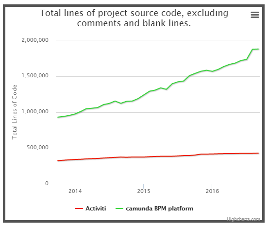

[TOC]

# 从Activiti切换到Camunda的5个理由

2019年04月05日 22:46:11 [skayliu](https://me.csdn.net/skayliu) 阅读数 1106

原文：[5 Reasons to switch from Activiti to Camunda](http://www.bpm-guide.de/2016/10/19/5-reasons-to-switch-from-activiti-to-camunda/)

最近，Alfresco Activiti的前关键工程师宣布辞去Alfresco的职务。他们Fork了Activiti并开始了他们自己的项目（Flowable）。虽然该项目的成功还有待观察（并且个人而言，我祝愿他们一切顺利），但有一点是明确的：退出公司的人才留下了一个巨大的漏洞，并使平台的未来发展方向受到质疑。尽管Alfresco仍有许多开发人员，但我们怀疑两年内的Activiti项目与目前的Activiti项目没有多大相似之处。这必须是许多现有用户/客户的重要关注点。

自从我们在3年半前Fork Activiti以来，许多用户已经从Activiti迁移到Camunda，他们没有回头。对于那些仍然使用Activiti的人，我想指出现在考虑这种迁移的5个充分理由。

## **1 - 切换很简单**

虽然我们在Fork Activiti之后已经在技术上做了很大的改进，但核心概念保持不变，而且向Camunda的迁移路径也是非常简单的 - 基本上只需几分钟。我的联合创始人BerndRücker撰写了一篇关于迁移的循序渐进的博客文章。

请阅读：[如何从Activiti 5.21迁移到Camunda BPM 7.5](https://blog.camunda.org/post/2016/10/migrate-from-activiti-to-camunda/)

## **2 - Camunda相似但更好**

当然我有偏见，但请让我指出一些事实：

- 有[科学证据](http://www.bpm-guide.de/2016/06/12/scientific-performance-benchmark-of-open-source-bpmn-engines/)表明Camunda BPMN引擎性能更好。
- 除了BPMN，Camunda还支持企业和社区版本中的CMMN（案例管理）和DMN（决策自动化）。
- Camunda不仅带有引擎，还带有非常[强大的工具，](https://camunda.org/features/)用于建模，任务管理，操作监控和用户管理，所有这些都是开源的。

还有很多值得一提的，但我想保持简短。我们的技术主管Daniel Meyer写了一篇关于细节的博客文章。

请阅读：[自Activiti Fork以来的Camunda Engine的演变](https://blog.camunda.org/post/2016/10/camunda-engine-since-activiti-fork/)

## **3 - Camunda是一个重要的开源项目**

在过去的3年半中，超过20位Camunda核心开发人员以及许多外部贡献者在Camunda的开源代码库上共同合作。当您[在OpenHub上将Camunda与Activiti进行比较时](https://www.openhub.net/p/_compare?project_0=Activiti&project_1=camunda+BPM+platform)，这变得非常明显，例如在比较项目的代码行时（参见图表）。

我们与社区密切合作，我们在柏林的年度用户会议也相应增长。2016年9月15日的最后一次会议吸引了120多名与会者（[点击查看议程](https://network.camunda.org/meetings/72)）。BPM分析师桑迪·凯姆斯利（Sandy Kemsley）出席了会议，并[在博客上发表了她的感想](https://column2.com/2016/09/camunda-community-day-community-contributions/)

> “Camunda显然意识到社区是企业版软件和公司成功的重要贡献者，并将其视为值得信赖的合作伙伴。”

全球许多组织都在使用Camunda BPM社区版，他们正在使用它做出惊人的事情。不幸的是，我们经常不被允许告诉公众。例如，[美国宇航局喷气推进实验室](http://www.jpl.nasa.gov/)自2014年以来一直在使用Camunda，并且最近才允许我们公开宣布这一点。我们仍然没有获得官方说明他们使用Camunda的许可，但我敢说整个Camunda团队对此感到非常兴奋......

## **4 - Camunda拥有强大的商业支持**

在我们Fork Activiti之前，我们已经建立了一个盈利的BPM专业咨询业务。我们在BPM市场也有很高的知名度，部分归功于我们畅销的书籍[Real-Life BPMN](https://www.amazon.com/Real-Life-BPMN-Analyze-Automate-Processes/dp/1502972328/ref=sr_1_1?ie=UTF8&qid=1476720822&sr=8-1&keywords=bpmn)。这使我们能够利用Camunda BPM [企业版](https://camunda.com/bpm/enterprise/)的订阅模式（即经常性收入模型）快速构建可持续，快速增长的产品业务。

今天，我们为100多个客户提供服务，其中包括AT＆T，T-Mobile和环球音乐（[点击查看更多客户](https://camunda.com/customers/)）。我们的年流失率（即终止订阅的客户）低于1％，截至2016年第三季度末，我们的年收入增长率为86％。在地理位置上，我们总部仍然设在柏林，我们的50多名员工中的大多数都是在柏林。然而，我们于2014年在旧金山成立了一家子公司，最近在科罗拉多州丹佛市开设了办事处，这使我们能够更好地服务于北美市场。我们的[合作伙伴网络](https://camunda.com/partners/si/)遍布20多个国家，以及我们的客户群。

我们在过去的3年半内取得了这些成果，并没有获得外部资金。Camunda仍然是由所有者和创始人经营的，这就引出了最后一点。

## **5 - Camunda专注于BPM**

在ECM和BPM之间，存在少量重叠。但不是更多。我们的一些客户使用工作流自动化来路由文档，但大多数客户不使用。此外，BPM技术面临的真正挑战并不在于“低代码”（low-code），这是对那些受IT研究公司观点和短期股东预期驱动的软件供应商的误解，而不是对用户需求的深刻理解。不幸的是，如果你没有充分专注于BPM，你就不会达到那种程度的理解。

当Bernd和我在2008年创办公司时，我们从第一天开始专注于BPM，因为BPM是我们的热情所在。多年来，我们聘请了那些分享这种激情并将其扩展到我们无法想象的领域的非凡人士。那些人允许我们开始新的开源项目，例如[bpmn.io](http://bpmn.io/)（很快将成为[我们的第一个SaaS产品](https://modeler.camunda.cloud/)），而那些人正在研究全新一代的工作流技术，这将使BPMN的执行方式成为可能。而你认为不可能。

为了吸引和留住这类人才，公司需要对他们想要解决的问题类型及其重要性有一个清晰一致的想法。然而，这仍然无法确保最有才华的人会来和你在一起，但如果没有，你可以肯定他们不会。

我们致力于提供世界上最好的BPM技术，我们希望您能加入我们 

立即下载：[Camunda BPM社区版](https://camunda.org/download/)

尝试一下：[开始使用Camunda和BPMN 2.0](https://docs.camunda.org/get-started/bpmn20/)

  

GitHub地址： <https://github.com/skayliu/CamundaSpringBootDemo>

码云地址：<https://gitee.com/skay463/CamundaSpringBootDemo>

<https://blog.csdn.net/skayliu/article/details/89048225>