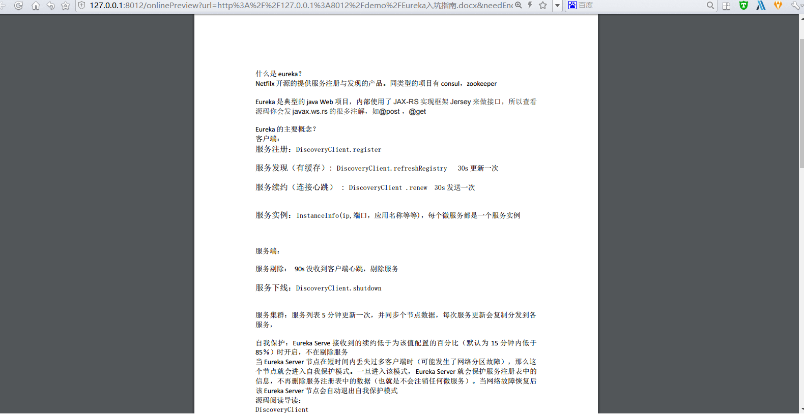
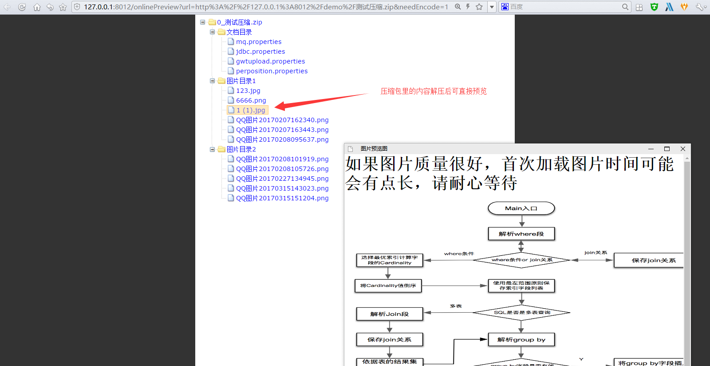
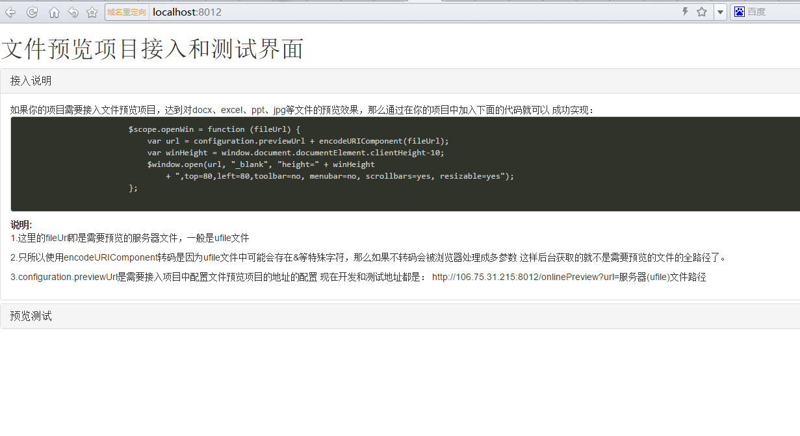

[TOC]


# 使用spring boot打造文件文档在线预览项目解决方案

# file-online-preview

此项目为文件文档在线预览项目解决方案，对标业内付费产品有【[永中office](http://dcs.yozosoft.com/)】【[office365](http://www.officeweb365.com/)】【[idocv](https://www.idocv.com/)】等，在取得公司高层同意后以Apache协议开源出来反哺社区，在此特别感谢@唐老大的支持以及@端木详笑的贡献。该项目使用流行的spring boot搭建，易上手和部署，基本支持主流办公文档的在线预览，如doc,docx,Excel,pdf,txt,zip,rar,图片等等

### 项目特性

1. 支持office，pdf等办公文档
2. 支持txt,java,php,py,md,js,css等所有纯文本
3. 支持zip,rar,jar,tar,gzip等压缩包
4. 支持jpg，jpeg，png，gif等图片预览（翻转，缩放，镜像）
5. 使用spring boot开发，预览服务搭建部署非常简便
6. rest接口提供服务，跨平台特性(java,php,python,go,php，....)都支持，应用接入简单方便
7. 抽象预览服务接口，方便二次开发，非常方便添加其他类型文件预览支持
8. 最最重要Apache协议开源，代码pull下来想干嘛就干嘛

### 在线体验

> 请善待公共服务，会不定时停用

地址：<http://file.keking.cn/>

### 项目文档（Project documentation）

1. 中文文档：<https://gitee.com/kekingcn/file-online-preview/blob/master/README.md>
2. English document：<https://github.com/kekingcn/kkFileView/blob/master/README.en.md>


### 文档预览效果

> Excel预览效果

[](https://camo.githubusercontent.com/3d8e747c9f5d6dcc95f9a4cffdf87ee756208a21/68747470733a2f2f67697465652e636f6d2f75706c6f6164732f696d616765732f323031372f313231332f3039333035315f63643535623365635f3439323231382e706e67)

> doc预览效果

[](https://camo.githubusercontent.com/8a13af1b4929f77d551c12d13c5d833ae38d2ee7/68747470733a2f2f67697465652e636f6d2f75706c6f6164732f696d616765732f323031372f313231332f3039323335305f35623265636265355f3439323231382e706e67)

> zip,rar压缩预览效果

[](https://camo.githubusercontent.com/9814409cb4d2c979c11e57f7e9498122a99b4139/68747470733a2f2f67697465652e636f6d2f75706c6f6164732f696d616765732f323031372f313231332f3039333830365f34366365646530365f3439323231382e706e67)

> png,jpeg,jpg等图片预览效果，支持滚轮缩放，旋转，倒置等

[](https://camo.githubusercontent.com/5d53b651c8c3afecdf3f5afd5d2e13182431d6dc/68747470733a2f2f67697465652e636f6d2f75706c6f6164732f696d616765732f323031372f313231332f3039343333355f36353761366636305f3439323231382e706e67)考虑说明篇幅原因，就不贴其他格式文件的预览效果了，感兴趣的可以参考下面的实例搭建下

### 快速开始

> 项目使用技术

- spring boot： [spring boot开发参考指南](http://www.kailing.pub/PdfReader/web/viewer.html?file=springboot)
- freemarker
- redisson
- jodconverter

> 依赖外部环境

- redis
- OpenOffice或者LibreOffice

1. 第一步：pull项目<https://github.com/kekingcn/file-online-preview.git>
2. 第二步：配置redis地址和OpenOffice目录，如

```
#=============================================#spring Redisson配置#===================================#
spring.redisson.address = 192.168.1.204:6379
##资源映射路径(因为jar方式运行的原因)
file.dir = C:\\Users\\yudian\\Desktop\\dev\\
## openoffice相关配置
office.home = C:\\Program Files (x86)\\OpenOffice 4
```

file.dir为转换文件实际存储地址，注意要以/结尾

1. 第三步：运行FilePreviewApplication的main方法，服务启动后，访问<http://localhost:8012/> 会看到如下界面，代表服务启动成功 [](https://camo.githubusercontent.com/1e203d664efb2054c8c15d7e91687394013a69b4/68747470733a2f2f67697465652e636f6d2f75706c6f6164732f696d616765732f323031372f313231332f3130303232315f65613135323032655f3439323231382e706e67)

### 历史更新记录

> 2018年01月19日 ：

1. 大文件入队提前处理
2. 新增addTask文件转换入队接口
3. 采用redis队列，支持kkFIleView接口和异构系统入队两种方式

> 2018年01月17日 ：

1. 优化项目结构，抽象文件预览接口，更方便的加入更多的文件类型预览支持，方便二次开发
2. 新增英文文档说明（@幻幻Fate，@汝辉）贡献
3. 新增图片预览文件支持类型
4. 修复压缩包内轮播图片总是从第一张开始的问题

> 2018年01月12日 ：

1. 新增多图片同时预览
2. 支持压缩包内图片轮番预览

> 2018年01月02日 ：

1. 修复txt等文本编码问题导致预览乱码
2. 修复项目模块依赖引入不到的问题
3. 新增spring boot profile，支持多环境配置
4. 引入pdf.js预览doc等文件，支持doc标题生成pdf预览菜单，支持手机端预览

### 使用登记

如果这个项目解决了你的实际问题，可在<https://gitee.com/kekingcn/file-online-preview/issues/IGSBV> 登记下，如果节省了你的三方预览服务费用，也愿意支持下的话，可点击下方【捐助】请作者喝杯咖啡，也是非常感谢

### 联系我们，加入组织

> 我们会用心回答解决大家在项目使用中的问题，也请大家在提问前至少Google或baidu过，珍爱生命远离无效的交流沟通

[](https://camo.githubusercontent.com/c4eb89a099ff353162d205a3570b2e39ec094fb2/68747470733a2f2f67697465652e636f6d2f75706c6f6164732f696d616765732f323031372f313231392f3137333731375f39333463623036385f3439323231382e706e67) QQ群号：613025121


<https://www.ctolib.com/kekingcn-file-online-preview.html>