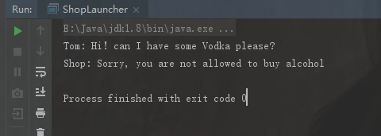

[TOC]


# 轻量级规则引擎easy-rules使用介绍

[张勇](http://tech.dianwoda.com/author/zhang-yong/) 2019年09月15日

## 简介

我们在写业务代码经常遇到需要一大堆if/else，会导致代码可读性大大降低，有没有一种方法可以避免代码中出现大量的判断语句呢？答案是用规则引擎，但是传统的规则引擎都比较重，比如开源的Drools，不适合在小需求中应用。最近在github上面看到一个傻瓜式的Java规则引擎**Easy-Rules**，这里结合自己写的demo介绍如何使用这个规则引擎，希望对大家有所帮助。


## easy-rules的特点

- 轻量级类库和容易上手
- 基于POJO的开发与注解的编程模型
- 基于MVEL表达式的编程模型（适用于极简单的规则，一般不推荐）
- 支持根据简单的规则创建组合规则
- 方便且适用于java的抽象的业务模型规则

它主要包括几个主要的类或接口：Rule,RulesEngine,RuleListener,Facts 
还有几个主要的注解：@Action,@Condition,@Fact,@Priority,@Rule

## 例1：基于POJO开发与注解的编程模型：判断1-50中，被3或者8整除的数

- 首先maven 引入easy-rules

```java
      <dependency>
            <groupId>org.jeasy</groupId>
            <artifactId>easy-rules-core</artifactId>
            <version>3.3.0</version>
        </dependency>
        <dependency>
            <groupId>org.jeasy</groupId>
            <artifactId>easy-rules-mvel</artifactId>
            <version>3.3.0</version>
        </dependency>
```

- 编写规则POJO：

```
@Rule(name = "被3整除", description = "number如果被3整除，打印：number is three")
public class ThreeRule {  
    @Condition //条件判断注解：如果return true， 执行Action
    public boolean isThree(@Fact("number") int number){
        return number % 3 == 0;
    }

    @Action //执行方法注解
    public void threeAction(@Fact("number") int number){
        System.out.print(number + " is three");
    }

    @Priority //优先级注解：return 数值越小，优先级越高
    public int getPriority(){
        return 1;
    }
}
@Rule(name = "被8整除")
public class EightRule {

    @Condition
    public boolean isEight(@Fact("number") int number){
        return number % 8 == 0;
    }

    @Action
    public void eightAction(@Fact("number") int number){
        System.out.print(number + " is eight");
    }

    @Priority
    public int getPriority(){
        return 2;
    }
}
@Rule(name = "被3和8同时整除",  description = "这是一个组合规则")
public class ThreeEightRuleUnitGroup extends UnitRuleGroup {  
    public ThreeEightRuleUnitGroup(Object... rules) {
        for (Object rule : rules) {
            addRule(rule);
        }
    }

    @Override
    public int getPriority() {
        return 0;
    }
}
@Rule(name = "既不被3整除也不被8整除", description = "打印number自己")
public class OtherRule {  
    @Condition
    public boolean isOther(@Fact("number") int number){
        return number % 3 != 0 || number % 8 != 0;
    }

    @Action
    public void printSelf(@Fact("number") int number){
        System.out.print(number);
    }

    @Priority
    public int getPriority(){
        return 3;
    }
}
```

- 执行规则

```java
public class ThreeEightRuleLauncher {

    public static void main(String[] args) {
        /**
         * 创建规则执行引擎
         * 注意: skipOnFirstAppliedRule意思是，只要匹配到第一条规则就跳过后面规则匹配
         */
        RulesEngineParameters parameters = new 
        RulesEngineParameters().skipOnFirstAppliedRule(true);
        RulesEngine rulesEngine = new DefaultRulesEngine(parameters);
        //创建规则
        Rules rules = new Rules();
        rules.register(new EightRule());
        rules.register(new ThreeRule());
        rules.register(new ThreeEightRuleUnitGroup(new EightRule(), new ThreeRule()));
        rules.register(new OtherRule());
        Facts facts = new Facts();
        for (int i=1 ; i<=50 ; i++){
            //规则因素，对应的name，要和规则里面的@Fact 一致
            facts.put("number", i);
            //执行规则
            rulesEngine.fire(rules, facts);
            System.out.println();
        }
    }
}
```

- 我们可以得到执行结果

```
1  
2  
3 is three  
4  
5  
6 is three  
7  
8 is eight  
9 is three  
10  
11  
12 is three  
13  
14  
15 is three  
16 is eight  
17  
18 is three  
19  
20  
21 is three  
22  
23  
24 is three24 is eight  
25  
26  
27 is three  
28  
29  
30 is three  
31  
32 is eight  
33 is three  
34  
35  
36 is three  
37  
38  
39 is three  
40 is eight  
41  
42 is three  
43  
44  
45 is three  
46  
47  
48 is three48 is eight  
49  
50  
```

## 例2：基于MVEL表达式的编程模型

本例演示如何使用MVEL表达式定义规则，MVEL通过Easy-Rules MVEL模块提供。此模块包含使用MVEL定义规则的API。我们将在这里使用这些API，其目标是实现一个简单的商店应用程序，要求如下：禁止儿童购买酒精，成年人的最低法定年龄为18岁。 商店顾客由Person类定义：

```
public class Person {  
    private String name;

    private boolean adult;

    private int age;
    //getter, setter 省略
}
```

我们定义两个规则：

- 规则1：可以更新Person实例，判断年龄是否大于18岁，并设置成人标志。
- 规则2：判断此人是否为成年人，并拒绝儿童（即非成年人）购买酒精。

显然，规则1的优先级要大于规则2，我们可以设置规则1的Priority为1，规则2的Priority为2，这样保证规则引擎在执行规则的时候，按优先级的顺序执行规则。

**规则1的定义**

```
 Rule ageRule = new MVELRule()
                .name("age rule")
                .description("Check if person's age is > 18 and marks the person as adult")
                .priority(1)
                .when("person.age > 18")
                .then("person.setAdult(true);");
```

**规则2的定义**，我们放到alcohol-rule.yml文件中

```
name: "alcohol rule"  
description: "children are not allowed to buy alcohol"  
priority: 2  
condition: "person.isAdult() == false"  
actions:  
  - "System.out.println(\"Shop: Sorry, you are not allowed to buy alcohol\");"
```

- 执行规则

```
public class ShopLauncher {  
    public static void main(String[] args) throws Exception {
        //创建一个Person实例(Fact)
        Person tom = new Person("Tom", 14);
        Facts facts = new Facts();
        facts.put("person", tom);

        //创建规则1
        Rule ageRule = new MVELRule()
                .name("age rule")
                .description("Check if person's age is > 18 and marks the person as adult")
                .priority(1)
                .when("person.age > 18")
                .then("person.setAdult(true);");
        //创建规则2
        Rule alcoholRule = MVELRuleFactory.createRuleFrom(new FileReader("alcohol-rule.yml"));

        Rules rules = new Rules();
        rules.register(ageRule);
        rules.register(alcoholRule);

        //创建规则执行引擎，并执行规则
        RulesEngine rulesEngine = new DefaultRulesEngine();
        System.out.println("Tom: Hi! can I have some Vodka please?");
        rulesEngine.fire(rules, facts);
    }
}
```

- 执行结果如下：本篇主要介绍easy-rules的使用 
  深入了解原理，可以查看github源码：<https://github.com/j-easy/easy-rules>


继续阅读此作者的[更多文章](http://tech.dianwoda.com/author/zhang-yong/)


<http://tech.dianwoda.com/2019/06/05/gui-ze-yin-qing-easy-rulejie-shao/>