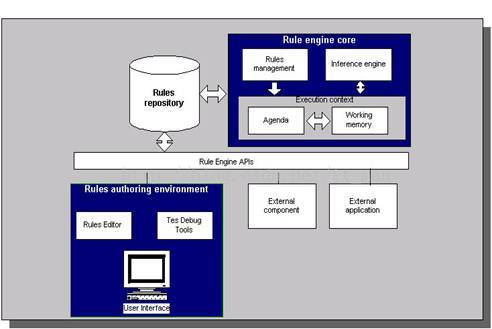
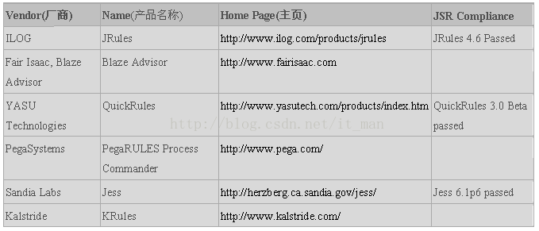

[TOC]

# 常见规则引擎技术

2013年10月16日 22:05:05

## 什么是业务规则

什么是业务规则？在需求里面我们往往把约束，完整性，校验，分支流等都可以算到业务规则里面。在规则引擎里面谈的业务规则重点是谈当满足什么样的条件的时候，需要执行什么样的操作。因此一个完整的业务规则包括了条件和触发操作两部分内容。而引擎是事物内部的重要的运行机制，规则引擎即重点是解决规则如何描述，如何执行，如何监控等一系列问题。

对于快速软件开发平台往往会包括两个方面的内容，一个是可重用性，一个是可配置性。对于公用组件，公用基础类库，公用算法等往往是增加了可重用性；而对于对象模型，权限模型，工作流模型，规则引擎则是解决平台的高可配置性。

- 权限模型实现了用户岗位，角色和权限调整可配置。
- 工作流引擎实现了在流程出现变化的时候可以灵活配置。
- 规则引擎将业务决策也从程序代码从抽离出来，实现规则变化也可以灵活配置。

在有了元数据模型，对象模型，工作流，权限，界面模型后。剩余的两个重点就是事件和规则，如果事件和规则能够灵活配置和修改，规则本身又能够很好的复用，则可实现一个较为完整的快速开发平台。

 

## **规则的定义和访问**

过去大部分的规则引擎开发并没有规范化，有其自有的API，这使得其与外部程序交互集成不够灵活。转而使用另外一种产品时往往意味需要重写应用程序逻辑和 API调用，代价较大。规则引擎工业中标准的缺乏成为令人关注的重要方面。2003年11月定稿并于2004年8月最终发布的JSR 94（Java规则引擎API）使得Java规则引擎的实现得以标准化。

JSR 94中没有涉及用来创建规则和动作的语言.规则语言是规则引擎应用程序的重要组成部分,所有的业务规则都必须用某种语言定义并且存储于规则执行集中,从而规则引擎可以装载和处理他们。规则语言的详情这里不作详细介绍，名称及其网址列出如下：

- [Rule Markup language (RuleML)   ](http://www.ruleml.org/)                    
- [Simple Rule Markup Language (SRML) ](http://xml.coverpages.org/srml.html)                  
- [Business Rules Markup Language (BRML)   ](http://xml.coverpages.org/brml.html)                
- [SWRL: A Semantic Web Rule Language Combining OWL and RuleML ](http://www.daml.org/2003/11/swrl/) 

多种规则语言的使用使得不同规则引擎实现之间的兼容性成为问题.通用的规则引擎API或许可以减轻不同厂家API之间的问题,但公用规则语言的缺乏将仍然阻碍不同规则引擎实现之间的互操作性。尽管业界在提出公用规则语言上做出了一些努力, 比如说RuleML,SRML的出现,但距离获得绝大部分规则引擎厂商同意的公用标准还有很长的路要走。

## **规则的执行**

在规则的定义阶段，会根据业务情况定义相应的规则，规则用规则语言描述。多个规则可以形成一组规则集合。而规则引擎的执行首先就是装载一个规则集，对规则进行解析。同时根据规则推理引擎，将这些解析完成的规则执行到具体输入的数据对象上。

当引擎执行时，会根据规则执行队列中的优先顺序逐条执行规则执行实例，由于规则的执行部分可能会改变工作区的数据对象，从而会使队列中的某些规则执行实例因为条件改变而失效，必须从队列中撤销，也可能会激活原来不满足条件的规则，生成新的规则执行实例进入队列。于是就产生了一种“动态”的规则执行链，形成规则的推理机制。这种规则的“链式”反应完全是由工作区中的数据驱动的。

规则条件匹配的效率决定了引擎的性能，引擎需要迅速测试工作区中的数据对象，从加载的规则集中发现符合条件的规则，生成规则执行实例。1982年美国卡耐基•梅隆大学的Charles L. Forgy发明了一种叫Rete的算法，很好地解决了这方面的问题。目前世界顶尖的商用业务规则引擎产品基本上都使用Rete算法。

## **规则引擎产品**

Java规则引擎商业产品主要有（Jess不是开源项目，它可以免费用于学术研究，但用于商业用途则要收费）

http://www.oschina.net/project/tag/231/rule-engine

开源项目的实现主要包括：

- Drools - Drools规则引擎应用Rete算法的改进形式Rete-II算法。从内部机制上讲，它使用了和Forgy的算法相同的概念和方法，但是增加了可与面向对象语言无缝连接的节点类型。
- Mandarax 基于反向推理（归纳法）。能够较容易地实现多个数据源的集成。例如，数据库记录能方便地集成为事实集(facts sets)，reflection用来集成对象模型中的功能。目前不支持JSR 94
- OFBiz Rule Engine - 支持归纳法(Backward chaining).最初代码基于Steven John Metsker的"Building Parsers in Java"，不支持JSR 94
- JLisa - JLisa是用来构建业务规则的强大框架，它有着扩展了LISP优秀特色的优点,比Clips还要强大.这些特色对于多范例软件的开发是至关重要的.支持JSR 94

目前最好的商用规则管理系统BRMS是ILOG JRules，最普遍使用的开源规则引擎是Drools，Java规则引擎的规范是JSR94，分别简要介绍如下：

（1）ILOG JRules
ILOG JRules 是ILOG 的旗舰级企业规则引擎产品，ILOG JRules 本身是一个灵活的BRMS(Business Rule Management System)，涵盖了业务规则的整个生命周期。ILOG JRules 内的规则引擎是J2EE应用程序，可以部署到任何J2EE项目。另外，ILOG能轻松集成到IDE环境中，可以利用Java控件调用规则引擎。
ILOG JRules定位在高端的BRMS市场，据IDC报告，ILOG的市场份额在30%左右，位居第一，与全球领先厂商实现了集成（IBM，BEA，Oracle，FileNet，……）。http://www.doc88.com/p-909285703209.html
ILOG于2009年1月被IBM收购，成为IBM WebSphere产品家族的重要成员。

（2）Drools
​    Drools 是用 Java 语言编写的开放源码规则引擎，基于Apache协议，于2005年被JBoss收购，目前版本是5.0.1，Drools从5.0后分为四个模块：

-  Drools Guvnor (BRMS/BPMS)
-  Drools Expert (rule engine),
-  Drools Flow (process/workflow)
-  Drools Fusion (cep/temporal reasoning)

其中Expert 是传统的规则引擎，Guvnor是一个完整的业务规则管理系统。Drools的主要功能及特点有：

-  使用 RETE算法对所编写的规则求值；
-  具有Web2.0 Ajax特性的用户友好的Web界面；
-  通过向导编辑器与文本编辑器，规则的作者更容易修改规则；
-  支持规则调试；
-  支持规则流；
-  自带一种非XML格式的规则语言DRL，并且通过DSL（域规则语言）支持自然语言的扩展；
-  支持xls或csv文件格式的决策表；
-  可版本化，你可以很容易的使用之前保存的版本替换现在的一套规则；
-  与JCR兼容的规则仓库；
-  提供了一个Java规则引擎API（JSR94）的实现；

（3）JSR94
Java规则引擎API由javax.rules包定义，是访问规则引擎的标准企业级API。Java规则引擎API允许客户程序使用统一的方式和不同厂商的规则引擎产品交互，就像使用JDBC编写独立于厂商访问不同的数据库产品一样。

补充： 如果使用C语言编写的规则引擎会速度快一些，以后可以找一个c的规则引擎。

版权声明：本文为博主原创文章，遵循[ CC 4.0 BY-SA ](http://creativecommons.org/licenses/by-sa/4.0/)版权协议，转载请附上原文出处链接和本声明。

本文链接：<https://blog.csdn.net/it_man/article/details/12795581>