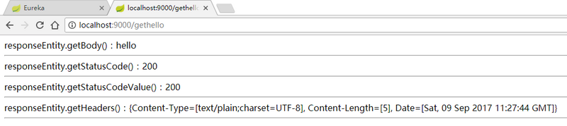
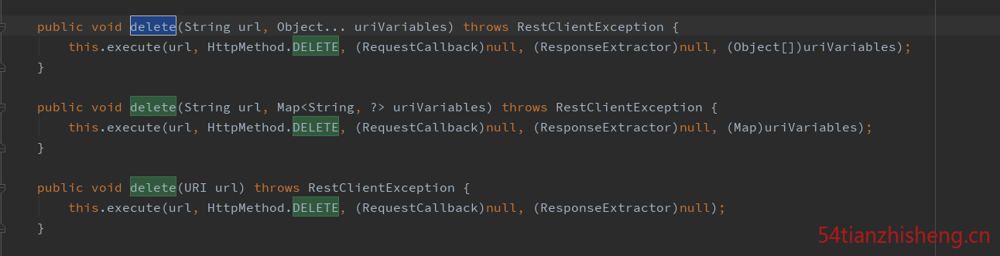

[TOC]


# RestTemplate 详解


### 背景

这段时间自己做的项目中需要调用服务提供者的服务（接口），具体就是：我这边需要将页面所输入的 Groovy 脚本代码传给别人提供的服务接口，然后那边返回脚本编译的结果给我，我需要将编译结果展示在页面，用的就是 RestTemplate 了，那 RestTemplate 是什么呢？简单说就是：简化了发起 HTTP 请求以及处理响应的过程，并且支持 REST 。下文就稍微总结下。

### 如何使用

先讲讲如何使用吧，我项目是 SpringBoot 项目，可以在启动类中加入：

```
@Bean
public RestTemplate restTemplate() {
  return new RestTemplate();
}
```

然后在 Controller 层中引入：

```
@Autowired
private RestTemplate restTemplate;
```

接下来就可以在 Controller 中各个方法中使用 restTemplate 了，但是 restTemplate 里面有什么方法呢？

### RestTemplate 内部方法


从图中 RestTemplate 可以看到有很多方法，我们可以提取出主要的几种方法是：

- **GET**
- **POST**
- **PUT**
- **DELETE**
- **HEAD**
- **OPTIONS**
- **EXCHANGE**
- **EXECUTE**

图片中依然可以知道 RestTemplate 类中的方法主要是来自接口 RestOperations，下面我们具体看看这些方法里面的具体实现与该如何使用。

### Get 方法

在 RestTemplate 中，发送一个 GET 请求，我们可以通过如下两种方式：

- **getForEntity**

  

  getForEntity 方法的返回值是一个`ResponseEntity<T>`，`ResponseEntity<T>`是 Spring 对 HTTP 请求响应的封装，包括了几个重要的元素，如响应码、contentType、contentLength、响应消息体等。比如下面一个例子：

  ```
  @RequestMapping("/gethello")
  public String getHello() {
      ResponseEntity<String> responseEntity = restTemplate.getForEntity("http://HELLO-SERVICE/hello", String.class);
      String body = responseEntity.getBody();
      HttpStatus statusCode = responseEntity.getStatusCode();
      int statusCodeValue = responseEntity.getStatusCodeValue();
      HttpHeaders headers = responseEntity.getHeaders();
      StringBuffer result = new StringBuffer();
      result.append("responseEntity.getBody()：").append(body).append("<hr>")
              .append("responseEntity.getStatusCode()：").append(statusCode).append("<hr>")
              .append("responseEntity.getStatusCodeValue()：").append(statusCodeValue).append("<hr>")
              .append("responseEntity.getHeaders()：").append(headers).append("<hr>");
      return result.toString();
  }
  ```

  关于这段代码，说如下几点：

  - getForEntity 的第一个参数为我要调用的服务的地址，这里我调用了服务提供者提供的 /hello 接口，注意这里是通过服务名调用而不是服务地址，如果写成服务地址就没法实现客户端负载均衡了。（备注：我项目中需要通过 ConsulClient 去获取服务名，然后在去获取服务的 IP 和 Port，并把它拼接起来组合成我的服务地址，所以就没法实现客户端的负载均衡了，如果要是实现负载均衡，可以在 SpringBoot 启动类的中加入注解 `@LoadBalanced`, 如下:

    ```
    @Bean
    @LoadBalanced
    public RestTemplate restTemplate() {
      return new RestTemplate();
    }
    ```

    ）

  - getForEntity 第二个参数 String.class 表示我希望返回的 body 类型是 String

  - 拿到返回结果之后，将返回结果遍历打印出来

  

有时候我在调用服务提供者提供的接口时，可能需要传递参数，有两种不同的方式:

```
@RequestMapping("/sayhello")
public String sayHello() {
    ResponseEntity<String> responseEntity = restTemplate.getForEntity("http://HELLO-SERVICE/sayhello?name={1}", String.class, "张三");
    return responseEntity.getBody();
}
@RequestMapping("/sayhello2")
public String sayHello2() {
    Map<String, String> map = new HashMap<>();
    map.put("name", "李四");
    ResponseEntity<String> responseEntity = restTemplate.getForEntity("http://HELLO-SERVICE/sayhello?name={name}", String.class, map);
    return responseEntity.getBody();
}
```

- 可以用一个数字做占位符，最后是一个可变长度的参数，来一 一替换前面的占位符

- 也可以前面使用 name={name} 这种形式，最后一个参数是一个 map，map 的 key 即为前边占位符的名字，map的 value 为参数值

  第一个调用地址也可以是一个URI而不是字符串，这个时候我们构建一个URI即可，参数神马的都包含在URI中了，如下：

  ```
  @RequestMapping("/sayhello3")
  public String sayHello3() {
      UriComponents uriComponents = UriComponentsBuilder.fromUriString("http://HELLO-SERVICE/sayhello?name={name}").build().expand("王五").encode();
      URI uri = uriComponents.toUri();
      ResponseEntity<String> responseEntity = restTemplate.getForEntity(uri, String.class);
      return responseEntity.getBody();
  }
  ```

  通过Spring中提供的UriComponents来构建Uri即可。

  当然，服务提供者不仅可以返回String，也可以返回一个自定义类型的对象，比如我的服务提供者中有如下方法：

  ```
  @RequestMapping(value = "/getbook1", method = RequestMethod.GET)
  public Book book1() {
      return new Book("三国演义", 90, "罗贯中", "花城出版社");
  }
  ```

  对于该方法我可以在服务消费者中通过如下方式来调用：

  ```
  @RequestMapping("/book1")
  public Book book1() {
      ResponseEntity<Book> responseEntity = restTemplate.getForEntity("http://HELLO-SERVICE/getbook1", Book.class);
      return responseEntity.getBody();
  }
  ```

  运行结果如下：

  


- **getForObject**

  
  ​

  getForObject 函数实际上是对 getForEntity 函数的进一步封装，如果你只关注返回的消息体的内容，对其他信息都不关注，此时可以使用 getForObject，举一个简单的例子，如下：

  ```
  @RequestMapping("/book2")
  public Book book2() {
      Book book = restTemplate.getForObject("http://HELLO-SERVICE/getbook1", Book.class);
      return book;
  }
  ```

### POST 方法

在 RestTemplate 中，POST 请求可以通过如下三个方法来发起：

- **postForEntity**

  

  该方法和get请求中的getForEntity方法类似，如下例子：

  ```
  @RequestMapping("/book3")
  public Book book3() {
      Book book = new Book();
      book.setName("红楼梦");
      ResponseEntity<Book> responseEntity = restTemplate.postForEntity("http://HELLO-SERVICE/getbook2", book, Book.class);
      return responseEntity.getBody();
  }
  ```

  - 方法的第一参数表示要调用的服务的地址
  - 方法的第二个参数表示上传的参数
  - 方法的第三个参数表示返回的消息体的数据类型

  我这里创建了一个Book对象，这个Book对象只有name属性有值，将之传递到服务提供者那里去，服务提供者代码如下：

  ```
  @RequestMapping(value = "/getbook2", method = RequestMethod.POST)
  public Book book2(@RequestBody Book book) {
      System.out.println(book.getName());
      book.setPrice(33);
      book.setAuthor("曹雪芹");
      book.setPublisher("人民文学出版社");
      return book;
  }
  ```

  服务提供者接收到服务消费者传来的参数book，给其他属性设置上值再返回，调用结果如下：

  

- **postForObject**

  

  如果你只关注，返回的消息体，可以直接使用postForObject。用法和getForObject一致。

- **postForLocation**

  

  postForLocation 也是提交新资源，提交成功之后，返回新资源的 URI，postForLocation 的参数和前面两种的参数基本一致，只不过该方法的返回值为 URI ，这个只需要服务提供者返回一个 URI 即可，该 URI 表示新资源的位置。

### PUT 方法


在 RestTemplate 中，PUT 请求可以通过 put 方法调用，put 方法的参数和前面介绍的 postForEntity 方法的参数基本一致，只是 put 方法没有返回值而已。举一个简单的例子，如下：

```
@RequestMapping("/put")
public void put() {
    Book book = new Book();
    book.setName("红楼梦");
    restTemplate.put("http://HELLO-SERVICE/getbook3/{1}", book, 99);
}
```

book对象是我要提交的参数，最后的99用来替换前面的占位符{1}

### DELETE 方法



delete 请求我们可以通过 delete 方法调用来实现，如下例子：

```
@RequestMapping("/delete")
public void delete() {
    restTemplate.delete("http://HELLO-SERVICE/getbook4/{1}", 100);
}
```

### HEADER 方法


返回资源的所有 HTTP headers。

### OPTIONS


问可以执行哪些方法。

### EXCHANGE


与其它接口的不同：

- 允许调用者指定HTTP请求的方法（GET,POST,PUT等）
- 可以在请求中增加body以及头信息，其内容通过参数 HttpEntity<?>requestEntity 描述
- exchange支持‘含参数的类型’（即泛型类）作为返回类型，该特性通过 ParameterizedTypeReferenceresponseType 描述

### EXECUTE

细心的你，不知道有没有发现上面所有的方法内部返回值都调用了同一个方法 —— execute 方法。

下面我们来看看：


可以看到，Excute方法只是将 String 格式的 URI 转成了 java.net.URI，之后调用了doExecute方法。整个调用过程关键起作用的是 doExecute 方法


### doExecute 方法


这里需要了解两个类： RequestCallback 和 ResponseExtractor


RestTemplate 类中可以看到他们两的实现类。

**RequestCallback** ：用于操作请求头和body，在请求发出前执行。

该接口有两个实现类：

| AcceptHeaderRequestCallback | 只处理请求头，用于getXXX()方法。                             |
| --------------------------- | ------------------------------------------------------------ |
| HttpEntityRequestCallback   | 继承于AcceptHeaderRequestCallback可以处理请求头和body，用于putXXX()、postXXX()和exchange()方法。 |

**ResponseExtractor**：解析HTTP响应的数据，而且不需要担心异常和资源的关闭

上面图纸这个实现类 ResponseEntityResponseExtractor 的作用是：使用 HttpMessageConverterExtractor 提取 body（委托模式），然后将 body 和响应头、状态封装成 ResponseEntity 对象。

### 最后

转载请注明地址：<http://www.54tianzhisheng.cn/2017/12/03/RestTemplate/>

### 参考资料

1、<https://www.cnblogs.com/caolei1108/p/6169950.html>

2、<https://segmentfault.com/a/1190000011093597>

如果想和我进一步交流请关注：


http://www.54tianzhisheng.cn/2017/12/03/RestTemplate/#如何使用