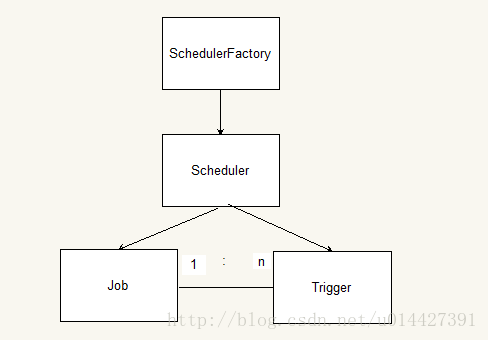

[TOC]


# 任务调度框架Quartz原理简介

2018年01月17日 17:23:59  更多


### 第一章 Quartz

#### 1.1 Quartz概念

Quartz是OpenSymphony开源组织的一个Java开源项目， 在2009被Terracotta收购。[Quartz官网](http://www.quartz-scheduler.org/)

#### 1.2 Quartz任务调度主要元素

- Quartz任务调度的主要元素有：

  Trigger(触发器)

  Scheduler(任务调度器)

  Job(任务)

其中Trigger，Job是元数据，Scheduler才是任务调度的控制器。

#### 1.3 Quartz特点

> 1. 强大的调度功能，例如支持多样的调度方式
> 2. 灵活的应用方式，例如支持任务和调度的多种组合方式
> 3. 分布式和集群功能，在被Terracotta收购后，在Quartz的基础上的拓展

#### 1.4 Quartz基本元素关系图



### 第二章 Trigger(触发器)

#### 2.1 Trigger定义

Trigger也即触发器，用于定义任务调度时间规则

#### 2.2 Trigger属性

1. startTime和endTime
   所有的Trigger都包含startTime、endTime这两个属性
2. 优先级(Priority)
   触发器的优先级值默认为5，不过注意优先级是针对同一时刻来说的，在同一时刻优先级高的先触发。假如一个触发器被执行时间为3:00，另外一个为3:01，那么肯定是先执行时间为3:00的触发器。
3. 错失触发(Misfire)策略
   在任务调度中，并不能保证所有的触发器都会在指定时间被触发，假如Scheduler资源不足或者服务器重启的情况，就好发生错失触发的情况。

#### 2.3 Trigger类型

在任务调度Quartz中，Trigger主要的触发器有：SimpleTrigger，CalendarIntervelTrigger，DailyTimeIntervalTrigger，CronTrigger，注意，本博客所介绍的触发器都是基于Quartz2.2.x版本的，不同版本，触发器类型略有不同。

##### 2.3.1 SimpleTrigger

SimpleTrigger是一种最基本的触发器，指定从某一个时间开始，以一定的时间间隔执行的任务。

- SimpleTrigger的属性有：

  repeatInterval重复间隔

  repeatCount重复次数，实际执行次数是repeatCount+1。

```
simpleSchedule()
    //.withIntervalInHours(1) //每小时执行一次
	.withIntervalInMinutes(1) //每分钟执行一次
	//.repeatForever() //次数不限
    .withRepeatCount(10) //次数为10次
    .build();//构建

```

##### 2.3.2 CalendarIntervalTrigger

CalendarIntervalTrigger和SimpleTrigger不同的是，SimpleTrigger指定的时间间隔为毫秒，CalendarIntervalTrigger支持的间隔单位有秒，分钟，小时，天，月，年，星期。

- CalendarIntervalTrigger的属性有：

  interval 执行间隔

  intervalUnit 执行间隔的单位（秒，分钟，小时，天，月，年，星期）

```
calendarIntervalSchedule()
    .withIntervalInDays(1) //每天执行一次
	//.withIntervalInWeeks(1) //每周执行一次
    .build(); 
```

##### 2.3.3 DailyTimeIntervalTrigger

DailyTimeIntervalTrigger和SimpleTrigger不同的是不仅可以支持SimpleTrigger支持时间间隔类型，而且还支持指定星期。

- DailyTimeIntervalTrigger的属性有：

  startTimeOfDay 每天开始时间

  endTimeOfDay 每天结束时间

  daysOfWeek 需要执行的星期

  interval 执行间隔

  intervalUnit 执行间隔的单位（秒，分钟，小时，天，月，年，星期）

  repeatCount 重复次数

```
dailyTimeIntervalSchedule()
    .startingDailyAt(TimeOfDay.hourAndMinuteOfDay(9, 0)) //第天9：00开始
    .endingDailyAt(TimeOfDay.hourAndMinuteOfDay(15, 0)) //15：00 结束 
    .onDaysOfTheWeek(MONDAY,TUESDAY,WEDNESDAY,THURSDAY,FRIDAY) //周一至周五执行
    .withIntervalInHours(1) //每间隔1小时执行一次
    .withRepeatCount(100) //最多重复100次（实际执行100+1次）
    .build();
1234567
```

##### 2.3.4 CronTrigge

CronTrigger适合于更复杂的任务，它支持Linux Cron的语法。CronTrigger覆盖了以上三种Trigger的大部分功能。

CronTrigger的属性只有;
： Cron表达式，Cron表达式需要程序员自己编写，比较复杂

```
cronSchedule("0 0/3 9-15 * * ?") // 每天9:00-15:00，每隔3分钟执行一次
    .build();

cronSchedule("0 30 9 ? * MON") // 每周一，9:30执行一次
.build();

weeklyOnDayAndHourAndMinute(MONDAY,9, 30) //等同于 0 30 9 ? * MON 
    .build();
 
```

Cron表达式

| 位置 | 时间域     | 允许值 | 特殊值         |
| ---- | ---------- | ------ | -------------- |
| 1    | 秒         | 0-59   | ,- * /         |
| 2    | 分钟       | 0-59   | ,- * /         |
| 3    | 小时       | 0-23   | ,- * /         |
| 4    | 日期       | 1-31   | ,- * ? / L W C |
| 5    | 月份       | 1-12   | ,- * /         |
| 6    | 星期       | 1-7    | ,- * ? / L C # |
| 7    | 年份(可选) | 1-31   | ,- * /         |

星号()：可用在所有字段中，表示对应时间域的每一个时刻，例如， 在分钟字段时，表示“每分钟”；

问号（?）：该字符只在日期和星期字段中使用，它通常指定为“无意义的值”，相当于点位符；

减号(-)：表达一个范围，如在小时字段中使用“10-12”，则表示从10到12点，即10,11,12；

逗号(,)：表达一个列表值，如在星期字段中使用“MON,WED,FRI”，则表示星期一，星期三和星期五；

斜杠(/)：x/y表达一个等步长序列，x为起始值，y为增量步长值。如在分钟字段中使用0/15，则表示为0,15,30和45秒，而5/15在分钟字段中表示5,20,35,50，你也可以使用*/y，它等同于0/y；

L：该字符只在日期和星期字段中使用，代表“Last”的意思，但它在两个字段中意思不同。L在日期字段中，表示这个月份的最后一天，如一月的31号，非闰年二月的28号；如果L用在星期中，则表示星期六，等同于7。但是，如果L出现在星期字段里，而且在前面有一个数值X，则表示“这个月的最后X天”，例如，6L表示该月的最后星期五；

W：该字符只能出现在日期字段里，是对前导日期的修饰，表示离该日期最近的工作日。例如15W表示离该月15号最近的工作日，如果该月15号是星期六，则匹配14号星期五；如果15日是星期日，则匹配16号星期一；如果15号是星期二，那结果就是15号星期二。但必须注意关联的匹配日期不能够跨月，如你指定1W，如果1号是星期六，结果匹配的是3号星期一，而非上个月最后的那天。W字符串只能指定单一日期，而不能指定日期范围；

LW组合：在日期字段可以组合使用LW，它的意思是当月的最后一个工作日；

井号(#)：该字符只能在星期字段中使用，表示当月某个工作日。如6#3表示当月的第三个星期五(6表示星期五，#3表示当前的第三个)，而4#5表示当月的第五个星期三，假设当月没有第五个星期三，忽略不触发；

C：该字符只在日期和星期字段中使用，代表“Calendar”的意思。它的意思是计划所关联的日期，如果日期没有被关联，则相当于日历中所有日期。例如5C在日期字段中就相当于日历5日以后的第一天。1C在星期字段中相当于星期日后的第一天。

Cron表达式对特殊字符的大小写不敏感，对代表星期的缩写英文大小写也不敏感。

### 第三章 Scheduler(任务调度器)

#### 3.1Scheduler定义

Scheduler就是任务调度控制器，Scheduler有两个重要组件：ThreadPool和JobStore。

注意：Job和Trigger需要存储下来才可以被使用。

ThreadPool就是线程池，所有的任务都会被线程池执行

JobStore是来存储运行时信息的，包括Trigger，Scheduler，JobDetail，业务锁等等。JobStore实现有RAMJob(内存实现)，JobStoreTX(JDBC，事务由Quartz管理），JobStoreCMT(JDBC，使用容器事务)，ClusteredJobStore(集群实现)等等

注意：Job和Trigger需要存储下来才可以被使用。

#### 3.2 Schedule种类

- Schedule有三种：

  StdScheduler

  RemoteMBeanScheduler

  RemoteScheduler

其中StdScheduler最常用。

#### 3.3 Schedule工厂

Schedule是由Schedule工厂创建的，有DirectSchedulerFactory或者StdSchedulerFactory，StdSchedulerFactory使用比较多

### 第四章 Job(任务)

#### 4.1 Job定义

Job：也就是表示被调度的任务.JobDetail是任务的定义，而Job是任务的执行逻辑。在JobDetail里会引用一个Job Class定义

#### 4.2 Job类型

Job有两种类型：无状态的(stateless)和有状态的(stateful)

> 区别在于：对于同一个Trigger来说，有状态的Job不能异步执行，也就是说需要等上一个任务Job执行完成后，才可以触发下一次执行。

#### 4.3 Job属性

Job的属性有两种：volatility和durability

> volatility表示任务是否持久化到数据库存储;
> durability表示在没有Trigger关联的条件下是否保留。
> volatility和durability都是boolean类型。

### 第五章 Quartz线程

#### 5.1 Quartz线程分类

在Quartz中，线程分为Scheduler调度线程和任务执行线程。
Scheduler调度线程主要有：执行常规调度的线程和执行misfired trigger的线程。

> 执行常规调度的线程(Regular Scheduler Thread)：轮询查询存储的所有触发器，到达触发时间，就从线程池获取一个空闲的线程，执行与触发器关联的任务。
> 执行错失调度的线程(Misfire Scheduler Thread)：Misfire线程扫描所有的触发器，检查是否有misfired的线程，也就是没有被执行错过的线程，有的话根据misfire的策略分别处理。

### 附录：参考资料

http://www.xuxueli.com/xxl-job/#/

https://www.cnblogs.com/drift-ice/p/3817269.html

https://www.ibm.com/developerworks/cn/opensource/os-cn-quartz/


https://blog.csdn.net/u014427391/article/details/79087865