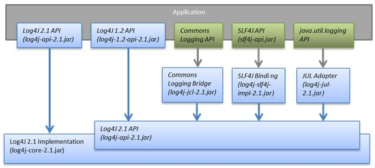

[TOC]


# Log4j2 + Slf4j 的配置和使用

## 前言

Log4j 2是log4j 1.x和logback的改进版，据说采用了一些新技术（无锁异步、等等），使得日志的吞吐量、性能比log4j 1.x提高10倍，并解决了一些死锁的bug，而且配置更加简单灵活。下面是结合slf4j的配置和使用过程：

## 1、引用依赖包及相关注释： 

```xml
<!-- log配置：Log4j2 + Slf4j -->
<dependency>
    <groupId>org.apache.logging.log4j</groupId>
    <artifactId>log4j-api</artifactId>
    <version>2.2</version>
</dependency>
<dependency>
    <groupId>org.apache.logging.log4j</groupId>
    <artifactId>log4j-core</artifactId>
    <version>2.2</version>
</dependency>
<dependency> <!-- 桥接：告诉Slf4j使用Log4j2 -->
    <groupId>org.apache.logging.log4j</groupId>
    <artifactId>log4j-slf4j-impl</artifactId>
    <version>2.2</version>
</dependency>
<dependency> <!-- 桥接：告诉commons logging使用Log4j2 -->
    <groupId>org.apache.logging.log4j</groupId>
    <artifactId>log4j-jcl</artifactId>
    <version>2.2</version>
</dependency>
<dependency>
    <groupId>org.slf4j</groupId>
    <artifactId>slf4j-api</artifactId>
    <version>1.7.10</version>
</dependency> 
```

**注：**log4j-api-2.x 和 log4j-core-2.x是必须的，其他包根据需要引入，如下图所示： 


## **2、代码中使用：**

```java
@RunWith(SpringJUnit4ClassRunner.class)  //使用Spring Junit4进行测试  
@ContextConfiguration ({"classpath:spring/applicationContext.xml"}) //加载配置文件
public abstract class BaseJunit4Test {
}

import org.junit.Test;
import org.slf4j.Logger;
import org.slf4j.LoggerFactory;
mport com.xjj.test.BaseJunit4Test; 
public class Log4j2Test extends BaseJunit4Test {
 static public Logger logger = LoggerFactory.getLogger(Log4j2Test.class); 

   @Test
   public void logTC1(){
      logger.error("error");
      logger.debug("debug");
      logger.info("info");
      logger.trace("trace");
      logger.warn("warn");
      logger.error("error {}", "param");
 }
} 
```

输出结果：

```
16:19:28.779 [main] ERROR com.xjj.test.mytest.Log4j2Test - error
16:19:28.781 [main] ERROR com.xjj.test.mytest.Log4j2Test - error param12
```

注：如果没有任何配置，Log4j2会使用缺省配置：

```
root logger：ConsoleAppender
PatternLayout："%d{HH:mm:ss.SSS} [%t] %-5level %logger{36} - %msg%n"12
```

级别：ERROR

## **3、配置（使用xml配置文件）：** 

官网配置指南：<http://logging.apache.org/log4j/2.x/manual/configuration.html>

在classpath中创建名字为log4j2.xml的配置文件。

**Configuration标签中的常用元素说明：** 
monitorInterval：Log4j 2 定期检查和应用配置文件的时间间隔（单位：秒，如果更改配置文件，不用重启系统）。 
status：Log4j内部事件记录的等级，只对Log4j本身的事件有效。 
strict：是否使用XML Schema来检查配置文件。 
schema：Shema文件的位置。 
例子：

```
<Configuration status="warn" monitorInterval="30" strict="true" schema="Log4J-V2.2.xsd">
    ……
</Configuration> 
```

**Loggers标签说明：** 
它被用来配置LoggerConfig，包含一个root logger和若干个普通logger 
普通必须有一个name元素，root logger不用name元素 
每个logger可以指定一个level（TRACE, DEBUG, INFO, WARN, ERROR, ALL or OFF），不指定时level默认为ERROR 
additivity指定是否同时输出log到父类的appender，缺省为true。（层级关系与java包类似，例如：com.foo是com.foo.Bar的父级；java是java.util的父级，是java.util.vector的祖先。root是最顶层。） 
每个logger可以包含若干个属性：AppenderRef, Filter, Layout, 等 
例子：

```
<Loggers>
    <Root level="warn"> <!-- 全局配置 -->
         <AppenderRef ref="Console"/>
    </Root>

    <!-- 为某些包/类配置Log级别，这些logger继承了root logger -->
    <Logger name="com.xjj.test" level="TRACE"/>
    <Logger name="com.xjj.test2" level="DEBUG" additivity="false">
         <AppenderRef ref="Console"/>
    </Logger>
</Loggers> 
```

**Filters标签说明：** 
与防火墙过滤的规则相似，log4j2的过滤器也将返回三类状态：Accept（接受）, Deny（拒绝） 或Neutral（中立）。其中，Accept意味着不用再调用其他过滤器了，这个LogEvent将被执行；Deny意味着马上忽略这个event，并将此event的控制权交还给过滤器的调用者；Neutral则意味着这个event应该传递给别的过滤器，如果再没有别的过滤器可以传递了，那么就由现在这个过滤器来处理。

**Appenders标签说明：** 
Appender用来定义不同的输出位置，可以是console、文件、远程socket服务器、Apache Flume、JMS以及远程 UNIX 系统日志守护进程。一个Logger可以绑定多个不同的Appender。

**Layout/PatternLayout：** 
定义log的格式（一种类似C语言printf函数的打印格式）。

配置例子和注解如下：

```
<?xml version="1.0" encoding="UTF-8"?>
<!DOCTYPE xml>
<!-- Log4j 2.x 配置文件。每30秒自动检查和应用配置文件的更新； -->
<Configuration status="warn" monitorInterval="30" strict="true" schema="Log4J-V2.2.xsd">
    <Appenders>
           <!-- 输出到控制台 -->
           <Console name="Console" target="SYSTEM_OUT">
               <!-- 需要记录的级别 -->
               <!-- <ThresholdFilter level="debug" onMatch="ACCEPT" onMismatch="DENY" /> -->
               <PatternLayout pattern="%d{yyyy-MM-dd HH:mm:ss,SSS}:%4p %t (%F:%L) - %m%n" />
          </Console>

          <!-- 输出到文件，按天或者超过80MB分割 -->
          <RollingFile name="RollingFile" fileName="../logs/xjj.log"    filePattern="../logs/$${date:yyyy-MM}/xjj-%d{yyyy-MM-dd}-%i.log.gz">
               <!-- 需要记录的级别 -->
               <!-- <ThresholdFilter level="info" onMatch="ACCEPT" onMismatch="DENY" /> -->
               <PatternLayout pattern="%d{yyyy-MM-dd HH:mm:ss,SSS}:%4p %t (%F:%L) - %m%n" />
               <Policies>
                    <OnStartupTriggeringPolicy />
                    <TimeBasedTriggeringPolicy />
                    <SizeBasedTriggeringPolicy size="80 MB" />
               </Policies>
          </RollingFile>
     </Appenders>
     <Loggers>
          <Root level="info"> <!-- 全局配置 -->
               <AppenderRef ref="Console" />
               <AppenderRef ref="RollingFile"/>
          </Root>
          <!-- 为sql语句配置特殊的Log级别，方便调试 -->
          <Logger name="com.xjj.dao" level="${log.sql.level}" additivity="false">
               <AppenderRef ref="Console" />
          </Logger>
     </Loggers>
</Configuration> 
```

实际使用的例子（用slf4j接口）：

```
import org.slf4j.Logger;
import org.slf4j.LoggerFactory;

private final static Logger logger = LoggerFactory.getLogger(MyClass.class);
try {
    ……
} catch (Exception e) {
    logger.error("发生了异常：", e);
}
logger.info("请求处理结束，耗时：{}毫秒", (System.currentTimeMillis() - beginTime));    //第一种用法
logger.info("请求处理结束，耗时：" + (System.currentTimeMillis() - beginTime)  + "毫秒");    //第二种用法 
```

**Tips：**根据官方测试的数据，第一种用法比第二种快47倍！


直接用log4j2也可以，只是如果直接用了log4j2，以后如果想换成其他log系统就得去所有使用的地方修改代码了。如果用slf4j，以后想换另外一种log系统，只需要改pom.xml里面的依赖就行了。


https://blog.csdn.net/ClementAD/article/details/44625787