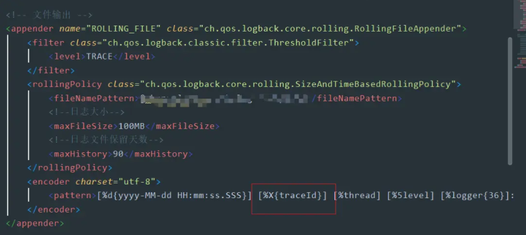
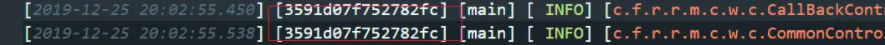
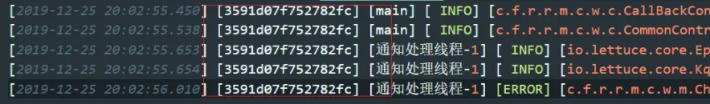
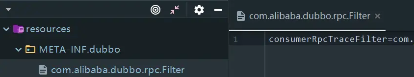

[TOC]


# java 服务调用全流程追踪 简易实现方案

## 前言

前段时间，本人一直协助项目组在做系统的重构，系统应用被拆分成了多个服务，部分服务做了集群部署。随着上述架构的演进，自然而然的引进了ELK + Filebeat 做日志收集。但是在使用Kibana查看日志时，由于缺少`TraceID`，导致开发人员很难筛选出指定请求的相关日志，也很难追踪应用对下游服务的调用过程，耗费了很多时间。我自己查过几次问题之后，实在受不了每次要花这么久的时间，就赶紧向主管提了这一次的改造。

本篇文章主要是记录本人对项目`TraceID`链路追踪改造的解决方案的研究、遇到的问题和具体的实现，同时本次改造也加深了我自己对分布式服务追踪的一些理解，我也写在了里面。

本文主要内容：

- 初步实现
- 异步线程traceId丢失的问题
- 面向 Dubbo RPC 链路追踪
- 面向 HTTP Service 链路追踪
- 思考 SpringCloud Sleuth 的实现
- 小结

## 一、初步实现

大体的思路就是借助slf4j的MDC功能 + Spring Interceptor，当外部请求进入时生成一个traceId放在MDC当中。

### MDC

这里简单介绍一下MDC。

> MDC（Mapped Diagnostic Context，映射调试上下文）是 log4j 和 logback 提供的一种方便在多线程条件下记录日志的功能。MDC 可以看成是一个与当前线程绑定的Map，可以往其中添加键值对。MDC 中包含的内容可以被同一线程中执行的代码所访问。当前线程的子线程会继承其父线程中的 MDC 的内容。当需要记录日志时，只需要从 MDC 中获取所需的信息即可。MDC 的内容则由程序在适当的时候保存进去。对于一个 Web 应用来说，通常是在请求被处理的最开始保存这些数据。

简单来说，MDC就是日志框架提供的一个`InheritableThreadLocal`，项目代码中可以将键值对放入其中，在打印的时候从`ThreadLocal`中获取到对应的值然后打印出来。详细的原理本文就不赘述了。看下 log4j 和 logback 里面的实现类就知道了。

### 实现

1. 自定义Spring 拦截器 `TraceInterceptor`

```java
/**
 * @author Richard_yyf
 */
public class TraceInterceptor extends HandlerInterceptorAdapter {

    @Override
    public boolean preHandle(HttpServletRequest request, HttpServletResponse response, Object handler) throws Exception {
        // 清空
        MDC.clear();

        ThreadMdcUtil.setTraceIdIfAbsent();

        //后续逻辑... ...
        return true;
    }
}
```

1. 注册 拦截器

```java
/**
 * @author Richard_yyf
 */
@Configuration
public class WebMvcConfig implements WebMvcConfigurer {

    @Override
    public void addInterceptors(InterceptorRegistry registry) {
        registry.addInterceptor(traceInterceptor())
                .addPathPatterns("/**")
                .order(0);
    }

    @Bean
    public TraceInterceptor traceInterceptor() {
        return new TraceInterceptor();
    }

}
```

`ThreadMdcUtil`是我自己封装的一个工具类，包装了对 TraceId 的一些操作：

```java
public class ThreadMdcUtil {
    
    public static String createTraceId() {
        String uuid = UUID.randomUUID().toString();
        return DigestUtils.md5Hex(uuid).substring(8, 24);
    }

    public static void setTraceIdIfAbsent() {
        if (MDC.get(TRACE_ID) == null) {
            MDC.put(TRACE_ID, createTraceId());
        }
    }
    // 省略了一些方法在后面会展示出来
}
```

`DigestUtils`来自于第三方依赖：

```
<dependency>
	<groupId>commons-codec</groupId>
	<artifactId>commons-codec</artifactId>
    <version>***</version>
</dependency>
```

`TRACE_ID`放在 `Constant`类中方便引用：

```
public class Constant {
    ...
   public static final String TRACE_ID = "traceId";
    ...
}
```

1. 在日志配置文件中修改输出格式，增加TraceID字段的打印

   取值方式：`%X{traceid}`



### 结果

通过上面的步骤之后，你的web应用接收到请求后打印的日志就会带上`TraceId`。




## 二、遇上线程池 TraceID 丢失的问题

前面的方案只是简单实现了我们的最基础的需求。但是如果你真的使用起来，会发现异步的任务线程是没有获取到`TraceID`的。

一个成熟的应用肯定会用到很多的线程池。常见的有`@Async`异步调用的线程池，应用自身定义的一些线程池等等。

前面有稍微提到过，MDC是通过`InheritableThreadLocal`实现的，创建子线程时，会复制父线程的inheritableThreadLocals属性。但是在线程池中，线程是复用的，而不是新创建的，所以MDC内容就无法传递进去。

所以我们就需要曲线救国，既然线程是复用的，那我们理所当然的就能想到在任务提交至线程池的时候做一些“骚”操作，来讲MDC的内容传递下去。

### 改造

这里就直接放上代码：

```java
/**
 * @author Richard_yyf
 */
public class ThreadMdcUtil {
    
    public static String createTraceId() {
        String uuid = UUID.randomUUID().toString();
        return DigestUtils.md5Hex(uuid).substring(8, 24);
    }

    public static void setTraceIdIfAbsent() {
        if (MDC.get(TRACE_ID) == null) {
            MDC.put(TRACE_ID, createTraceId());
        }
    }

    public static void setTraceId() {
        MDC.put(TRACE_ID, createTraceId());
    }

    public static void setTraceId(String traceId) {
        MDC.put(TRACE_ID, traceId);
    }

    public static <T> Callable<T> wrap(final Callable<T> callable, final Map<String, String> context) {
        return () -> {
            if (context == null) {
                MDC.clear();
            } else {
                MDC.setContextMap(context);
            }
            setTraceIdIfAbsent();
            try {
                return callable.call();
            } finally {
                MDC.clear();
            }
        };
    }

    public static Runnable wrap(final Runnable runnable, final Map<String, String> context) {
        return () -> {
            if (context == null) {
                MDC.clear();
            } else {
                MDC.setContextMap(context);
            }
            setTraceIdIfAbsent();
            try {
                runnable.run();
            } finally {
                MDC.clear();
            }
        };
    }
}
```

自己包装扩展 `ThreadPoolExecutor`

```java
/**
 * @author Richard_yyf
 */
public class ThreadPoolExecutorMdcWrapper extends ThreadPoolExecutor {

    public ThreadPoolExecutorMdcWrapper(int corePoolSize, int maximumPoolSize, long keepAliveTime, TimeUnit unit,
                                        BlockingQueue<Runnable> workQueue) {
        super(corePoolSize, maximumPoolSize, keepAliveTime, unit, workQueue);
    }

    public ThreadPoolExecutorMdcWrapper(int corePoolSize, int maximumPoolSize, long keepAliveTime, TimeUnit unit,
                                        BlockingQueue<Runnable> workQueue, ThreadFactory threadFactory) {
        super(corePoolSize, maximumPoolSize, keepAliveTime, unit, workQueue, threadFactory);
    }

    public ThreadPoolExecutorMdcWrapper(int corePoolSize, int maximumPoolSize, long keepAliveTime, TimeUnit unit,
                                        BlockingQueue<Runnable> workQueue, RejectedExecutionHandler handler) {
        super(corePoolSize, maximumPoolSize, keepAliveTime, unit, workQueue, handler);
    }

    public ThreadPoolExecutorMdcWrapper(int corePoolSize, int maximumPoolSize, long keepAliveTime, TimeUnit unit,
                                        BlockingQueue<Runnable> workQueue, ThreadFactory threadFactory,
                                        RejectedExecutionHandler handler) {
        super(corePoolSize, maximumPoolSize, keepAliveTime, unit, workQueue, threadFactory, handler);
    }

    @Override
    public void execute(Runnable task) {
        super.execute(ThreadMdcUtil.wrap(task, MDC.getCopyOfContextMap()));
    }

    @Override
    public <T> Future<T> submit(Runnable task, T result) {
        return super.submit(ThreadMdcUtil.wrap(task, MDC.getCopyOfContextMap()), result);
    }

    @Override
    public <T> Future<T> submit(Callable<T> task) {
        return super.submit(ThreadMdcUtil.wrap(task, MDC.getCopyOfContextMap()));
    }

    @Override
    public Future<?> submit(Runnable task) {
        return super.submit(ThreadMdcUtil.wrap(task, MDC.getCopyOfContextMap()));
    }
}
```

### 使用

具体的使用就是把你原来`executor = new ThreadPoolExecutor(...)`改成`executor = new ThreadPoolExecutorMdcWrapper(...)`即可。

比如你是用Spring `@Async`异步方法的，在配置线程池的时候就这样声明：

```java
@SpringBootApplication
public class Application {

    public static void main(String[] args) {
        SpringApplication.run(Application.class, args);
    }

    @EnableAsync
    @Configuration
    class TaskPoolConfig {

        @Bean("taskExecutor")
        public Executor taskExecutor() {
            ThreadPoolTaskExecutor executor = new ThreadPoolExecutorMdcWrapper();
            executor.setCorePoolSize(10);
            executor.setMaxPoolSize(20);
            executor.setQueueCapacity(200);
            executor.setKeepAliveSeconds(60);
            return executor;
        }
    }

}
```

### 结果

按照上述步骤，你的异步任务在打印日志的时候，就会带上原本请求的TraceID了。




## 三、面向 Dubbo RPC 链路追踪

我们项目组主要使用Dubbo进行微服务框架的开发。我们想在服务调用之间，传递上游服务的`TraceID`，来达到链路追踪的效果。

Dubbo 提供了这样的机制，可以通过`Dubbo RPC` + `Dubbo Filter` 来设置和传递消费者的`TraceID`。

> 详见官网对于这两个概念的说明。
>
> > [Dubbo RPC](http://dubbo.apache.org/zh-cn/docs/user/demos/context.html)
> >
> > [Dubbo Filter](http://dubbo.apache.org/zh-cn/docs/dev/impls/filter.html)

这边我直接给出代码和扩展点配置。

### Dubbo Filter for Consumer

消费者应用端：

```
/**
 * @author Richard_yyf
 */
@Activate(group = {Constants.CONSUMER})
public class ConsumerRpcTraceFilter implements Filter {

    @Override
    public Result invoke(Invoker<?> invoker, Invocation invocation) throws RpcException {
        //如果MDC上下文有追踪ID，则原样传递给provider端
        String traceId = MDC.get(TRACE_ID);
        if (StringUtils.isNotEmpty(traceId)) {
            RpcContext.getContext().setAttachment(TRACE_ID, traceId);
        }
        return invoker.invoke(invocation);
    }

} 
```

**SPI 配置**：

在`resources`目录下，创建`/META-INF/dubbo/com.alibaba.dubbo.rpc.Filter`文件.

```
consumerRpcTraceFilter=com.xxx.xxx.filter.ConsumerRpcTraceFilter 
```




### Dubbo Filter for Provider

服务提供者应用端：

```
/**
 * @author Richard_yyf
 */
@Activate(group = {Constants.PROVIDER})
public class ProviderRpcTraceFilter implements Filter {
    
    @Override
    public Result invoke(Invoker<?> invoker, Invocation invocation) throws RpcException {
        // 接收消费端的traceId
        String traceId = RpcContext.getContext().getAttachment(TRACE_ID);
        if (StringUtils.isBlank(traceId)) {
            traceId = ThreadMdcUtil.createTraceId();
        }

        // 设置日志traceId
        ThreadMdcUtil.setTraceId(traceId);

        // TODO 如果这个服务还会调用下一个服务，需要再次设置下游参数
        // RpcContext.getContext().setAttachment("trace_id", traceId);

        try {
            return invoker.invoke(invocation);
        } finally {
            // 调用完成后移除MDC属性
            MDC.remove(TRACE_ID);
        }
    }

} 
```

**SPI 配置：**

```
providerRpcTraceFilter=com.xxx.xxx.filter.ProviderRpcTraceFilter 
```

## 四、面向 HTTP Service 链路追踪

除了Dubbo RPC 的这种方式，常见微服务之间的调用也有通过 HTTP REST 来完成调用的。这种场景下就需要在上游服务在发起HTTP调用的时候自动将 `TraceID`添加到 HTTP Header 中。

以常用的 Spring RestTemplate 为例，使用拦截器来包装 HTTP Header。

```java
        RestTemplate restTemplate = new RestTemplate();

        List<ClientHttpRequestInterceptor> list = new ArrayList<>();
        list.add((request, body, execution) -> {
            String traceId = MDC.get(TRACE_ID);
            if (StringUtils.isNotEmpty(traceId)) {
                request.getHeaders().add(TRACE_ID, traceId);
            }
            return execution.execute(request, body);
        });

        restTemplate.setInterceptors(list); 
```

下游服务由于是通过HTTP 接口暴露的服务，就添加一个拦截器来获取就好。

```java
public class TraceInterceptor extends HandlerInterceptorAdapter {

    @Override
    public boolean preHandle(HttpServletRequest request, HttpServletResponse response, Object handler) {
        MDC.clear();
        String traceId = request.getHeader(TRACE_ID);
        if (StringUtils.isEmpty(traceId)) {
            ThreadMdcUtil.setTraceId();
        } else {
            MDC.put(TRACE_ID, traceId);
        }
        return true;
    }
}
```

## 五、思考 Spring Cloud Sleuth 的实现

经过上面的几个步骤，我们相当于是自己形成了一个比较基础的服务追踪的解决方案。

Spring Cloud 作为一个一站式 微服务开发框架，提供了Spring Cloud Sleuth 作为 该技术体系下分布式跟踪的解决方案。这里我想拿出来讲一讲。

Sleuth 是一个成熟的技术解决方案，基于 Google Dapper 为理论基础实现，里面的一些术语都来自于那篇论文。在对于`TraceID`传递的问题上，我们上面讲的简单版的解决方案的一些解决问题的思路，实际上在Sleuth 中也有体现。

首先就是分布式追踪，Sleuth 会将 `SpanID` 和 `TraceID`添加到 Slf4J MDC 中，这样在打印出来的日志就会有带上对应的标识。

在遇到线程池 TraceID 传递失效的问题时，我们相当了对提交任务的操作进行包装，而在Slueth 中，是通过实现`HystrixConcurrencyStrategy`接口来解决 `TraceID`异步传递的问题。Hystrix在实际调用时，会调用`HystrixConcurrencyStrategy`的 `wrapCallable` 方法。通过实现这个接口，在`wrapCallable` 中将`TraceID`存放起来（具体参见`SleuthHystrixConcurrencyStrategy`）。

在面对Dubbo RPC 的调用方式和 Http Service 的调用方式中，我们通过Dubbo RpcContext + Filter和 Http Header + Interceptor 的方式，通过协议或者框架本身提供的扩展点和上下文机制，来传递`TraceID`。而在 Spring Cloud Sleuth中追踪`@Async`,`RestTemplate`,`Zuul`,`Feign`等组件时，也是类似的解决思路。比如追踪`RestTemplate`就是和上文一样借用了Spring Client的 Interceptor 机制 （@See `TraceRestTemplateInterceptor`）。

上述就是将我们的简单解决方案和 Spring Cloud Sleuth 的对比，想说明日志追踪的思想和一些技术解决思路是共通相近的。

当然，Spring Cloud Sleuth 基于 Dapper 实现，提供了一个比较成熟的分布式系统调用追踪架构，集成ZipKin + spring-cloud-sleuth-zipkin 依赖之后，能够搭建一个完整的具有数据收集、数据存储和数据展示功能的分布式服务追踪系统。

通过Sleuth可以很清楚的了解到一个服务请求经过了哪些服务，每个服务处理花费了多长。从而让我们可以很方便的理清各微服务间的调用关系。此外Sleuth可以帮助我们：

- 耗时分析: 通过Sleuth可以很方便的了解到每个采样请求的耗时，从而分析出哪些服务调用比较耗时;
- 可视化错误: 对于程序未捕捉的异常，可以通过集成Zipkin服务界面上看到;
- 链路优化: 对于调用比较频繁的服务，可以针对这些服务实施一些优化措施。

> PS：spring-cloud-sleth 2.0 中开始 [正式支持 Dubbo](https://cloud.spring.io/spring-cloud-static/spring-cloud-sleuth/2.0.2.RELEASE/single/spring-cloud-sleuth.html#_dubbo_rpc_support)，思路的话则是通过Dubbo filter 扩展机制。

## 小结

再讲讲为什么不引入Sleuth + ZipKin 这种解决方案呢？因为我们系统的调用链路并不复杂，一般只有一层的调用关系，所以并不希望增加第三方的组件，更倾向于使用简单的解决方案。

本篇文章到这里就结束了。实现一个简单的微服务调用追踪的日志方案并没有太大的难度，重要的还是解决问题的思路，并且触类旁通，去学习一些市面上的已存在的优秀技术解决方案。


https://juejin.im/post/5e04527c6fb9a01661391114