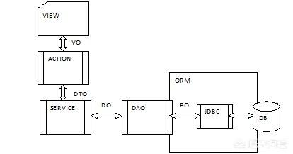
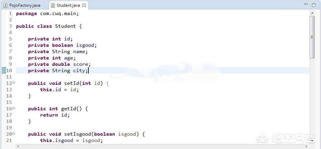
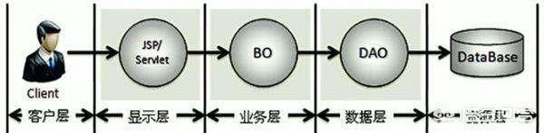

[TOC]

# vo、po、dto、bo、pojo、entity、mode如何区分？

称呼确实很多，我把我知道的总结一下：

## VO（View Object）

VO（View Object）
视图对象，用于展示层，它的作用是把某个指定页面（或组件）的所有数据封装起来。

## PO（PersistentObject）

持久化对象，它跟持久层（通常是关系型数据库）的数据结构形成一一对应的映射关系，如果持久层是关系型数据库，那么，数据表中的每个字段（或若干个）就对应PO的一个（或若干个）属性。

## Entity  

实体bean ，一般是用于ORM 对象关系映射 ，一个实体映射成一张表，一般无业务逻辑代码。
如果是简单的java对象就是pojo，如果进行了持久化有了orm映射以后就是po。
po的作用简单的说就是将数据库中的表映射成java对象，就是属性对应数据库字段。

## DTO（Data Transfer Object）

数据传输对象，这个概念来源于J2EE的设计模式，原来的目的是为了EJB的分布式应用提供粗粒度的数据实体，以减少分布式调用的次数，从而提高分布式调用的性能和降低网络负载，但在这里，我泛指用于展示层与服务层之间的数据传输对象。

## DO（Domain Object）

领域对象，就是从现实世界中抽象出来的有形或无形的业务实体。

## BO

business object：业务对象

BO把业务逻辑封装为一个对象。

我理解是PO的组合，比如投保人是一个PO，被保险人是一个PO，险种信息是一个PO等等，他们组合起来是第一张保单的BO。

## POJO

plain ordinary java object：简单无规则java对象

纯的传统意义的java对象，最基本的Java Bean只有属性加上属性的get和set方法。

可以转化为PO、DTO、VO；比如POJO在传输过程中就是DTO。

## DAO

data access object：数据访问对象

主要用来封装对数据的访问，注意，是对数据的访问，不是对数据库的访问。

其他的还有model/module/domain/entity什么的... 

## 举例
后端返回个前端的对象，可以 ***VO.java

mybatis生成的dao表实体对象，可以 ****PO.java

一般是 PO 转换 DO 然后 转换 DTO提供服务供外部调用  

## 注意
PO一般自动生成和表字段一一映射
DO一般和DO很多字段是一样带，但很多如类型字段是枚举,有的项目中DO是Model结尾的类
DTO如webservice接口（提供外部服务的），返回结果对象都是DTO，里面属性的定义比较讲究，易懂安全好扩展，DTO与DTO之间关系是包含还是平级，设计的时候一定要定义清楚，不然后期就是个坑
VO比较简单，前端展示需要什么就怎么定义

https://www.toutiao.com/a6649179430251921927/?tt_from=android_share&utm_campaign=client_share&timestamp=1555736884&app=news_article&utm_medium=toutiao_android&req_id=20190420130803010019025043808A06B&group_id=6649179430251921927
https://www.wukong.com/answer/6535030067171442948/?iid=28537493856&app=news_article&share_ansid=6535030067171442948&tt_from=android_share&utm_medium=toutiao_android&utm_campaign=client_share