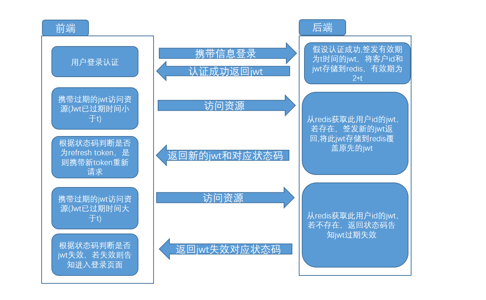
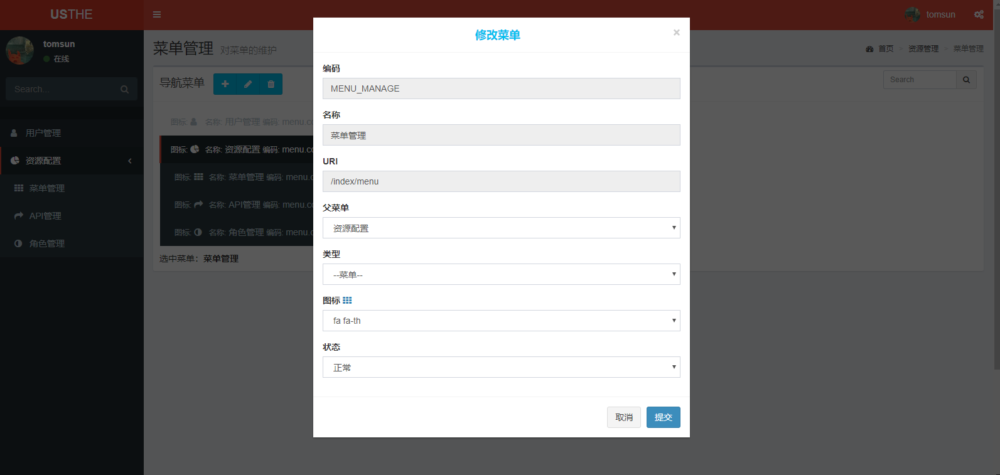
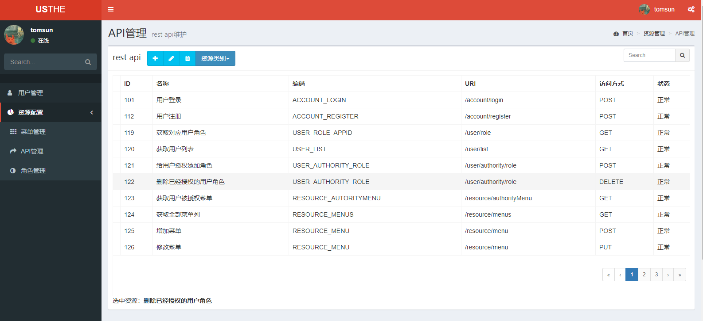
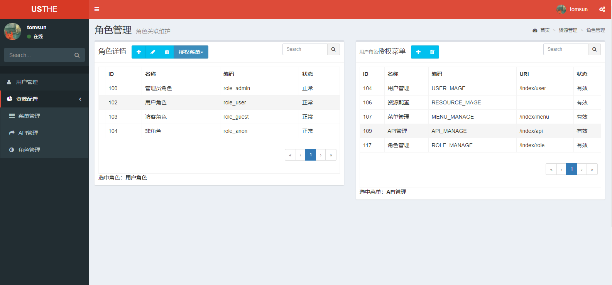
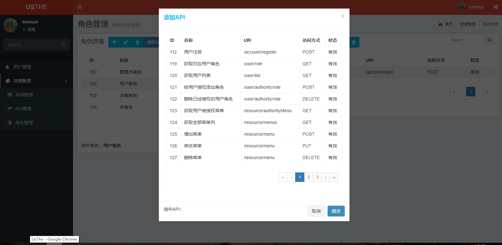

[TOC]


# JWT 签发的用户认证token超时刷新策略

2018-04-22 | 阅读：次

  

## 签发的用户认证token超时刷新策略

这个模块分离至上上上上一篇[api权限管理系统与前后端分离实践](http://usthe.com/2018/04/api权限管理小系统与前后端分离实践/)，感觉那样太长了找不到重点，分离出来要好点。

------

对于登录的用户签发其对应的jwt，我们在jwt设置他的固定有效期时间，在有效期内用户携带jwt访问没问题，当过有效期后jwt失效，用户需要重新登录获取新的jwt。这个体验不太好，好的体验应该是：活跃的用户应该在无感知的情况下在jwt失效后获取到新的jwt，携带这个新的jwt进行访问，而长时间不活跃的用户应该在jwt失效后需要进行重新的登录认证。

这里就涉及到了token的超时刷新问题，解决方案看图：



在签发有效期为 t 时间的jwt后，把jwt用（”JWT-SESSION-“+appId,jwt）的key-value形式存储到redis中，有效期设置为2倍的 t 。这样jwt在有效期过后的 t 时间段内可以申请刷新token。
还有个问题是用户携带过期的jwt对后台请求，在可刷新时间段内返回了新的jwt，应该在用户无感知的情况下返回请求的内容，而不是接收一个刷新的jwt。我们是不是可以在每次request请求回调的时候判断返回的是不是刷新jwt，但是判断是之后我们是否放弃之前的用户请求，如果不放弃，那是不是应该在最开始的用户request请求前先保存这个请求，在之后的回调中如果是返回刷新jwt，我们再携带这个新的jwt再请求一次保存好的request请求？但对于前端这么大量的不同请求，这样是不是太麻烦了？

这困扰了我很久哎，直到我用到了angualr的`HttpInterceptor`哈哈哈哈哈哈哈哈哈哈哈哈哈哈。

angualr的`HttpInterceptor`就是前端的拦截过滤器,发起请求会拦截处理,接收请求也会拦截处理。最大的好处对每次的原始request他都会完整的保存下来，我们向后台发生的request是他的clone。`next.handle(request.clone)`
继承HttpInterceptor的AuthInterceptor，拦截response判断是否为refresh token，是则携带新token再次发起保存的request：

```js
@Injectable()
export class AuthInterceptor implements HttpInterceptor {

  constructor(private authService: AuthService, private router: Router) {}

  intercept(req: HttpRequest<any>, next: HttpHandler): Observable<HttpEvent<any>> {
    const authToken = this.authService.getAuthorizationToken();
    const uid = this.authService.getUid();
    let authReq: any;
    if (authToken != null && uid != null) {
      authReq = req.clone({
        setHeaders: {
          'authorization': authToken,
          'appId': uid
        }
      });
    } else {
      authReq = req.clone();
    }

    console.log(authReq);
    return next.handle(authReq).pipe(
      mergeMap(event => {
        // 返回response
        if (event instanceof HttpResponse) {
          if (event.status === 200) {
            // 若返回JWT过期但refresh token未过期,返回新的JWT 状态码为1005
            if (event.body.meta.code === 1005) {
              const jwt = event.body.data.jwt;
              // 更新AuthorizationToken
              this.authService.updateAuthorizationToken(jwt);
              // clone request 重新发起请求
              // retry(1);
              authReq = req.clone({
                setHeaders: {
                  'authorization': jwt,
                  'appId': uid
                }
              });
              return next.handle(authReq);

            }
          }
          if (event.status === 404) {
            // go to 404 html
            this.router.navigateByUrl('/404');
          }
          if (event.status === 500) {
            // go to 500 html
            this.router.navigateByUrl('/500');
          }
        }
        console.log(event);
        // 返回正常情况的可观察对象
        return of(event);
      }),
      catchError(this.handleError)
    );
  }

  private handleError(error: HttpErrorResponse) {
    if (error.error instanceof ErrorEvent) {
      // A client-side or network error occurred. Handle it accordingly.
      console.error('An error occurred:', error.error.message);
    } else {
      console.error( `Backend returned code ${error.status}, ` +
        `body was: ${error.error}`);
    }
    repeat(1);
    return new ErrorObservable('亲请检查网络');

  }
}
```

后端签发jwt时所做的：

```java
 		/* *
     * @Description 这里已经在 passwordFilter 进行了登录认证
     * @Param [] 登录签发 JWT
     * @Return java.lang.String
     */
    @ApiOperation(value = "用户登录",notes = "POST用户登录签发JWT")
    @PostMapping("/login")
    public Message accountLogin(HttpServletRequest request, HttpServletResponse response) {
        Map<String,String> params = RequestResponseUtil.getRequestParameters(request);
        String appId = params.get("appId");
        // 根据appId获取其对应所拥有的角色(这里设计为角色对应资源，没有权限对应资源)
        String roles = accountService.loadAccountRole(appId);
        // 时间以秒计算,token有效刷新时间是token有效过期时间的2倍
        long refreshPeriodTime = 36000L;
        String jwt = JsonWebTokenUtil.issueJWT(UUID.randomUUID().toString(),appId,
                "token-server",refreshPeriodTime >> 2,roles,null, SignatureAlgorithm.HS512);
        // 将签发的JWT存储到Redis： {JWT-SESSION-{appID} , jwt}
        redisTemplate.opsForValue().set("JWT-SESSION-"+appId,jwt,refreshPeriodTime, TimeUnit.SECONDS);
        AuthUser authUser = userService.getUserByAppId(appId);

        return new Message().ok(1003,"issue jwt success").addData("jwt",jwt).addData("user",authUser);
    }
```

后端refresh token时所做的：

```java
protected boolean isAccessAllowed(ServletRequest servletRequest, ServletResponse servletResponse, Object mappedValue) throws Exception {
        Subject subject = getSubject(servletRequest,servletResponse);
        // 判断是否为JWT认证请求
        if ((null == subject || !subject.isAuthenticated()) && isJwtSubmission(servletRequest)) {
            AuthenticationToken token = createJwtToken(servletRequest);
            try {
                subject.login(token);
//                return this.checkRoles(subject,mappedValue) && this.checkPerms(subject,mappedValue);
                return this.checkRoles(subject,mappedValue);
            }catch (AuthenticationException e) {
                LOGGER.info(e.getMessage(),e);
                // 如果是JWT过期
                if (e.getMessage().equals("expiredJwt")) {
                    // 这里初始方案先抛出令牌过期，之后设计为在Redis中查询当前appId对应令牌，其设置的过期时间是JWT的两倍，此作为JWT的refresh时间
                    // 当JWT的有效时间过期后，查询其refresh时间，refresh时间有效即重新派发新的JWT给客户端，
                    // refresh也过期则告知客户端JWT时间过期重新认证

                    // 当存储在redis的JWT没有过期，即refresh time 没有过期
                    String appId = WebUtils.toHttp(servletRequest).getHeader("appId");
                    String jwt = WebUtils.toHttp(servletRequest).getHeader("authorization");
                    String refreshJwt = redisTemplate.opsForValue().get("JWT-SESSION-"+appId);
                    if (null != refreshJwt && refreshJwt.equals(jwt)) {
                        // 重新申请新的JWT
                        // 根据appId获取其对应所拥有的角色(这里设计为角色对应资源，没有权限对应资源)
                        String roles = accountService.loadAccountRole(appId);
                        long refreshPeriodTime = 36000L;  //seconds为单位,10 hours
                        String newJwt = JsonWebTokenUtil.issueJWT(UUID.randomUUID().toString(),appId,
                                "token-server",refreshPeriodTime >> 2,roles,null, SignatureAlgorithm.HS512);
                        // 将签发的JWT存储到Redis： {JWT-SESSION-{appID} , jwt}
                        redisTemplate.opsForValue().set("JWT-SESSION-"+appId,newJwt,refreshPeriodTime, TimeUnit.SECONDS);
                        Message message = new Message().ok(1005,"new jwt").addData("jwt",newJwt);
                        RequestResponseUtil.responseWrite(JSON.toJSONString(message),servletResponse);
                        return false;
                    }else {
                        // jwt时间失效过期,jwt refresh time失效 返回jwt过期客户端重新登录
                        Message message = new Message().error(1006,"expired jwt");
                        RequestResponseUtil.responseWrite(JSON.toJSONString(message),servletResponse);
                        return false;
                    }

                }
                // 其他的判断为JWT错误无效
                Message message = new Message().error(1007,"error Jwt");
                RequestResponseUtil.responseWrite(JSON.toJSONString(message),servletResponse);
                return false;

            }catch (Exception e) {
                // 其他错误
                LOGGER.warn(servletRequest.getRemoteAddr()+"JWT认证"+e.getMessage(),e);
                // 告知客户端JWT错误1005,需重新登录申请jwt
                Message message = new Message().error(1007,"error jwt");
                RequestResponseUtil.responseWrite(JSON.toJSONString(message),servletResponse);
                return false;
            }
        }else {
            // 请求未携带jwt 判断为无效请求
            Message message = new Message().error(1111,"error request");
            RequestResponseUtil.responseWrite(JSON.toJSONString(message),servletResponse);
            return false;
        }
    }
```


### 效果展示









github:
[bootshiro](https://github.com/tomsun28/bootshiro)
[usthe](https://github.com/tomsun28/usthe)

码云:
[bootshiro](https://gitee.com/tomsun28/bootshiro)
[usthe](https://gitee.com/tomsun28/usthe)


持续更新。。。。。。

**分享一波阿里云代金券[快速上云](https://promotion.aliyun.com/ntms/act/ambassador/sharetouser.html?userCode=rjlzz3uf&utm_source=rjlzz3uf)**

*转载请注明* [from tomsun28](http://usthe.com/)


[https://usthe.com/2018/04/%E7%AD%BE%E5%8F%91%E7%9A%84%E7%94%A8%E6%88%B7%E8%AE%A4%E8%AF%81token%E8%B6%85%E6%97%B6%E5%88%B7%E6%96%B0%E7%AD%96%E7%95%A5/](https://usthe.com/2018/04/签发的用户认证token超时刷新策略/)