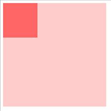

[TOC]


# css BFC详解

　　BFC(block formating context)，翻译过来就是块级格式化上下文。我们可以理解为：BFC就是一个Block-level Box内部的Block-level Box布局的一系列规则。下面我们列出将有哪些布局规则并且举例解释说明。

#### 布局规则：

　　1. 内部的Box会在垂直方向，从顶部开始一个接一个地放置。（即每个块级元素独占一行）

　　2. Box垂直方向的距离由margin决定。属于同一个BFC的两个相邻Box的margin会发生叠加。（垂直方向上margin塌陷）

　　3. 每个元素的margin box的左边， 与包含块border box的左边相接触(对于从左往右的格式化，否则相反)。即使存在浮动也是如此。（规则1产生的原因）

　　4. BFC的区域不会与float box重叠。

　　5. BFC就是页面上的一个隔离的独立容器，容器里面的子元素不会影响到外面的元素。反之也如此。

　　6. 计算BFC的高度时，浮动元素也参与计算。（overflow:hidden清除浮动远离）

#### 如何产生BFC：

1. float 除了none以外的值
2. overflow 除了visible 以外的值（hidden，auto，scroll ）
3. display (table-cell，table-caption，inline-block, flex, inline-flex)
4. position值为（absolute，fixed）

#### 规则解释说明：

> 　　规则2: Box垂直方向的距离由margin决定。属于同一个BFC的两个相邻Box的margin会发生叠加。（垂直方向上margin塌陷）

```css
<!-- 样式 -->
    <style>
    .item {
        width: 100px;
        height: 100px;
        background-color: #f44;
        margin: 50px;
    }
</style>

<!-- 结构 -->
<div class="item"></div>
<div class="item"></div>
```


上图中两个元素上下都有50px的margin，但是由于规则2，显示出来的间隔只有50px；并没有我们像我们想象中出现100px的间隔。这种现象叫做margin塌陷。并且当上下margin不一致时，取较大的那个值。

> 规则3: 每个元素的margin box的左边， 与包含块border box的左边相接触(对于从左往右的格式化，否则相反)。即使存在浮动也是如此。（规则1产生的原因）
>
> 规则4: BFC的区域不会与float box重叠。

```js
<!-- 样式 -->
    <style>
    .aside {
        width: 100px;
        height: 100px;
        background-color: #f66;
        float: left;
    }
    
    .main {
        width: 300px;
        height: 300px;
        background-color: #fcc;
        /*overflow: hidden;*/
    }
</style>

<!-- 结构 -->
<div class="container">
    <div class="aside"></div>
    <div class="main"></div>
</div>
```

当我们注释掉overflow: hidden时：此时两个div满足规则3，与外层border相连，由于浮动的div不占标准文档流位置，所有出现重叠现象；（第一幅图）

当我们添加上overflow: hidden时；此时class为main的div产生BFC，不与float元素重叠，满足规则4，所以class为main的div紧挨浮动的div。（第二幅图）

                          

 

详细BFC讲解可以参考：http://sentsin.com/web/529.html


https://www.cnblogs.com/diligentYe/p/6407300.html