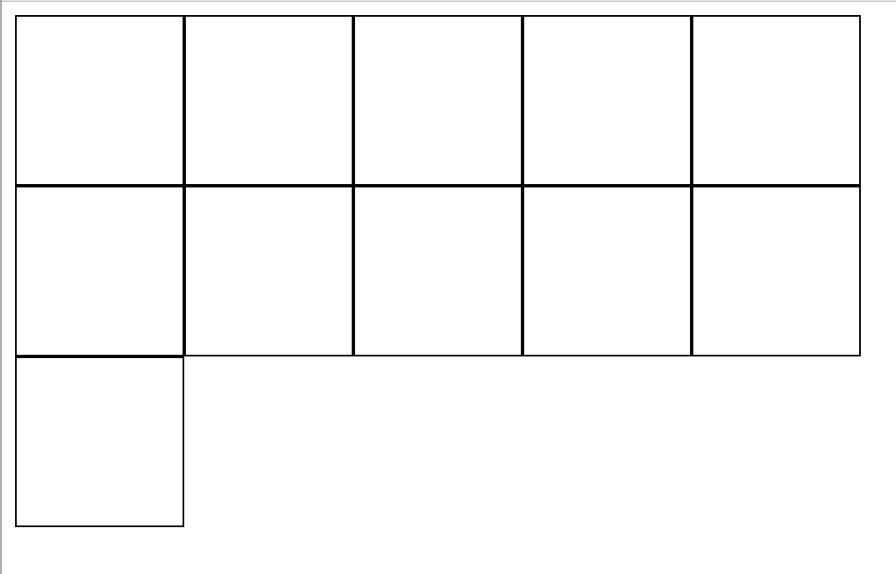
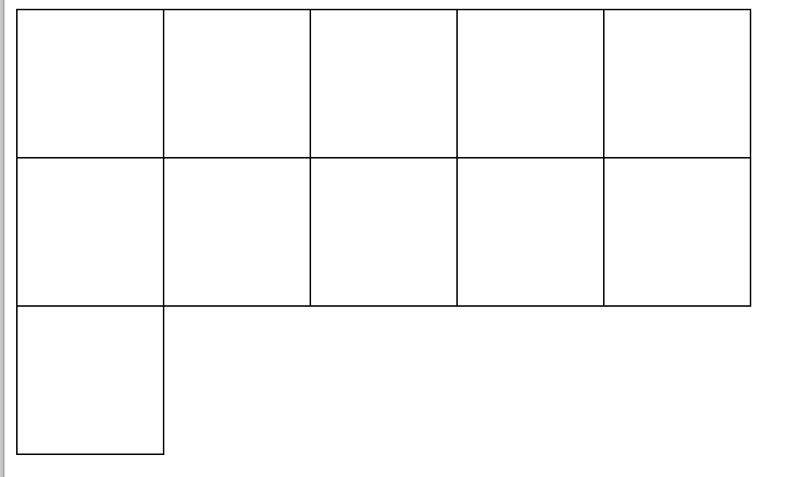

# DIV 边框重叠 像素变粗 解决办法

/Users/jerryye/backup/studio/AvailableCode/web/css/css-demo/border边框/div边框重叠,像素变粗/div_border.html

我们在网站设计时，难免会用到表格。表格中我们需要用到边框，border属性，这篇文章就是讲解DIV css （border属性）边框重叠 像素变粗 解决办法之一



（边框重叠）

                           

（解决后）


**其实很简单：只需要设置div的margin值为边框值的相反数就行**

```html
<!DOCTYPE html>
<html>
<head>
    <title> new document </title>
    <meta charset="utf-8"/>
    <script>
    </script>
    <style>
        .father{
            display: flex;
            flex-wrap: wrap;
        }
        .c{
            width:99px;
            height:100px;
            margin-right:-1px;
            margin-bottom:-1px;
            /*border-right: none;border-bottom: none; 也可以指定右边框和下边框为none*/
            border:1px solid black;
        }
    </style>
</head>
<body>
<div class="father">
    <div class="c"></div>
    <div class="c"></div>
    <div class="c"></div>
    <div class="c"></div>
    <div class="c"></div>
    <div class="c"></div>
    <div class="c"></div>
    <div class="c"></div>
    <div class="c"></div>
    <div class="c"></div>
    <div class="c"></div>
</div>
</body>
</html>

```


https://www.ablanxue.com/shtml/201408/25700_1.shtml