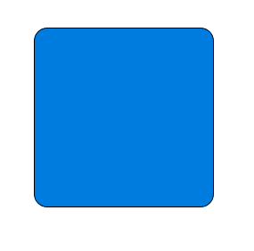
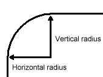
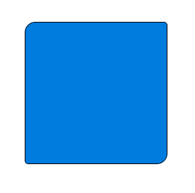
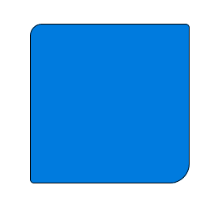
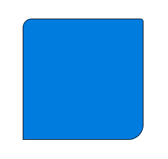
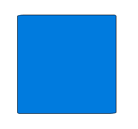
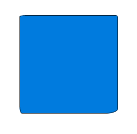
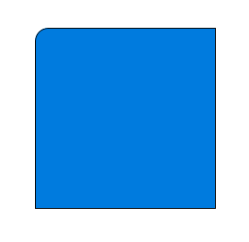
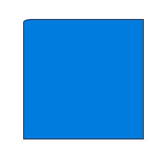
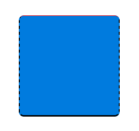

[TOC]

# css3 border 边框圆角详解

CSS3是样式表（style sheet）语言的最新版本，它的一大优点就是支持圆角。

## **一、CSS3圆角的优点**

传统的圆角生成方案，必须使用多张图片作为背景图案。CSS3的出现，使得我们再也不必浪费时间去制作这些图片了，而且还有其他多个优点：

　　* 减少维护的工作量。图片文件的生成、更新、编写网页代码，这些工作都不再需要了。

　　* 提高网页性能。由于不必再发出多余的HTTP请求，网页的载入速度将变快。

　　* 增加视觉可靠性。某些情况下（网络拥堵、服务器出错、网速过慢等等），背景图片会下载失败，导致视觉效果不佳。CSS3就不会发生这种情况。

## **二、border-radius属性**

CSS3圆角只需设置一个属性：border-radius（含义是"边框半径"）。你为这个属性提供一个值，就能同时设置四个圆角的半径。所有合法的CSS度量值都可以使用：em、ex、pt、px、百分比等等。

比如，下面是一个div方框：

现在设置它的圆角半径为15px：

　　border-radius: 15px;

这条语句同时将每个圆角的"水平半径"（horizontal radius）和"垂直半径"（vertical radius）都设置为15px。

border-radius可以同时设置1到4个值。如果设置1个值，表示4个圆角都使用这个值。如果设置两个值，表示左上角和右下角使用第一个值，右上角和左下角使用第二个值。如果设置三个值，表示左上角使用第一个值，右上角和左下角使用第二个值，右下角使用第三个值。如果设置四个值，则依次对应左上角、右上角、右下角、左下角（顺时针顺序）。

　　border-radius: 15px 5px;

　　border-radius: 15px 5px 25px;

　　border-radius: 15px 5px 25px 0px;

（左下角的半径为0，就变成直角了。）

border-radius还可以用斜杠设置第二组值。这时，第一组值表示水平半径，第二组值表示垂直半径。第二组值也可以同时设置1到4个值，应用规则与第一组值相同。

　　border-radius: 15px 5px / 3px;

　　border-radius: 15px 5px 25px / 3px 5px;

　　border-radius: 15px 5px 25px 5px / 3px 5px 10px 15px;

## **三、单个圆角的设置**

除了同时设置四个圆角以外，还可以单独对每个角进行设置。对应四个角，CSS3提供四个单独的属性：

　　* border-top-left-radius
　　* border-top-right-radius
　　* border-bottom-right-radius
　　* border-bottom-left-radius

这四个属性都可以同时设置1到2个值。如果设置1个值，表示水平半径与垂直半径相等。如果设置2个值，第一个值表示水平半径，第二个值表示垂直半径。

　　border-top-left-radius: 15px;

　　border-top-left-radius: 15px 5px;

## **四、浏览器支持**

IE 9、Opera 10.5、Safari 5、Chrome 4和Firefox 4，都支持上述的border-radius属性。早期版本的Safari和Chrome，支持-webkit-border-radius属性，早期版本的Firefox支持-moz-border-radius属性。

目前来看，为了保证兼容性，只需同时设置-moz-border-radius和border-radius即可。

　　-moz-border-radius: 15px;
　　border-radius: 15px;

（注意：border-radius必须放在最后声明，否则可能会失效。）

另外，早期版本Firefox的单个圆角的语句，与标准语法略有不同。

　　* -moz-border-radius-topleft（标准语法：border-top-left-radius）
　　* -moz-border-radius-topright（标准语法：border-top-right-radius）
　　* -moz-border-radius-bottomleft（标准语法：border-bottom-left-radius）
　　* -moz-border-radius-bottomright（标准语法：border-bottom-right-radius）

## **五、注意事项**

虽然各大浏览器都支持border-radius，但是在某些细节上，实现都不一样。当四个角的颜色、宽度、风格（实线框、虚线框等）、单位都相同时，所有浏览器的渲染结果基本一致；一旦四个角的设置不相同，就会出现很大的差异。比如，下面这段代码在不同的浏览器中，渲染结果就相差很大。

　　border-color: black;
　　border-style: solid dashed;
　　border-width: 1px 2px 3px;
　　border-top-color: red;
　　border-radius: 5%;

另外，并非所有浏览器，都支持将圆角半径设为一个百分比值。

因此，目前最安全的做法，就是将每个圆角边框的风格和宽度，都设为一样的值，并且避免使用百分比值。

（完）

作者：Nicholas Zakas

译者：阮一峰

原文：<http://msdn.microsoft.com/en-us/scriptjunkie/gg508841.aspx>

发表日期：2010年12月8日

 

 