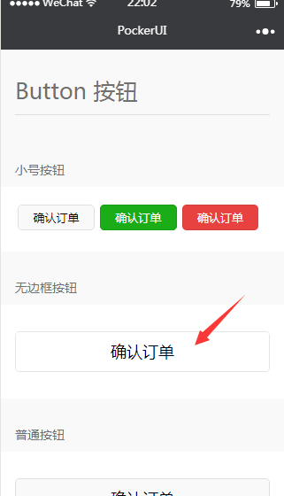
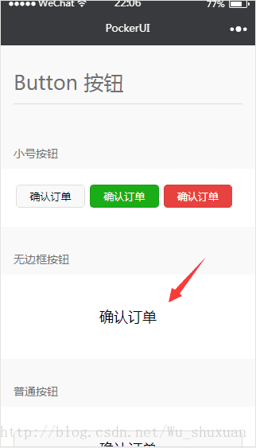

# css button按钮去除border边框 微信小程序

在开发微信小程序组件框架时，我遇到了一个问题，微信小程序中的button组件有特定的css，背景可以用“background：none”去掉，但是边框再用“border : none”去掉就不可以了，这也是微信小程序与h5的不同之处。

但是在微信小程序中使用:after选择器就可以实现这一功能。

例子如下：

```
传统的用“border:none;来去除边框”，依旧有一条细细的border; 
```



```
  使用 button::after{ border: none; } 来去除边框 
```



```css
/*使用 button::after{ border: none; } 来去除边框*/
.free-btn-bordernone{
  background: none !important;
  color: #000 !important;
}
/*主要这个去边框*/
.free-btn-bordernone:after{
  border: none;
}
```


https://blog.csdn.net/Wu_shuxuan/article/details/78209125