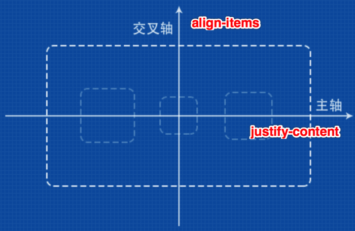
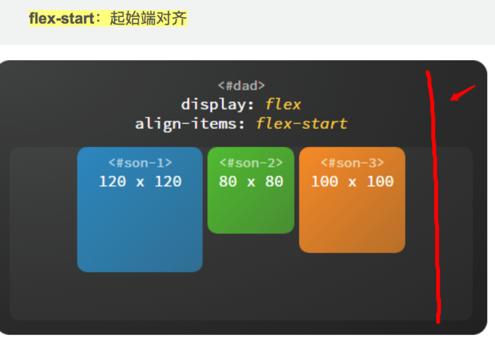
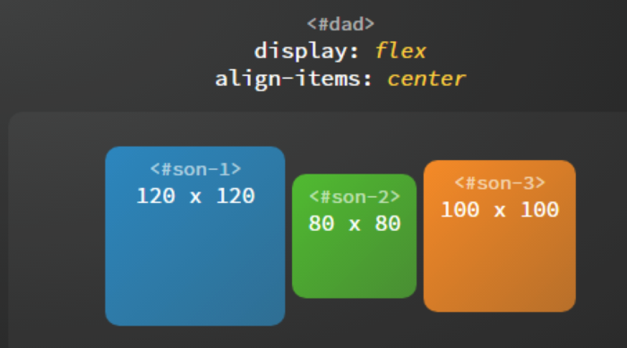

# 关于Flex布局的轴

/Users/jerryye/backup/studio/AvailableCode/web/css/css-demo/layout 页面布局相关/flex

## 轴是怎么定义的？

这个轴啊，是理解flex布局的关键
轴有main-axis，cross-axis。翻译为主轴和交叉轴（交叉轴属于乱翻译）也有的叫侧轴。
如图，在主轴上元素的排列靠justify-content决定。纵轴（侧轴）上的排列有align-items决定。

image.png

举个例子，容器的上边也就是纵轴的起始位置，即flex-start。然后元素顶部沿着这个起始位置对齐就是flex-start。

image.png

image.png

简单看，其实justify-content说的是上中下边的对齐。
自然，align-items说的是左中右边的对齐。

## 轴的位置可以相互交换么？

可以，事实上主轴也可以是竖直的那条轴，这个由flex
-direction决定。

## 多行元素怎么对齐？

上面一个水平对齐，一个垂直对齐，看似很完美。
事实上不符合mece原则，因为上面根本没解决多行元素对齐的问题。
多行元素对齐用align-content。

## 参考

[一劳永逸的搞定 flex 布局 - octopus的专栏 - CSDN博客](https://link.jianshu.com/?t=http://blog.csdn.net/magneto7/article/details/70854472)

https://www.jianshu.com/p/dddd6e3500ff