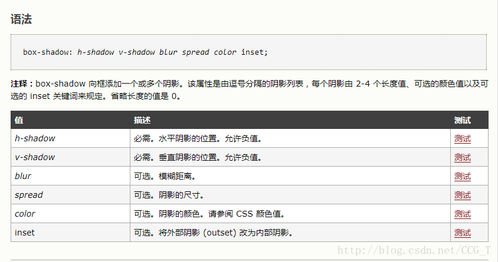
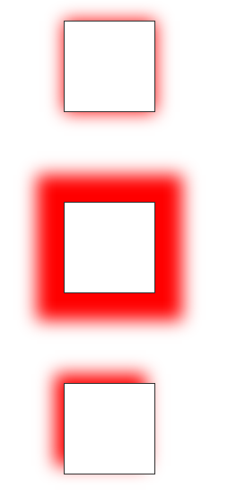
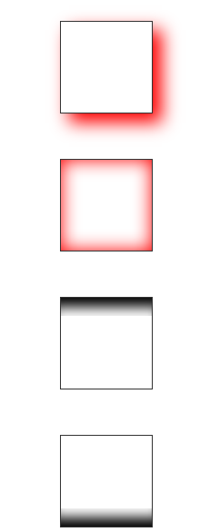

[TOC]


# 阴影box-shadow详解

/Users/jerryye/backup/studio/AvailableCode/web/css/css-demo/box-shadow阴影/阴影box-shadow.html

## box-shadow的基础语法：给块元素设置阴影。 


（1）h-shadow为负值代表左边框设置阴影；若为正值代表右边框设置阴影；若为0则代表左右两边都设置阴影。 
（2）v-shadow为负值代表顶部设置阴影；若为负值代表底部设置阴影；若为0则代表顶部和底部两边都设置阴影。 
（3）blur：只能取非负值，取值为0时代表阴影不具有模糊效果，取值越大代表代表阴影边缘越模糊。 
（4）spread：意思是可扩展半径。取值为正时，值越大代表扩展范围越大；取值为负值时代表阴影缩小。 
（5）inset：代表块元素里面设置阴影。 
（6）outset：代表块元素外面设置阴影，默认值。 

## 常用几种阴影效果例子如下： 

 


代码如下：

```html
<!DOCTYPE html>
<html lang="en">
<head>
    <meta charset="UTF-8">
    <title>阴影box-shadow</title>
    <style>
        .box {
            width: 100%;
        }

        .box1, .box2, .box3, .box4, .box5, .box6, .box7 {
            margin: 0 auto;
            margin-top: 100px;
            width: 100px;
            height: 100px;
        }

        /*盒子外添加(spread为0)*/
        .box1 {
            border: 1px solid #333333;
            box-shadow: 0 0 30px red;
        }

        /*盒子外添加(spread不为0)*/
        .box2 {
            border: 1px solid #333333;
            box-shadow: 0 0 30px 30px red;
        }

        /*盒子左边、顶部添加阴影*/
        .box3 {
            border: 1px solid #333333;
            box-shadow: -10px -10px 30px red;
        }

        /*盒子外右边，底部添加阴影*/
        .box4 {
            border: 1px solid #333333;
            box-shadow: 10px 10px 30px red;
        }

        /*盒子内部添加阴影*/
        .box5 {
            border: 1px solid #333333;
            box-shadow: 0 0 30px red inset;
        }

        /*只给盒子顶部添加阴影*/
        .box6 {
            border: 1px solid #333333;
        }

        .box6-child {
            width: 100%;
            height: 20px;
            box-shadow: 0 20px 20px -10px #000 inset;
        }

        /*只给盒子底部添加阴影*/
        .box7 {
            border: 1px solid #333333;
            position: relative;
        }

        .box7-child {
            width: 100%;
            height: 20px;
            box-shadow: 0 -20px 20px -10px #000 inset;
            position: absolute;
            bottom: 0;
            left: 0;
        }

    </style>
</head>
<body>
<div class="box">
    <!--盒子外添加(spread为0)-->
    <div class="box1"></div>
    <!--盒子外添加(spread不为0)-->
    <div class="box2"></div>
    <!--盒子左边、顶部添加阴影-->
    <div class="box3"></div>
    <!--盒子外右边，底部添加阴影-->
    <div class="box4"></div>
    <!--盒子内部添加阴影-->
    <div class="box5"></div>
    <!--只给盒子顶部添加阴影-->
    <div class="box6">
        <div class="box6-child"></div>
    </div>
    <!--只给盒子底部添加阴影-->
    <div class="box7">
        <div class="box7-child"></div>
    </div>
</div>

</body>
</html>

```


https://blog.csdn.net/CCG_T/article/details/77860260