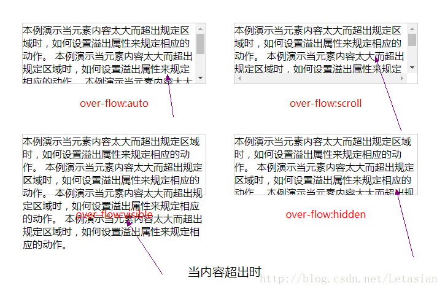

[TOC]


# css中overflow的那些坑

 

元素的overflow属性是用来规定当内容溢出元素框时发生的事情，设置单个方向的overflow-x和overflow-y同理，它有五个值，visible（默认），hidden，scroll，auto，inherit，现在我们先来简单说下这几个属性值： 
**visible**：默认值，它会把内容完全展现出来，即使内容超出已定义的父元素大小，它还是会超出部分按正常显示，但是也不会影响其他元素的布局。 
**hidden**：当内容超过父元素大小，内容会被修剪，其余部分不可见。 
**scroll**：当内容超过父元素大小，内容会被修剪，但是浏览器会显示滚动条以便查看其余的内容。 
**auto**：根据元素内容是否超出来自动控制，当内容超过父元素大小，则如果内容被修剪，浏览器会显示滚动条以便查看其余的内容，不超出则正常显示。 
**inherit**：从父元素继承该属性的值。 
每个属性值效果如下： 
 
 
这里我们重点说**hidden**和**scroll**属性值。

### overflow:hidden

此属性值我们用来最多的就是**清除浮动**，即消除浮动带来的影响==》父元素的高度坍塌，它的原理是父元素设置了overflow：hidden后会给此元素加上BFC超级属性，它会先去计算包括浮动元素的高度，然后才比较高度去进行修剪。

### overflow:scroll

此属性值默认是在垂直方向进行滚动，但是我们经常需要垂直高度固定，仅在水平方向出现滚动条，这时我们需要：

```html
<!DOCTYPE html>
<html lang="en">
<head>
    <meta charset="UTF-8">
    <title>Document</title>
    <style>
        ul {
            margin: 100px auto;
            width: 400px;
            height: 60px;
            padding: 10px;
            overflow-x: scroll;
            /* 或者overflow-x: auto; */
            overflow-y: hidden;
            white-space: nowrap;
        }

        li {
            list-style-type: none;
            width: 80px;
            height: 30px;
            line-height: 30px;
            background: #ccc;
            margin-left: 4px;
            display: inline-block;
        }
    </style>
</head>
<body>
<ul>
    <li>aaa</li>
    <li>aaa</li>
    <li>aaa</li>
    <li>aaa</li>
    <li>aaa</li>
    <li>aaa</li>
</ul>
</body>
</html>
```


实现效果： 
 
这里我们主要注意**white-space: nowrap;**一定要写上overflow-x可以auto或者scroll，父元素需要定宽。

以上就是对overflow属性的一些总结，主要是解决仅出现横向滚动条问题这一坑。


https://blog.csdn.net/Letasian/article/details/76451618