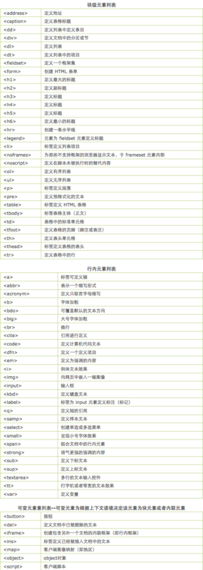

[TOC]


# css中的display属性详解（行内元素和块级元素）

## display属性

首先，所有主流浏览器都支持 `display` 属性。其次，我们都知道`display` 属性规定元素应该生成的框的类型。默认值：`inline`

**我们常用的display属性值有：**

1. `inline`
2. `block`
3. `inline-block`
4. `none`

把 `display` 设置成 `none` 不会保留元素本该显示的空间，但是 `visibility: hidden` 还会保留。

那么，`display`:**inline**、`display`:**block**和`display`:**inline-block**有什么区别呢？

```
<!DOCTYPE html>
<html lang="en">
<head>
    <meta charset="UTF-8">
    <title>Title</title>
    <style>
        .inline {
            display: inline;
            width: 100px;
            height: 100px;
            padding: 5px;
            background-color: #F00;
        }

        .block {
            display: block;
            width: 100px;
            height: 100px;
            padding: 5px;
            background-color: #0f0;
        }

        .inline-block {
            display: inline-block;
            width: 100px;
            height: 100px;
            padding: 5px;
            background-color: #00f;
        }
    </style>
</head>
<body>

<span class="inline">
inline
</span>
<span class="block">
block
</span> block
<span class="inline-block">
inline-block
</span>inline-block

</body>
</html>
```

点击result查看demo:
<http://jsfiddle.net/qjgcjLm8/>点击预览

### inline特性

我们发现内联对象`inline`给它设置属性`height`和`width`是没有用的，致使它变宽变大的
原因是

```
内部元素的宽高`+padding`。观察inline对象的前后元素我们会发现`inline`不单独占一行，
其它元素会紧跟其后。
```

### block特性

```
而块对象`block`是可以设置宽高的，但是它的实际宽高是本身宽高`+padding`。
观察`block`的前后元素我们会发现`block`要单独占一行。
```

然而，当我们即需要div有宽高，又不希望它独占一行怎么办？

### inline-block特性

这个时候我们就需要使用`inline-block`了，再观察一下上面的demo，我们会发现：

```
inline-block既具有block的宽高特性又具有inline的同行元素特性。
```

也就是说，当我们想要让一个元素既不独占一行，又可以设置其宽高属性的时候，我们就可以选择`inline-block`了。

然而，在IE6/7下`padding`对`inline`的宽高是对其没影响的。

由此，我们可以联想到**行内元素**和**块级元素**

### 行内元素特点

```
1、和其他元素都在一行上；

2、元素的高度、宽度、行高及顶部和底部边距不可设置；

3、元素的宽度就是它包含的文字或图片的宽度，不可改变。 
```

### 块级元素特点

```
1、每个块级元素都从新的一行开始，并且其后的元素也另起一行。（真霸道，一个块级元素独占一行）

2、元素的高度、宽度、行高以及顶和底边距都可设置。

3、元素宽度在不设置的情况下，是它本身父容器的100%（和父元素的宽度一致），除非设定一个宽度。
```

在html中，`<span>、<a>、<label>、<input>、 、 <strong> 和<em>`就是典型的行内元素（inline）元素。

块级元素是可以设置宽高的，但是它的实际宽高是本身宽高+padding。block元素要单独占一行。内联元素不单独占一行，给他设置宽高是没有用的。

在html中`<div>、 <p>、<h1>、<form>、<ul> 和 <li>`就是块级元素。设置`display:block`就是将元素显示为块级元素。如下代码就是将行内元素a转换为块状元素，从页使用a元素具有块状元素特点。

```
a{display:block;}
```

那么，`display`的其他属性值呢？

------

`list-item` 此元素会作为列表显示。

`run-in`此元素会根据上下文作为块级元素或内联元素显示。

`compact` CSS 中有值 compact，不过由于缺乏广泛支持，已经从 CSS2.1 中删除。

`marker` CSS 中有值 marker，不过由于缺乏广泛支持，已经从 CSS2.1 中删除。

`table` 此元素会作为块级表格来显示（类似table），表格前后带有换行符。
`inline-table` 此元素会作为内联表格来显示（类似table），表格前后没有换行符。
`table-row-group` 此元素会作为一个或多个行的分组来显示（类似tbody）
`table-header-group` 此元素会作为一个或多个行的分组来显示（类似thead）
`table-footer-group：` 此元素会作为一个或多个行的分组来显示（类似tfoot）
`table-row` 此元素会作为一个表格行显示（类似 tr ）。
`table-column-group` 此元素会作为一个或多个列的分组来显示（类似 colgroup ）。
`table-column` 此元素会作为一个单元格列显示（类似 col ）
`table-cell` 此元素会作为一个表格单元格显示（类似 td 和 th）
`table-caption` 此元素会作为一个表格标题显示（类似 caption）

## 行内和块级元素



- [2014年08月31日发布](https://segmentfault.com/a/1190000000654770)


https://segmentfault.com/a/1190000000654770