[TOC]


# CSS vertical-align属性详解 垂直对齐

## 前言：关于vertical-align属性

vertical-align属性可能是CSS属性中比较不好理解的一个。

W3C对它的解释是：该属性定义行内元素的基线相对于该元素所在行的基线的垂直对齐。

本文将通过一系列实例实验说明它的作用。

[注：将鼠标放置到本文的图片上可看到辅助线]

## 实践出真知

### vertical-align:baseline;

首先，在HTML body中定义一个用于实验的HTML结构

它包含一个div作为父元素，两张图片，和一个span元素，如下：

```html
<div>
   Writing
   
   <span id="span">span元素</span>
   
</div>
```

为了更易于比较，需要加一些简单的样式，如下所示：

```css
div{
  border:1px solid black;/*给父元素添加一个边框，便于辨认*/
  width:1000px;
  height:200px;
  font-size: 50px;/*设置大号字体，便于比较*/
}

img#img1{
  width:150px;
}

#span{
  display: inline-block;/*注意这里的inline-block*/
  width:250px;
  height:80px;
  background-color: yellow;/*给span元素设置一背景色，便于辨认*/
}

img#img2{
  width:250px;
} 
```

因为vertical-align的默认值为baseline，所以以上代码相当于为#img1元素设置了vertical-align:baseline;属性。

W3C对baseline值的解释是：默认，元素放置在父元素的基线上。

目前的效果大概是这样（黑色边框即为父元素div范围）：

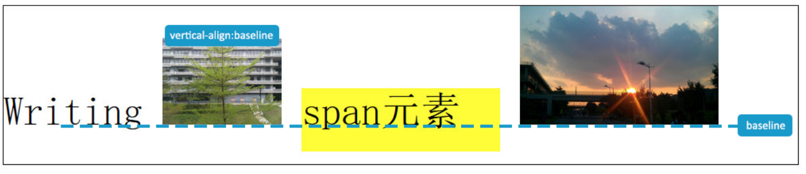

### vertical-align:top;

第二个属性值是vertical-align:top;，W3C对top值的解释是：把元素的顶端与行中最高元素的顶端对齐。

```
        img#img1 {
            vertical-align:top;/*添加*/
            width: 150px;
        }
```

本例中，最高元素即为图片2（#img2），如下所示：

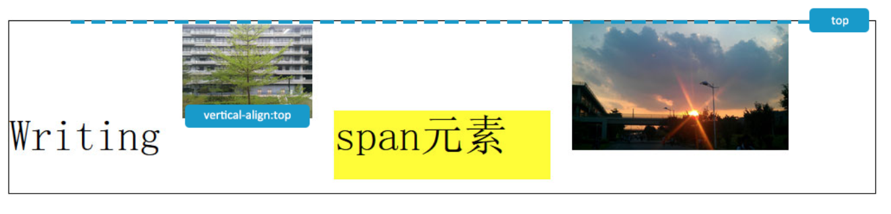

### vertical-align:text-top;

第三个属性值是vertical-align:text-top;，W3C对text-top值的解释是：把元素的顶端与父元素字体的顶端对齐。如下所示：

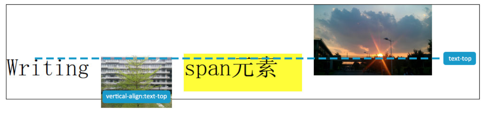

### vertical-align:middle;

第四个属性值是vertical-align:middle;，W3C对middle值的解释是：把此元素放置在父元素的中部。

其实从下图可以看出，对齐的是父元素文本的中部：

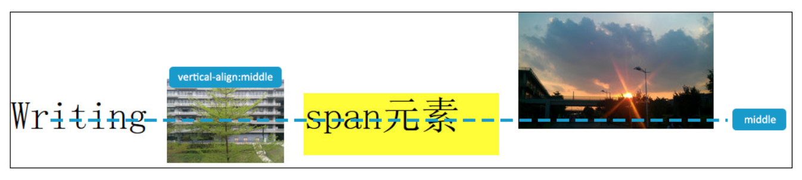

### vertical-align:bottom;

第五个属性值是vertical-align:bottom;，W3C对bottom值的解释是：把元素的顶端与行中最低的元素的顶端对齐。

本例中，行中最低元素即为span元素，如下所示：

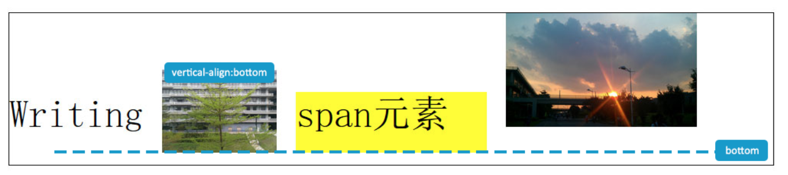

### vertical-align:text-bottom;

第六个属性值是vertical-align:text-bottom;，W3C对text-bottom值的解释是：把元素的底端与父元素字体的底端对齐。如下所示：

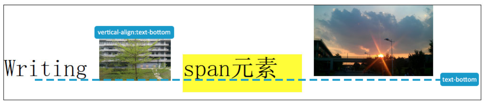

### vertical-align:20px;

可以使用定长表示元素底部与父元素基线（baseline）的距离，如vertical-align:20px;

正值表示往上，负值表示往下，如下所示：

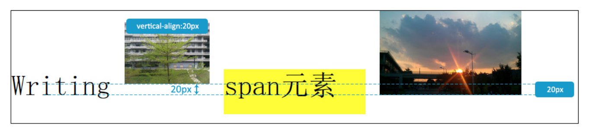

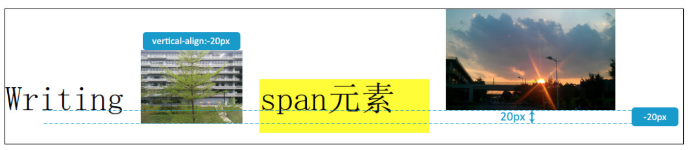

### vertical-align:40%;

亦可使用百分数表示元素底部相对于父元素基线（baseline）移动相对于父元素高（height）的百分比，如vertical-align:40%;

同样的，正值表示往上，负值表示往下，如下所示：

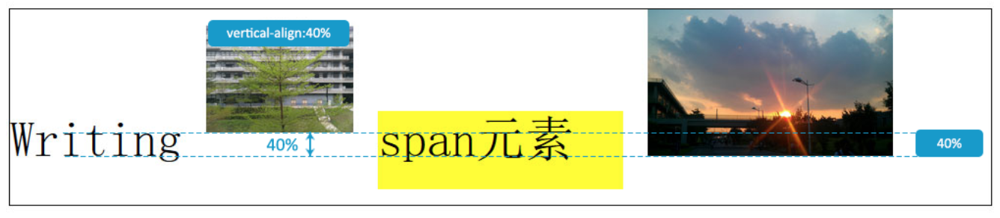

不仅可以将vertical-align属性应用在图片上，也可以应用 在其它行内（内联）元素上

如此例，把vertical-align:top;运用在span元素上，如下所示：

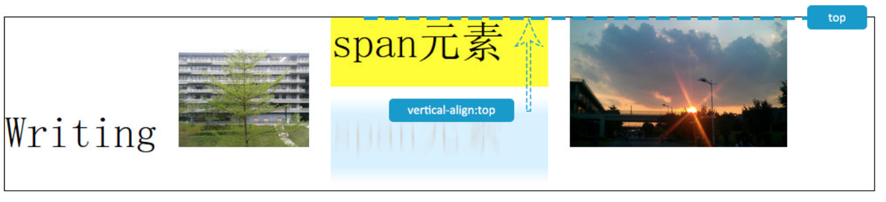

## 垂直居中

从上文的示例分析可以看出，vertical-align属性虽有很多个可能的值

我们可以利用它的middle值，构造出令不定高的行内（内联）元素在父元素中垂直居中的效果

只需要在需要居中的元素外增加一个空的span元素

将span元素`display:inline-block;width:1px;height:100%;`并添加`vertical-align:middle;`

将需要垂直居中的元素（本例中为#img1元素）添加vertical-align:middle;

为了将元素水平居中，可以在它的父元素（本例中为div元素）设置text-align:center;

目前的HTML结构看起来可能像这样：

```
<div>
   <span id="span"></span>
   
</div>
```

目前的CSS应该像这样：

```
div{
  width:1000px;
  height:200px;
  text-align: center;
}

img#img1{
  vertical-align: middle;
}

#span{
  display: inline-block; 
  width:1px;
  height:100%;
  vertical-align: middle;
}
```

效果会像这样：

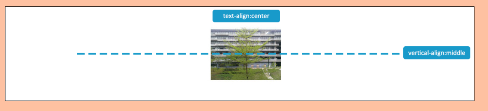

## 第二种用法

其实，vertical-align属性还有第二种用法

vertical-align可以用在display:table-cell;元素的下面（典型的就是td），这时的有四个可取值baseline|top|middle|bottom如下图

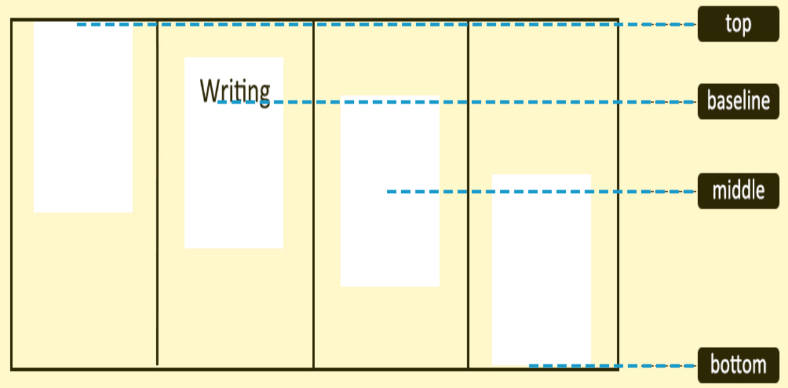

这种用法相对比较简单，在此不再展开赘述。


https://www.cnblogs.com/hykun/p/3937852.html