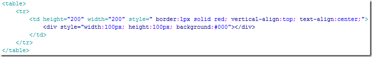

[TOC]

## css 布局技巧之各种居中

居中是我们使用css来布局时常遇到的情况。使用css来进行居中时，有时一个属性就能搞定，有时则需要一定的技巧才能兼容到所有浏览器，本文就居中的一些常用方法做个简单的介绍。

注：本文所讲方法除了特别说明外，都是兼容IE6+、谷歌、火狐等主流浏览器的。

先来说几种简单的、人畜无害的居中方法

## **1. 把margin设为auto**

具体来说就是把要居中的元素的margin-left和margin-right都设为auto，此方法只能进行水平的居中，且对浮动元素或绝对定位元素无效。

## **2、使用 text-align:center**

这个没什么好说的，只能对图片，按钮，文字等行内元素(display为inline或inline-block等)进行水平居中。但要说明的是在IE6、7这两个奇葩的浏览器中，它是能对任何元素进行水平居中的。

## **3、使用line-height让单行的文字垂直居中**

把文字的line-height设为文字父容器的高度，适用于只有一行文字的情况。

## **4、使用表格**

如果你使用的是表格的话，那完全不用为各种居中问题而烦恼了，只要用到 td(也可能会用到 th)元素的 align="center" 以及 valign="middle" 这两个属性就可以完美的处理它里面内容的水平和垂直居中问题了,而且表格默认的就会对它里面的内容进行垂直居中。如果想在css中控制表格内容的居中，垂直居中可以使用 vertical-align:middle，至于水平居中，貌似css中是没有相对应的属性的,但是在IE6、7中我们可以使用text-align:center来对表格里的元素进行水平居中，IE8+以及谷歌、火狐等浏览器的text-align:center只对行内元素起作用，对块状元素无效。

在ie6、7中可以通过css的text-algin来控制表格内容的水平方向的对齐，无论内容是行内元素还是块状元素都有效。

但在ie8+以及chrome、firefox等浏览器中的text-align:center对块状元素无效，只能用表格自有的align属性。

## **5、使用display:table-cell来居中**

对于那些不是表格的元素，我们可以通过display:table-cell 来把它模拟成一个表格单元格，这样就可以利用表格那很方便的居中特性了。例如：

但是，这种方法只能在IE8+、谷歌、火狐等浏览器上使用，IE6、IE7都无效。

 

那面所说的都是很基础的方法，自然不能称之为奇淫巧计，下面就来说一些需要使用一些技巧的居中方法。

## **6、使用绝对定位来进行居中**

此法只适用于那些我们已经知道它们的宽度或高度的元素。

绝对定位进行居中的原理是通过把这个绝对定位元素的left或top的属性设为50%,这个时候元素并不是居中的，而是比居中的位置向右或向左偏了这个元素宽度或高度的一半的距离，所以需要使用一个负的margin-left或margin-top的值来把它拉回到居中的位置，这个负的margin值就取元素宽度或高度的一半。

运行效果：

如果只想实现一个方向的居中，则可以只使用left , margin-left 来实现水平居中，使用top , margin-top来实现垂直居中。

 

## **7、另一种使用绝对定位来居中的方法**

此法同样只适用于那些我们已经知道它们的宽度或高度的元素，并且遗憾的是它只支持IE9+,谷歌，火狐等符合w3c标准的现代浏览器。

下面用一段代码来了解这种方法：

运行效果：

这里如果不定义元素的宽和高的话，那么他的宽就会由left,right的值来决定，高会由top,bottom的值来决定，所以必须要设置元素的高和宽。同时如果改变left，right , top , bottom的值还能让元素向某个方向偏移，大家可以自己去尝试。

 

## **8、使用浮动配合相对定位来进行水平居中**

此方法也是关于浮动元素怎么水平居中的解决方法，并且我们不需要知道需要居中的元素的宽度。

浮动居中的原理是：把浮动元素相对定位到父元素宽度50%的地方，但这个时候元素还不是居中的，而是比居中的那个位置多出了自身一半的宽度，这时就需要他里面的子元素再用一个相对定位，把那多出的自身一半的宽度拉回来，而因为相对定位正是相对于自身来定位的，所以自身一半的宽度只要把left 或 right 设为50%就可以得到了，因而不用知道自身的实际宽度是多少。

这种使用浮动配合相对定位来居中的方法，优点是不用知道要居中的元素的宽度，即使这个宽度是不断变化的也行；缺点是需要一个多余的元素来包裹要居中的元素。

看下代码：

 

运行效果：

 

## **9、利用font-size来实现垂直居中**

如果父元素高度是已知的，要把它里面的子元素进行水平垂直居中，则可以使用这种方法，且子元素的宽度或高度都不必知道。

该方法只对IE6和IE7有效。

该方法的要点是给父元素设一个合适的font-size的值，这个值的取值为该父元素的高度除以1.14得到的值，并且子元素必须 是一个inline或inline-block元素，需要加上vertical-align:middle属性。

至于为什么是除以1.14而不是其他的数，还真没有人知道，你只需要记住1.14这个数就行了。

在方法5中说过在IE8+、火狐谷歌等现在浏览器中可以用display:table-cell来进行居中，而这里的font-size的方法则适用于IE6和IE7，所以把这两种方法结合起来就能兼容所有浏览器了：

上面的例子中因为要居中的元素是一个块状元素，所以我们还需要把他变成行内元素，如果要居中的元素是图片等行内元素，则可以省略此步。

另外，如果 vertical-align:middle 是写在父元素中而不是子元素中，这样也是可以的，只不过计算font-size时使用的  1.14 这个 数值要变成大约 1.5 这个值。

 

以上就是一些常见的居中方法了，如有疏漏或错误之处，敬请指正！

 

[CSS布局奇淫技巧之-宽度自适应](http://www.cnblogs.com/2050/archive/2012/07/30/2614852.html)

[CSS布局奇淫技巧之-高度自适应](http://www.cnblogs.com/2050/archive/2012/07/30/2615260.html)

[CSS布局奇淫技巧之-多列等高](http://www.cnblogs.com/2050/archive/2012/07/31/2616460.html)

http://www.cnblogs.com/2050/p/3392803.html