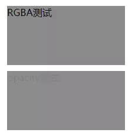

# CSS3中RGBA和opacity的区别

## RGBA是什么？

是在RGB<Red（红色） Green（绿色） Blue（蓝色）>的基础上增加了一个通道Alpha。Alpha参数为透明值，在0~1之间。

RGBA 不仅可以用在 background 属性上，还可以用在 color 和 border 属性中。

RGBA和opacity之间的不同点是前者只应用到指定的元素上，后者会影响指定的元素及其子元素。

下面通过实例演示来说明 。

效果展示：



rgba演示.png

```
<!--HTML部分-->
<div class="demo" id="demo">RGBA测试</div>
<div class="demo" id="demo2">opacity测试</div>
```

```

 /*css部分*/ 
   #demo {
       width: 200px;
       height: 100px;
       background: rgba(25, 25, 25, .5);
       margin: 10px;
   }
   
   #demo2 {
       width: 200px;
       height: 100px;
       background: rgb(25, 25, 25);
       opacity: .5;
       margin: 10px;
   }
```


https://www.jianshu.com/p/32b534e26c12