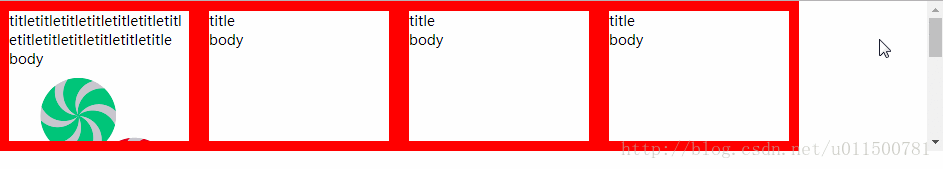
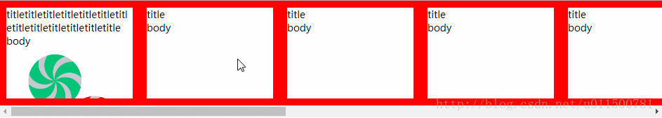

# 如何让多个div横向排列而不换行

### 现象

- 多个div排列在一行，包裹的框宽度不足时，那么会换行显示
- 如图 
  

### 解决

- 关键点在于`white-space: nowrap;`的使用

- 效果 
  

- 代码

  ```
  <!DOCTYPE html>
  <html lang="en">

  <head>
      <meta charset="UTF-8">
      <meta name="viewport" content="width=device-width, initial-scale=1.0">
      <meta http-equiv="X-UA-Compatible" content="ie=edge">
      <title>demo</title>
  </head>
  <style type="text/css">
      * {
          margin: 0;
          padding: 0;
      }

      .t-ctn {
          width: 100%;
          overflow-x: auto;
      }

      .t-ctn .s-ctn {
          height: 150px;
          white-space: nowrap;
          font-size: 0;
      }

      .t-ctn .s-ctn div {
          font-size: 14px;
          box-sizing: border-box;
          white-space: normal;
          word-wrap: break-word;
          word-break: break-all;
          overflow: hidden;
          display: inline-block;
          width: 200px;
          height: 100%;
          border: 10px solid red;
      }
  </style>

  <body>
      <div class="t-ctn">
          <div class="s-ctn">
              <div>
                  <p>titletitletitletitletitletitletitletitletitletitletitletitletitle</p>
                  <p>body</p>
                  
              </div>
              <div>
                  <p>title</p>
                  <p>body</p>
              </div>
              <div>
                  <p>title</p>
                  <p>body</p>
              </div>
              <div>
                  <p>title</p>
                  <p>body</p>
              </div>
              <div>
                  <p>title</p>
                  <p>body</p>
              </div>
              <div>
                  <p>title</p>
                  <p>body</p>
              </div>
              <div>
                  <p>title</p>
                  <p>body</p>
              </div>
              <div>
                  <p>title</p>
                  <p>body</p>
              </div>
              <div>
                  <p>title</p>
                  <p>body</p>
              </div>
              <div>
                  <p>title</p>
                  <p>body</p>
              </div>
              <div>
                  <p>title</p>
                  <p>body</p>
              </div>
          </div>
      </div>
  </body>

  </html>
  ```


https://blog.csdn.net/u011500781/article/details/78814862?utm_source=blogxgwz1