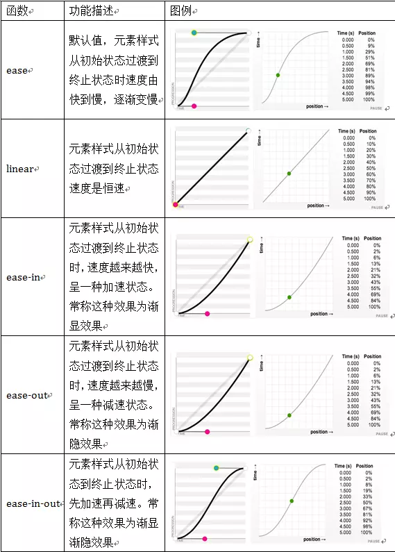

[TOC]


# css3 动画 animation属性 详解

介绍的属性并不完全，写的都是我认为容易混淆的难点属性，所以属性会在最后综合案例展示~

## Keyframes介绍：

Keyframes被称为关键帧，其类似于Flash中的关键帧。在CSS3中其主要以“@keyframes”开头，后面紧跟着是动画名称加上一对花括号“{…}”，括号中就是一些不同时间段样式规则。

```
@keyframes changecolor{
  0%{
   background: red;
  }
  100%{
    background: green;
  }
}
```

animation

```
animation: [name/动画名称] [duration/动画时间] [timing-function/动画周期(ease)] delay[动画延时] [iteration-count/动画播放次数] [direction/指定是否应该轮流反向播放动画] [fill-mode/规定当动画不播放时（当动画完成时，或当动画有一个延迟未开始播放时），要应用到元素的样式] [play-state/指定动画是否正在运行或已暂停];
```

| 属性            | 属性单独使用                | 属性作用                                                     | 属性可选值                                                   |
| --------------- | --------------------------- | ------------------------------------------------------------ | ------------------------------------------------------------ |
| name            | *animation-name*            | 动画名称(@keyframes name)                                    | @keframes name                                               |
| duration        | *animation-duration*        | 动画运行时间(1s)                                             | 参数num(1s or 0.5s)                                          |
| timing-function | *animation-timing-function* | 设置动画将如何完成一个周期                                   | - linear [动画从头到尾的速度是相同的] - ease [默认。动画以低速开始，然后加快，在结束前变慢] - ease-in [动画以低速开始] - ease-out [动画以低速结束] - ease-in-out [动画以低速开始和结束] - cubic-bezier(n,n,n,n) [在 cubic-bezier 函数中自己的值。可能的值是从 0 到 1 的数值] |
| delay           | *animation-delay*           | 设置动画在启动前的延迟间隔                                   | time [可选。定义动画开始前等待的时间，以秒或毫秒计。默认值为0] |
| iteration-count | *animation-iteration-count* | 定义动画的播放次数                                           | - n [一个数字，定义应该播放多少次动画] - infinite [指定动画应该播放无限次（永远] |
| direction       | *animation-direction*       | 指定是否应该轮流反向播放动画                                 | - normal [默认值。动画按正常播放] - reverse [动画反向播放] - alternate [动画在奇数次（1、3、5...）正向播放，在偶数次（2、4、6...）反向播放] - alternate-reverse [动画在奇数次（1、3、5...）反向播放，在偶数次（2、4、6...）正向播放] - initial [置该属性为它的默认值。请参阅[*initial*](https://link.jianshu.com/?t=http://www.runoob.com/cssref/css-initial.html)] - inherit [从父元素继承该属性。请参阅[*inherit*](https://link.jianshu.com/?t=http://www.runoob.com/cssref/css-inherit.html)] |
| fill-mode       | *animation-fill-mode*       | 规定当动画不播放时（当动画完成时，或当动画有一个延迟未开始播放时），要应用到元素的样式 |                                                              |
| play-state      | *animation-play-state*      | 指定动画是否正在运行或已暂停                                 |                                                              |

- 示例：创建一个动画名叫“changecolor”，在“0%”时背景色为red,在20%时背景色为blue，在40%背景色为orange，在60%背景色为green，在80%时背景色yellow，在100%处时背景色为red。

```Html
<!DOCTYPE html>
<html>
<head>
<meta charset="utf-8">
<title>css3动画</title>
<style>
@keyframes changecolor{
  0%{
    background: red;
  }
  20%{
    background:blue;
  }
  40%{
    background:orange;
  }
  60%{
    background:green;
  }
  80%{
    background:yellow;
  }
  100%{
    background: red;
  }
}
div {
  width: 300px;
  height: 200px;
  background: red;
  color:#fff;
  margin: 20px auto;
}
div:hover {
  animation: changecolor 5s ease-out .2s;
}
</style>
</head>
<body>
<div>hover颜色改变</div>
 
</body>
</html>
```

## 设置动画播放方式

语法规则：

- animation-timing-function:ease(由快到慢，逐渐变慢) | linear | ease-in | ease-out | ease-in-out | cubic-bezier(\<number>, <number>, <number>, <number>) [, ease | linear | ease-in | ease-out | ease-in-out | cubic-bezier(<number>, <number>, <number>, <number>)]*



 

## 设置动画播放方向

animation-direction属性主要用来设置动画播放方向，其语法规则如下：

- animation-direction:normal | alternate [, normal | alternate]*

其主要有两个值：normal、alternate

- normal是默认值，如果设置为normal时，动画的每次循环都是向前播放；
- 另一个值是alternate，他的作用是，动画播放在第偶数次向前播放，第奇数次向反方向播放。

## 设置动画的播放状态

animation-play-state属性主要用来控制元素动画的播放状态。

参数：

- 其主要有两个值：running和paused。
- 其中running是其默认值，主要作用就是类似于音乐播放器一样，可以通过paused将正在播放的动画停下来，也可以通过running将暂停的动画重新播放，这里的重新播放不一定是从元素动画的开始播放，而是从暂停的那个位置开始播放。另外如果暂停了动画的播放，元素的样式将回到最原始设置状态。

例如，页面加载时，动画不播放。代码如下：

- animation-play-state:paused;

## 设置动画时间外属性

- animation-fill-mode属性定义在动画开始之前和结束之后发生的操作。主要具有四个属性值：none、forwards、backwords和both。其四个属性值对应效果如下：
- none | 默认值，表示动画将按预期进行和结束，在动画完成其最后一帧时，动画会反转到初始帧处
- forwards | 表示动画在结束后继续应用最后的关键帧的位置
- backwards | 会在向元素应用动画样式时迅速应用动画的初始帧
- both | 元素动画同时具有forwards和backwards效果


https://www.jianshu.com/p/c9ca7a85f1b1