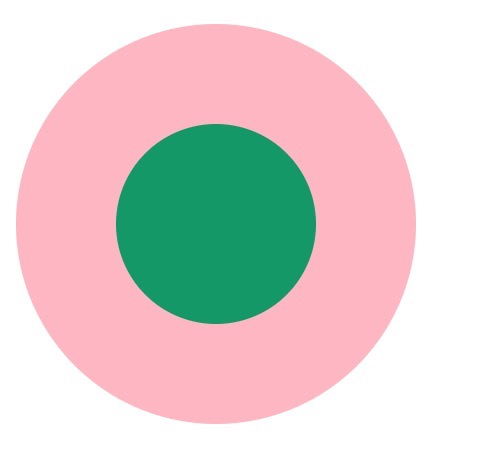

# 实现CSS圆环的5种方法

圆环的问题，特意写篇文章总结一下吧！总结了一下大概有5种方法。



## 1. 两个标签的嵌套：

```javascript
<div class="element1">
    <div class="child1"></div>
</div>

```

```css
        .element1 {
            width: 200px;
            height: 200px;
            background-color: lightpink;
            border-radius: 50%;
        }
        .child1 {
            width: 100px;
            height: 100px;
            border-radius: 50%;
            background-color: #009966;
            position: relative;
            top: 50px;
            left: 50px;
        }
```


## 2. 使用伪元素，before／after

```javascript
<div class="element2"></div>

```

```
.element2 {
    width: 200px;
    height: 200px;
    background-color: lightpink;
    border-radius: 50%;
}

.element2:after {
    content: "";
    display: block;
    width: 100px;
    height: 100px;
    border-radius: 50%;
    background-color: #009966;
    position: relative;
    top: 50px;
    left: 50px;
}
```


## 3. 使用border:

```javascript
<div class="element3"></div>

```

```
 .element3{
            width: 100px;
            height: 100px;
            background-color: #009966;
            border-radius: 50%;
            border: 50px solid lightpink ;
        }

```


## 4. 使用border-shadow

```javascript
<div class="element4"></div>
```

```
.element4{
    width: 100px;
    height: 100px;
    background-color: #009966;
    border-radius: 50%;
    box-shadow: 0 0 0 50px lightpink ;
    margin: auto;
}
```

```
<div class="element5">
```

```
.element5{
    width: 200px;
    height: 200px;
    background-color: #009966;
    border-radius: 50%;
    box-shadow: 0 0 0 50px lightpink inset;
    margin: auto;
}
```


## 5. 使用radial-gradient

```javascript
<div class="element6"></div>
```

```
.element6{
    width: 200px;
    height: 200px;
    border-radius: 50%;
    background: -webkit-radial-gradient( circle closest-side,#009966 50%,lightpink 50%);
}

```

如果大家有其他的方法，请告诉我吧，谢谢！！！


https://blog.csdn.net/LXY224/article/details/79526061