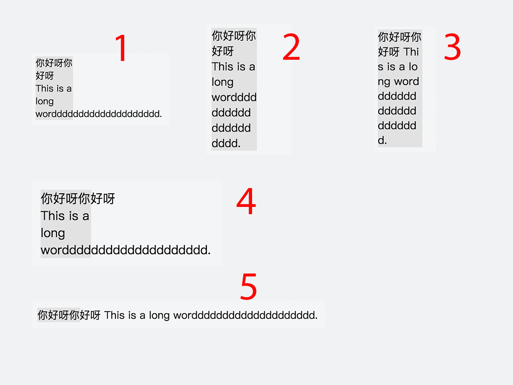
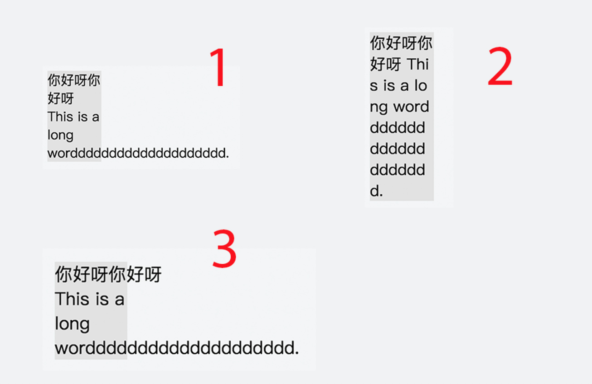
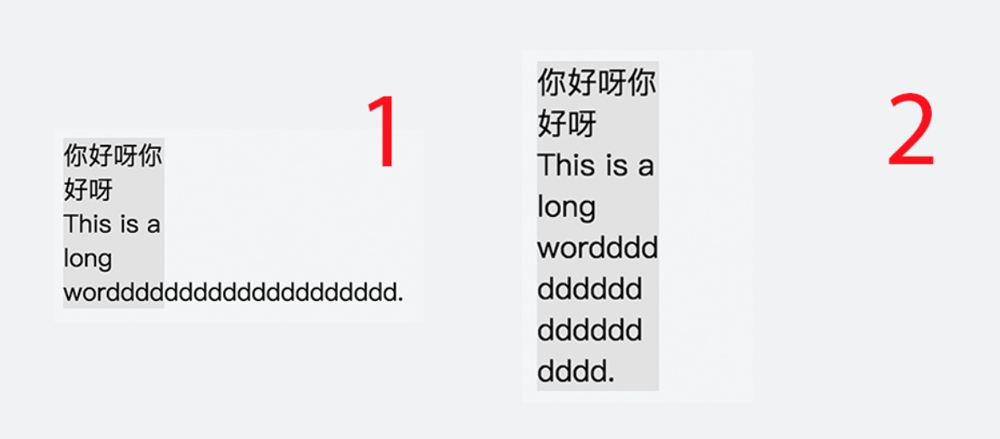
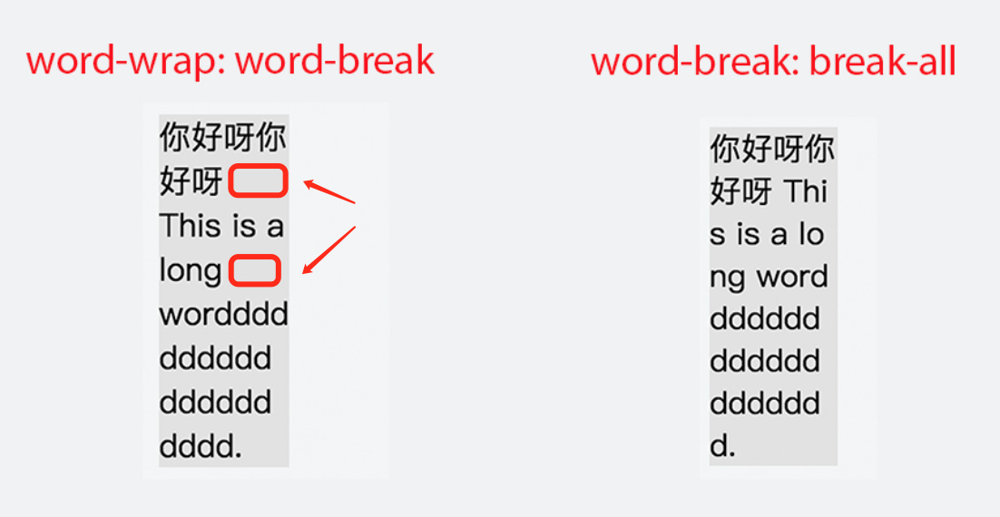
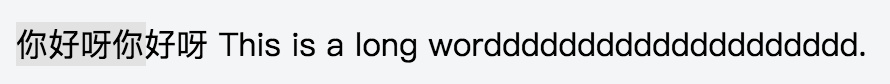

[TOC]


# word-break 和 word-wrap 的区别

[html&css](http://imweb.io/tab/rebuild)

> 本文作者：IMWeb elvin 原文出处：[IMWeb社区](http://imweb.io/topic/59fe82991f0e50753869bf8c) **未经同意，禁止转载**

本文主要要介绍的是 CSS 中 `word-break: break-all` 和 `word-wrap: break-word` 的区别，虽然这两个属性都有使用过，但都是属于使用时查一查文档随手就用，用完了也不会深入去探究的范畴，希望借着这篇文章来深入的探究一下这两者的区别。

有一句话是*“没图说个 xx”*，我觉得这句话在探究 CSS 时特别正确。先让我们来看一张图：



上面的图是同一段 HTML 代码由不同的 CSS 控制产生的效果，大家能猜到具体是哪些 CSS 值吗？答案在 <https://jsfiddle.net/elvinn/88p8v4o3/>中，可以去看看猜的对不对 ^_^ 如果猜对了的话，那么可以残忍地关闭这篇文章了；不过假如没有猜对的话，那么不妨和我一起来探究一番吧。

## word-break

`word-break` 在 MDN 上的官方解释是 *specifies whether or not the browser should insert line breaks wherever the text would otherwise overflow its content box*，翻译一下就是它决定了当文本要溢出容器时，浏览器是否应该插入换行符避免溢出，它有下列值：

```
word-break: normal;
word-break: break-all;
word-break: keep-all;

/* 全局属性 */
word-break: inherit;
word-break: initial;
word-break: unset;
```

我们只需要关注前三个值：`normal`、`break-all`、和 `keep-all`，具体介绍如下：

- normal：CJK(即 Chinese/Japanese/Koean，中日韩) 文本插入断行，其它文本不插入断行，如下图中 1 所示；
- break-all：所有文本都会插入断行，如下图中 2 所示；
- keep-all：所有文本都不会插入断行，如下图中 3 所示（该值在移动端低版本浏览器上不支持）。



## word-wrap

`word-wrap` 在 MDN 上的官方解释是 *specifies whether or not the browser should insert line breaks within words to prevent text from overflowing its content box*，把这个和 `word-break` 的解释对比，可以发现基本一模一样，只是多了 `within words` 两个单词进行了限制，也就是说它只能控制是否在单词内加入断行，它有下列值：

```
word-wrap: normal;
word-wrap: break-word;

/* 全局属性 */
word-wrap: inherit;
word-wrap: initial;
word-wrap: unset;
```

我们只需要关注前两个值：`normal`、`break-word`，具体介绍如下：

- normal：不会在非 CJK 单词中插入断行，如下图中 1 所示；
- break-word: 会在单词中插入断行避免溢出，如下图中 2 所示。



> 也许 W3C 也觉得 `word-break` 和 `word-wrap` 这两个属性名字实在是太相似了吧，所以在 CSS3 规范里把 `word-wrap` 用 `overflow-wrap` 重命名了，不过目前浏览器支持不是很好，所以还是乖乖地使用 `word-wrap` 吧。

## word-break 和 word-wrap 的区别

终于来到本文的重点了！一开始看到 `word-break: break-all` 和 `word-wrap: word-break` 就头大，这也太相像了，一共就四个单词，结果还有三个单词都是一样的，效果看上去也好像没什么区别，也难怪 W3C 要给 `word-wrap` 换个名字了。那说回正题，区别在哪里呢？？



俗话说的好，一图胜千言。在上图中，我们可以清楚地看到，`word-break: break-all` 值如其名，断开一切，利用上每一块可以利用的空间来塞下文本，避免铺张浪费；而 `word-wrap: word-break` 则收敛许多，假如一行文字有可以换行的点，如标点、CJK 文本等，那么就不会在英文单词或者字符中插入断行了，不过从显示效果来说的话则容易一块儿密集、一块儿空白，很不美观。

## white-space 大佬

前面说了这么多 `word-break` 和 `word-wrap` 的值的作用，显得它们很厉害的样子。不过实际上它们受 `white-space` 大佬管辖，它的默认值为 `normal` 时可以允许 `word-break` 和 `word-wrap` 发挥作用，不过当它的值设为 `nowrap` 时，就会不允许换行，导致所有的文本都挤在一行之中，如下图所示。



## 参考链接

1. [张鑫旭 - word-break:break-all和word-wrap:break-word的区别](http://www.zhangxinxu.com/wordpress/2015/11/diff-word-break-break-all-word-wrap-break-word/)
2. [MDN- word-break](https://developer.mozilla.org/en-US/docs/Web/CSS/word-break)
3. [MDN - overflow-wrap](https://developer.mozilla.org/en-US/docs/Web/CSS/overflow-wrap)