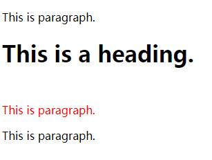
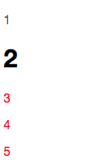

[TOC]


# css兄弟选择器(+ 和 ~)的使用和区别

时间: *2018-04-09*阅读: *3056*标签: *选择器 

这篇文章主要讲解css中兄弟选择器的使用，以及+和~的区别有哪些？


## + 选择器

如果需要选择紧接在另一个元素后的元素，而且二者有相同的父元素，可以使用相邻兄弟选择器。 比如：

```html
<style type="text/css">
    h1 + p {
        margin-top:50px;
        color:red;
    }
</style>
<p>This is paragraph.</p>
<h1>This is a heading.</h1>
<p>This is paragraph.</p>
<p>This is paragraph.</p>
```

效果图如下：



兄弟选择器只会影响下面的p标签的样式，不影响上面兄弟的样式。 

注意这里的’+’的意义跟’and’意义不一样，兄弟选择器的样式是应用在兄弟元素上，跟参照的元素样式无关，如上例只影响p元素的样式，而不影响h1标签的样式。 当然这个也会循环查找，即**当两个兄弟元素相同时，会一次循环查找**：  

```
<style type="text/css">
    li + li {
        color:red;
    }
</style>

<div>
  <ul>
    <li>List item 1</li>
    <li>List item 2</li>
    <li>List item 3</li>
  </ul>
</div>
```

效果如下：

- List item 1
- List item 2
- List item 3

可以看出第一个li字体颜色没有变红，第二个和第三个元素字体变红，这就是因为第三个li是第二个li的兄弟元素，所以也会应用样式。  


##  ~ 选择器 

作用是查找某一个指定元素的后面的所有兄弟结点。 示例代码：   

```
<style type="text/css">
    h1 ~ p{
        color:red;
    }
</style>

<p>1</p>
<h1>2</h1>
<p>3</p>
<p>4</p>
<p>5</p>
```

运行结果如下：




<http://www.fly63.com/article/detial/603>