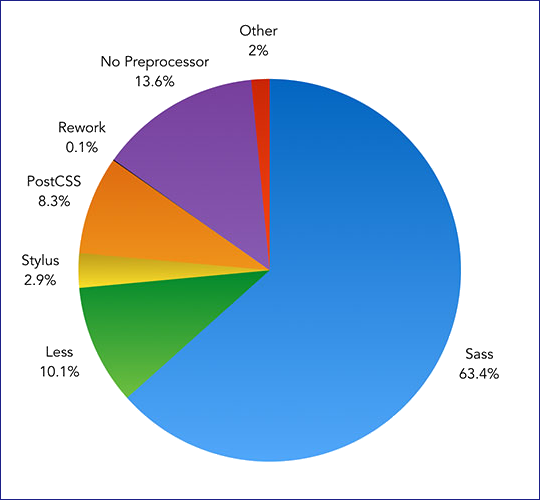
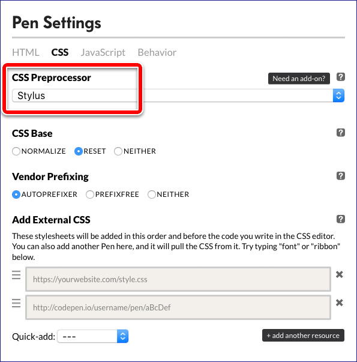

[TOC]

# 浅谈 CSS 预处理器（二）：如何快速上手？

2017/01/22 · [CSS](http://web.jobbole.com/category/css/) · [预处理器](http://web.jobbole.com/tag/%e9%a2%84%e5%a4%84%e7%90%86%e5%99%a8/)

分享到：[0]()

本文作者： [伯乐在线](http://web.jobbole.com/) - [CSS魔法](http://www.jobbole.com/members/cssmagic) 。未经作者许可，禁止转载！
欢迎加入伯乐在线 [专栏作者](http://blog.jobbole.com/99322)。

> 看完了上一篇[《为什么要使用预处理器？》](https://github.com/cssmagic/blog/issues/73)的各种安利，你应该已经跃跃欲试了吧！接下来我们来聊一聊，如何快速上手 CSS 预处理器。

在接触 CSS 预处理器之前，你最好已经具备了一定的 CSS 基础和实践能力，比如你可以完成常见网页的样式和布局；另外，如果你有一些项目经验就更好了，比如组织过整个网站的 CSS 文件、设计过 CSS 代码的分层和复用等等。

因为，当你有了这方面的经验之后，在学习 CSS 预处理器时，对它提供的功能会更有感触，会更有针对性地解决过往 CSS 开发中的种种痛点。

好，接下来，魔法哥建议 “三步走”。

## 第一步：选择语言

首先，你需要选定一门 CSS 预处理语言。目前主流的预处理语言主要是 Sass、Less 和 Stylus，它们的流行度差不多也是这个顺序。

（图片来源：ashleynolan.co.uk）

如果你比较保守，可以选择 Sass（或它的变种 SCSS）。因为它相当成熟，用它的人也最多，比如 Bootstrap 4 就是用 Sass 写的。你遇到的坑一般都已经有无数人趟过了，在网上比较容易找到 Sass 相关的文档和教程。

如果你不喜欢随大流，那我就要向你推荐 Stylus 了！与 Sass 和 Less 相比，Stylus 更像是一门编程语言，功能强大，语法灵活。同时，Stylus 完全由 JavaScript 实现，对 Node.js 工具链极为友好。目前百姓网主站和百度的部分业务在用 Stylus。

除了上述两项以外，还有个 Less。不过这里就不多介绍了，因为在魔法哥看来，除了一些老项目还在用，Less 跟前两者相比已经没啥优势了。

## 第二步：了解功能

在选好你中意的预处理语言之后，我建议你打开它的官网，大致了解一下它的主要功能和语法。

- Sass 官网：<http://sass-lang.com/>
- Stylus 官网：<http://stylus-lang.com/>
- Less 官网：<http://lesscss.org/>

在最开始接触一门 CSS 预处理语言的时候，我们不需要立刻成为这门语言的专家。只需要把官方文档快速扫一遍，建立一个整体的印象，为接下来的动手尝试做好准备就可以了；同时多看看官方的示例代码，找找感觉。

当你日后觉得有必要深入学习的时候，就要细嚼慢咽官方文档了，同时还有必要找些教程或书籍来仔细研读。

上面提到过，Sass 的资料最多，也有中文书。Stylus 目前还没有中文书出版，不过张鑫旭老师翻译了中文文档，也写过教程，都是不错的学习资源。

## 第三步：玩起来

走到这一步，你就可以找个地方放手实践啦！找个一张网页设计稿来写写看，或者翻出一个以前写的 CSS 文件来改造一番：你可以试试用变更和 Mixin 来把重复的值和代码片断抽象出来，用嵌套来把代码组织成一个个段落，在这个过程中逐渐熟悉这门预处理语言。

“慢着，你还没说编译的事儿呢！”

没错，要把预处理器代码应用到浏览器环境，还需要操心编译这一步。不过在上手阶段，你可以先把配环境的事儿先放一放，因为你可以选择那些开箱即用的环境，先玩起来再说。

#### 在线环境

如果你对编辑器没啥特殊要求，可以尝试像 [JS Bin](http://jsbin.com/) 或 [CodePen](http://codepen.io/) 这样的在线 demo 网站，它们通常都提供了实时的 CSS 预处理器编译功能。

以 CodePen 为例，我们在新建一个 Pen 之后，点击 CSS 窗格左上角的小齿轮按钮，进入设置界面，在 “CSS Preprocessor” 一栏选择你需要的语言就可以了（如下图所示）。

当然如果你懒得设置的话，可以直接套用魔法哥已经配置好的 Pen 模板。打开 <http://codepen.io/pen?template=QKQvRw> 这个链接就可以直接写 Stylus 代码了！

#### 本地环境

如果你还是想在本机舒适的 IDE 里写代码，或者想尝试用模块来拆分代码，那不妨试试魔法哥为你配置好的 Stylus 试用环境。

在 GitHub 上找到 [cssmagic/stylus-playground](https://github.com/cssmagic/stylus-playground) 这个项目，按照 README 的介绍，把它下载到本地，然后运行一个简单的启动命令就可以开始玩了。

这个简易的试用环境已经配置好了 Stylus 语言的编译程序，默认加载 Normalize 和 CSS Reset，还加入了 Autoprefixer 为你的代码自动添加浏览器前缀。此外，这个环境还设置了一些便利机制，帮助你回避一切与写代码无关的琐事，只为让你写得舒服。

在运行启动命令之后，你的浏览器会自动打开一个 HTML 页面；然后每当你修改这个试用环境内的 HTML 文件或 Stylus 文件时，这个浏览器页面都会自动更新，让你看到最新的修改效果…………

……

……

如果有人让你推荐前端技术书，请让他看这个列表 ->《[经典前端技术书籍](http://web.jobbole.com/86734/)》

http://web.jobbole.com/90064/?utm_source=blog.jobbole.com&utm_medium=relatedPosts