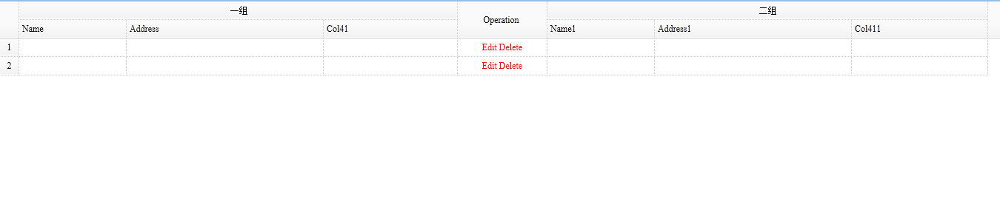
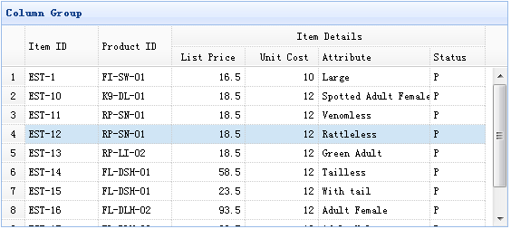
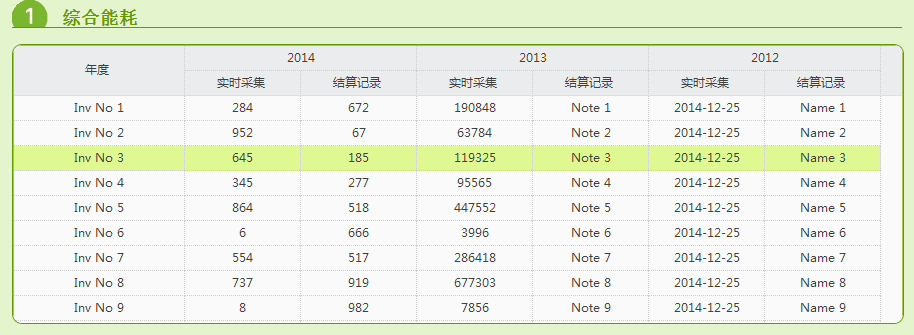

[TOC]


# JQuery EasyUI datagrid 复杂表头处理

下面是我项目中和网上收集的EasyUI的表头处理的,合适的拿去用吧.

## 例子1:

```
$('#day_health').datagrid({
                url: "sqb_bweb_day_health.aspx?mode=day_health",
                pagination: true,
                total: 2000,
                pageSize: 10,
                pageList: [10, 20, 30, 40, 50, 60, 70, 80, 90, 100],
                rownumbers: true,
                fit: true,        //自动大小
                fitColumns: true, //自适应列宽
                singleSelect: true,  //是否单选
                idField: 'Project_id',
                columns: [[
                    {title:'一组',colspan:3},
                    {field:'opt',title:'Operation',width:100,align:'center', rowspan:2,
                        formatter:function(value,rec){
                            return '<span style="color:red">Edit Delete</span>';
                        }
                    },
                    {title:'二组',colspan:3}
                ],[ 
                    {field:'name',title:'Name',width:120,rowspan:1},
                    {field:'addr',title:'Address',width:220,rowspan:1,sortable:true,
                        sorter:function(a,b){
                            return (a>b?1:-1);
                        }
                    },
                    {field:'col4',title:'Col41',width:150,rowspan:1},
                        {field:'name1',title:'Name1',width:120,rowspan:1},
                    {field:'addr1',title:'Address1',width:220,rowspan:1,sortable:true,
                        sorter:function(a,b){
                            return (a>b?1:-1);
                        }
                    },
                    {field:'col41',title:'Col411',width:150,rowspan:1}
                ]]
            });
```

  

## 例子2:

View Demo

In this example, we use flat data to populate the DataGrid data, and group the listprice,unitcost,addr1,status columns under a single column.

To create column groups you should defines the columns property of datagrid plugin. Each element of columns is a definition of group which can use rowspan or colspan property to combine cells together.

The following code implements above example:

```
<table id="tt" title="Column Group" class="easyui-datagrid" style="width:550px;height:250px"  
        url="data/datagrid_data.json"  
        singleSelect="true" iconCls="icon-save" rownumbers="true">  
    <thead>  
        <tr>  
            <th rowspan="2" field="itemid" width="80">Item ID</th>  
            <th rowspan="2" field="productid" width="80">Product ID</th>  
            <th colspan="4">Item Details</th>  
        </tr>  
        <tr>  
            <th field="listprice" width="80" align="right">List Price</th>  
            <th field="unitcost" width="80" align="right">Unit Cost</th>  
            <th field="attr1" width="100">Attribute</th>  
            <th field="status" width="60" align="center">Stauts</th>  
        </tr>  
    </thead>  
</table>  
```



## 例子3：

    <table id="dg" style="width:890px;height:305px;" data-options="                    
    	singleSelect:true,
    	autoRowHeight:false
    	">
        <thead>
            <tr>
                <th rowspan="2" field="inv" width="170" align="center">年度</th>
                <th colspan="2" width="230" align="center">2014</th>
                <th colspan="2" width="230" align="center">2013</th>
                <th colspan="2"  width="230" align="center">2012</th>
            </tr>
            <tr>
                <th field="amount" width="115" align="center">实时采集</th>
                <th field="price" width="115" align="center">结算记录</th>
                <th field="cost" width="115" align="center">实时采集</th>
                <th field="note" width="115" align="center">结算记录</th>
                <th field="date" width="115" align="center">实时采集</th>
                <th field="name" width="115" align="center">结算记录</th>
        </thead>
    </table> 




https://www.cnblogs.com/nangong/p/ccdfabb7ccedbfa580acc6eeef286a27.html

​     