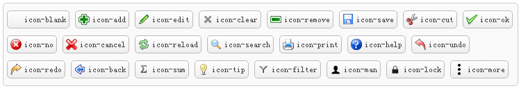

# EasyUi图标

虽然EasyUi提供的图标不多，不过在下眼拙，在官网中没找到图标对照文档，有时想要在某些特别设置中变化个图标有些不方便。所以简单整理了下easyui的图标与调用类的对照关系。

EasyUi 版本：1.4.3

 

```html
    <a href="###" class="easyui-linkbutton" iconCls="icon-blank">icon-blank</a>
    <a href="###" class="easyui-linkbutton" iconCls="icon-add">icon-add</a>
    <a href="###" class="easyui-linkbutton" iconCls="icon-edit">icon-edit</a>
    <a href="###" class="easyui-linkbutton" iconCls="icon-clear">icon-clear</a>
    <a href="###" class="easyui-linkbutton" iconCls="icon-remove">icon-remove</a>
    <a href="###" class="easyui-linkbutton" iconCls="icon-save">icon-save</a>
    <a href="###" class="easyui-linkbutton" iconCls="icon-cut">icon-cut</a>
    <a href="###" class="easyui-linkbutton" iconCls="icon-ok">icon-ok</a>
    <a href="###" class="easyui-linkbutton" iconCls="icon-no">icon-no</a>
    <a href="###" class="easyui-linkbutton" iconCls="icon-cancel">icon-cancel</a>
    <a href="###" class="easyui-linkbutton" iconCls="icon-reload">icon-reload</a>
    <a href="###" class="easyui-linkbutton" iconCls="icon-search">icon-search</a>
    <a href="###" class="easyui-linkbutton" iconCls="icon-print">icon-print</a>
    <a href="###" class="easyui-linkbutton" iconCls="icon-help">icon-help</a>
    <a href="###" class="easyui-linkbutton" iconCls="icon-undo">icon-undo</a>
    <a href="###" class="easyui-linkbutton" iconCls="icon-redo">icon-redo</a>
    <a href="###" class="easyui-linkbutton" iconCls="icon-back">icon-back</a>
    <a href="###" class="easyui-linkbutton" iconCls="icon-sum">icon-sum</a>
    <a href="###" class="easyui-linkbutton" iconCls="icon-tip">icon-tip</a>
    <a href="###" class="easyui-linkbutton" iconCls="icon-filter">icon-filter</a>
    <a href="###" class="easyui-linkbutton" iconCls="icon-man">icon-man</a>
    <a href="###" class="easyui-linkbutton" iconCls="icon-lock">icon-lock</a>
    <a href="###" class="easyui-linkbutton" iconCls="icon-more">icon-more</a>
```

 


https://www.cnblogs.com/timememory/p/5182803.html