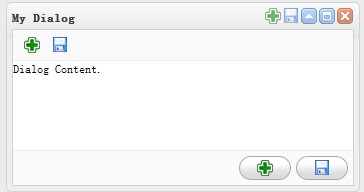

# easyui 常见用法总结

 

## **1. 使用 data-options 来初始化属性。**

 

data-options是jQuery Easyui 最近两个版本才加上的一个特殊属性。通过这个属性，我们可以对easyui组件的实例化可以完全写入到html中，例如：

```
<div class="easyui-dialog" style="width:400px;height:200px"
    data-options="title:'My Dialog',collapsible:true,iconCls:'icon-ok',onOpen:function(){}">
    dialog content.
</div>
```

属性，事件，都可以直接写在data-options里面，这样就方便多了。

 

## **2.  tools定义工具栏，继承自panel的应该都可以使用。**


```
$('#p').panel({   
    width:500,   
    height:150,   
    title: 'My Panel',   
   tools: [{   
     iconCls:'icon-add',   
     handler:function(){alert('new')}   
    },{   
     iconCls:'icon-save'  
     handler:function(){alert('save')}   
   }]   
}); 
```


tools 同样可以加到data-options里面。

 

## **3.  easyui 里面的组件属性，同样可以写在标签里面。**


```
<div id="p" class="easyui-panel" title="My Panel" style="width:500px;height:150px;padding:10px;background:#fafafa;"  
          iconCls="icon-save"  closable="true"  
          collapsible="true" minimizable="true" maximizable=true>  
      <p>panel content.</p>  
      <p>panel content.</p>  
</div>  
```


data-options和这里效果是一样，但是API里面大部分是按照属性来定义标签的，就想早先的HTML，而data-options就像style定义样式，不知道这两种有什么优劣。

 

##  **4. 继承**

```
<!DOCTYPE html PUBLIC "-//W3C//DTD XHTML 1.0 Transitional//EN" "http://www.w3.org/TR/xhtml1/DTD/xhtml1-transitional.dtd">
<html xmlns="http://www.w3.org/1999/xhtml">
<head>
    <title></title>
    <script src="easyui/jquery-1.7.2.min.js" type="text/javascript"></script>
    <script src="easyui/jquery.easyui.min.js" type="text/javascript"></script>
    <link href="easyui/themes/gray/easyui.css" rel="stylesheet" type="text/css" />
    <link href="easyui/themes/icon.css" rel="stylesheet" type="text/css" />
    <script type="text/javascript">
        $(function () {
            $('#dd').dialog({
                title: "My Dialog",
                modal: true, //dialog继承自window，而window里面有modal属性，所以dialog也可以使用
                collapsible: true, //是否可折叠，默认false
                minimizable: false, //是否可最小化，默认false
                maximizable: true, //是否可最大化，默认false
                resizable: true, //是否可折叠，默认false
                toolbar: [{
                    iconCls: 'icon-add',
                    handler: function () { alert('new') }
                }, {
                    iconCls: 'icon-save',
                    handler: function () { alert('save') }
                }],
                buttons: [{
                    iconCls: 'icon-add',
                    handler: function () { alert('new') }
                }, {
                    iconCls: 'icon-save',
                    handler: function () { alert('save') }
                }],
                //继承自panel,tool只有下面两个属性
                tools: [{
                    iconCls: 'icon-add',
                    handler: function () { alert('new') }
                }, {
                    iconCls: 'icon-save',
                    handler: function () { alert('save') }
                }]
            });
        })
    </script>
</head>
<body>
    <div id="dd" style="width: 500px; height: 400px;">
        Dialog Content.
    </div>
</body>
</html>
```

实现效果就是这样的！



 

 http://www.cnblogs.com/yokoboy/archive/2012/12/06/2806132.html

 

 

 