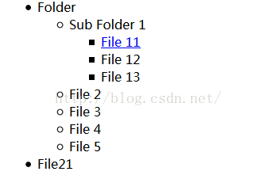

# easyui中data-options用法

​        data-options是jquery easyui 最近几个版本才开发的一个属性。在控件中具有和Index相对应的Controller，调用其中的方法。因为有这个属性，我们在html中就可以实例化组件。

子节点属性赋值

```
<span style="font-size:14px;"><div class="easyui-dialog" style="width:200px;height:100px"  
    data-options="title:'My Dialog',collapsible:true,iconCls:'icon-ok',onOpen:function(){}">  
    dialog content.  
</div></span>  
```

data-options属性可以定义各种组件的样式和内容及事件，比如在easyui-tree控件中会有node的某些属性，在实例的时候，通过html是不能实现的，必须通过json赋值。但是使用上data-options属性就方便了很多。

举例：

```html
<span style="font-size:14px;"><ul id="tt1" class="easyui-tree" data-options="animate:true,dnd:true"><span style="font-size:14px;"><ul id="tt1" class="easyui-tree" data-options="animate:true,dnd:true">im"><span style="font-size:14px;"><ul id="tt1" class="easyui-tree" data-options="animate:true,dnd:true"><span style="font-size:14px;"><ul id="tt1" class="easyui-tree" data-options="animate:true,dnd:true">im  
    <li>  
        <span>Folder</span>  
        <ul>  
            <li data-options="state:'closed'">  
                 <span>Sub Folder 1</span>  
                 <ul>  
                     <li data-options="attributes:{'url':'xxxxx'}">  
                    <span><a href="#">File 11</a></span>  
                 </li>  
                 <li data-options="attributes:{'url':'xxxxx'}">  
                        <span>File 12</span>  
                     </li>  
                     <li>  
                        <span>File 13</span>  
                     </li>  
                 </ul>  
            </li>  
            <li data-options="attributes:{'url':'xxxxx'}">  
                <span>File 2</span>  
            </li>  
            <li data-options="attributes:{'url':'xxxxx'}">  
                <span>File 3</span>  
            </li>  
            <li id="123" data-options="attributes:{'url':'xxxxx'}">File 4</li>  
            <li>File 5</li>  
        </ul>  
    </li>  
    <li>  
         <span>File21</span>  
    </li>  
</ul></span> 
```

效果：



​       easyui是一种基于jQuery的用户界面插件集合。

​       easyui为创建现代化，互动，JavaScript应用程序，提供必要的功能。使用easyui你不需要写很多代码，你只需要通过编写一些简单HTML标记，就可以定义用户界面。

​       easyui是个完美支持HTML5网页的完整框架。节省网页开发的时间和规模。很简单但功能强大的。

参考：[EasyUI——常见用法总结](http://www.cnblogs.com/yokoboy/archive/2012/12/06/2806132.html)

[           EasyUI官网](http://www.jeasyui.com/download/index.php)


https://blog.csdn.net/mayfla/article/details/48105815