[TOC]


# HTML table基础

## 前言

HTML 中的`<table>`标签表示表格数据----通过二维数据表来展示信息。

表格相关的HTML标签：`<table>` `<tr>` `<td>` `<th>` `<thead>` `<tbody>` `<tfoot>` `<caption>` `<col>` `<colgroup>`
表格标签的编写顺序：

- `<table>` 定义表格 每个表格从 `<table>` 开始
- `<caption>` 定义表格标题，可选（可写可不写，根据需要）
- `<colgroup>` 用于对表格的列进行组合，以方便对列设置属性，可选
- `<col>` 用于为表格的列设置属性，可选
- `<thead>` 用于对表格的表头内容进行分组，可选
- `<tfoot>` 用于对表格的页脚、脚注或表注进行分组，可选
- `<tbody>` 用于组合表格的主体内容，可选
- `<tr>` 定义表格中的行 每个表格行从 `<tr>` 开始
- `<td>` 定义单元格 每个单元格从 `<td>` 开始
- `<th>` 定义表头单元格
- `<thead>`、`<tbody>` 以及 `<tfoot>` 很少被使用

## 表格实验

#### 1 . 无边框表格

```
<table>
<tr>
  <td>100</td>
  <td>200</td>
  <td>300</td>
</tr>
<tr>
  <td>400</td>
  <td>500</td>
  <td>600</td>
</tr>
</table>
```

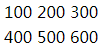

------

#### 2 . 普通边框表格

```
<table border="1">
<tr>
  <td>100</td>
  <td>200</td>
  <td>300</td>
</tr>
<tr>
  <td>400</td>
  <td>500</td>
  <td>600</td>
</tr>
</table>
```

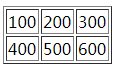

------

#### 3 . 粗边框表格

```
<table border="15">
<tr>
  <td>First</td>
  <td>Row</td>
</tr>   
<tr>
  <td>Second</td>
  <td>Row</td>
</tr>
</table>
```

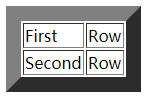

------

#### 4 . 为表格设置`cellpadding`属性

```
<table border="1" cellpadding="100">
<tr>
  <td>First</td>
  <td>Row</td>
</tr>   
<tr>
  <td>Second</td>
  <td>Row</td>
</tr>
</table>
```

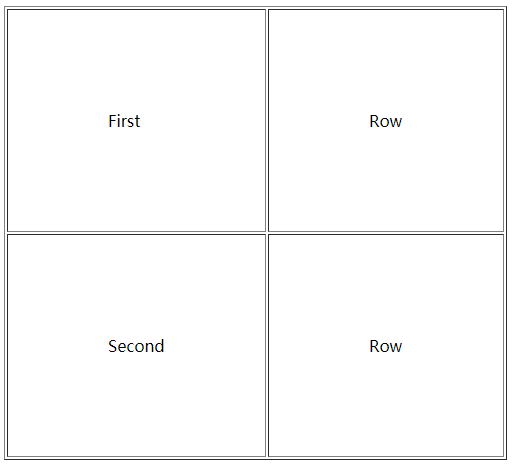

------

#### 5 . 为表格设置`cellspacing`属性

```
<table border="1" cellspacing="20">
<tr>
  <td>First</td>
  <td>Row</td>
</tr>   
<tr>
  <td>Second</td>
  <td>Row</td>
</tr>
</table>
```

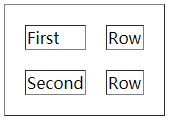

```
<table border="1" cellspacing="0">
<tr>
  <td>First</td>
  <td>Row</td>
</tr>   
<tr>
  <td>Second</td>
  <td>Row</td>
</tr>
</table>
```

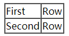

------

#### 6 . 为表格设置`border-collapse`属性

**默认值**：separate

取值：

- separate：边框独立 
- collapse：相邻边被合并 

说明：

设置或检索表格的行和单元格的边是合并还是独立。

- 只有当表格边框独立（即 <' [border-collapse](https://css.doyoe.com/properties/table/border-collapse.htm) '> 属性等于`separate`时）， <' [border-spacing](https://css.doyoe.com/properties/table/border-spacing.htm) '> 和 <' [empty-cells](https://css.doyoe.com/properties/table/empty-cells.htm) '> 才起作用。
- 对应的脚本特性为**borderCollapse**。

```
<table border="1" style="border-collapse: collapse;">
<tr>
  <td>First </td>
  <td>Row</td>
</tr>   
<tr>
  <td>Second</td>
  <td>Row</td>
</tr>
</table>
```

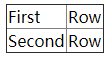

------

#### 7 . 为表格设置frame属性

```
<table frame="box">
  <tr>
    <th>Month</th>
    <th>Savings</th>
  </tr>
  <tr>
    <td>January</td>
    <td>$100</td>
  </tr>
</table>
```

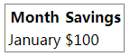

```
<table frame="above">
  <tr>
    <th>Month</th>
    <th>Savings</th>
  </tr>
  <tr>
    <td>January</td>
    <td>$100</td>
  </tr>
</table>
```

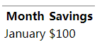

```
<table frame="hsides">
  <tr>
    <th>Month</th>
    <th>Savings</th>
  </tr>
  <tr>
    <td>January</td>
    <td>$100</td>
  </tr>
</table>
```

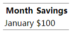

------

#### 8 . 表格跨列、跨行

```
<!-- 横跨两列的单元格 -->
<table border="1">
<tr>
  <th>姓名</th>
  <th colspan="2">电话</th>
</tr>
<tr>
  <td>Bill Gates</td>
  <td>555 77 854</td>
  <td>555 77 855</td>
</tr>
</table>


<!-- 横跨两行的单元格 -->
<table border="1">
<tr>
  <th>姓名</th>
  <td>Bill Gates</td>
</tr>
<tr>
  <th rowspan="2">电话</th>
  <td>555 77 854</td>
</tr>
<tr>
  <td>555 77 855</td>
</tr>
</table>
```

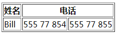

------

#### 9 . 使用`<col>` `<colgroup>`为列设置属性

> 为行设置属性? 设置`<tr>`即可。

```
<table width="100%" border="1">
  <col style='background: #ccc;' />
  <col style='background: #444;' />
  <col style='background: #888;' />
  <tr>
    <th>ISBN</th>
    <th>Title</th>
    <th>Price</th>
  </tr>
  <tr>
    <td>3476896</td>
    <td>My first HTML</td>
    <td>$53</td>
  </tr>
  <tr>
    <td>2489604</td>
    <td>My first CSS</td>
    <td>$47</td>
  </tr>
</table>
```

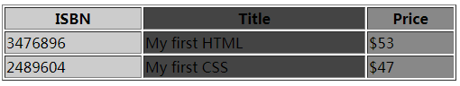

```
<table width="100%" border="1">
  <colgroup span="2" style="background: #ddd;font-weight: bold;"></colgroup>
  <colgroup style="background:blue;"></colgroup>
  <tr>
    <th>ISBN</th>
    <th>Title</th>
    <th>Price</th>
  </tr>
  <tr>
    <td>3476896</td>
    <td>My first HTML</td>
    <td>$53</td>
  </tr>
  <tr>
    <td>2489604</td>
    <td>My first CSS</td>
    <td>$47</td>
  </tr>
</table>
```

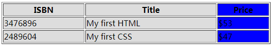

------

## 后语

- 第一次是用 segmentfault 写文章就发现可以将剪切板的图片粘贴（`Ctrl` + `V`）添加到文章，很惊喜。 之前使用的是作业部落，会员才能上传图片。

参考资料： 
【1】W3school [http://www.w3school.com.cn/ta...](http://www.w3school.com.cn/tags/tag_table.asp)
【2】MDN [https://developer.mozilla.org...](https://developer.mozilla.org/zh-CN/docs/Web/HTML/Element/table)


https://segmentfault.com/a/1190000010013922