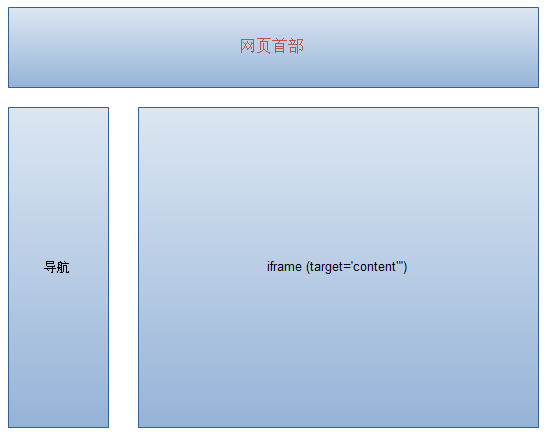

iframe是什么？iframe用法详解。


[TOC]


# iframe是什么？iframe用法详解

## 前言

经常和网站打交道或者经常建站的朋友对iframe肯定不陌生，网站有了iframe会变得更加美观、大气。对于初涉互联网的新手来说，iframe并不熟悉，那么iframe到底是什么？iframe用法有哪些呢？



## **iframe是什么**

  iframe就是我们常用的iframe标签：\<iframe>。iframe标签是框架的一种形式，也比较常用到，iframe一般用来包含别的页面，例如我们可以在我们自己的网站页面加载别人网站或者本站其他页面的内容。iframe标签的最大作用就是让页面变得美观。iframe标签的用法有很多，主要区别在于对iframe标签定义的形式不同，例如定义iframe的长宽高。

## **iframe用法详解**

  首先需要了解iframe标签的写法，和大多HTML标签写法相同，iframe标签输入形式为：<iframe>和</iframe>。以<iframe>开头，以</iframe>结尾，将需要的文本内容添加到两个标签之间即可。iframe标签内的内容可以做为浏览器不支持iframe标签时显示。

### iframe标签的属性

  align：left、right、top、middle、bottom。用于规定如何根据周围的元素来对齐此框架。不赞成使用。请使用样式代替。

  frameborder：1、0。用于规定是否显示框架周围的边框。

  height：pixels、%。用于规定iframe的高度。

  longdesc：URL。规定一个页面，该页面包含了有关iframe的较长描述。

  marginheight：pixels。定义iframe的顶部和底部的边距。 

  marginwidth：pixels。定义iframe的左侧和右侧的边距。 

  name：frame_name。规定iframe的名称。 

  scrolling：yes、no、auto。规定是否在iframe中显示滚动条。
  src：URL。规定在iframe中显示的文档的URL。 

width：pixels。%。定义iframe的宽度。 

### iframe用法案例

#### 例子1

```
 <iframe width=420 height=330 frameborder=0 scrolling=auto src=URL></iframe>
```

　width插入页的宽；height插入页的高；scrolling 是否显示页面滚动条（可选的参数为 auto、yes、no，如果省略这个参数，则默认为auto）；frameborder  边框大小；

　注意：URL建议用绝对路径

　传说中百DU用：

```
<iframe width=0 height=0 frameborder=0 scrolling=auto src=www.zzidc.com></iframe>
```

#### 例子2

　如果一个页面里面有框架。。随便点页面里的连接，要求在这个<iframe> 里打开。在iframe 中加入name=** （**自己设定）

```
<iframe name=**  ></iframe>
```

　然后在修改默认打开模式，：网页HEAD中加上\<a href=URL target=**>或部分连接的目标框架设为（**）

#### 例子3

　要插入一个页面。要求只拿中间一部分。其他的都不要。，。。

　代码：

```html
<iframe name=123  align=middle marginwidth=0 marginheight=0 vspace=-170 hspace=0 
        src='http://host.zzidc.com/'  frameborder=no scrolling=no  width=776  
        height=2500></iframe>
```

　控制插入页被框架覆盖的深度 marginwidth=0 marginheight=0；控制框架覆盖上部分的深度 vspace=-170

　scrolling滚动条要否（auto、yes、no）   frameborder框架的边框大小，width=776  height=2500此框架的大小。

　一、页面内加入iframe

```
<iframe width=420 height=330 frameborder=0 scrolling=auto src=URL></iframe>，
```

scrolling表示是否显示页面滚动条，可选的参数为auto、yes、no，如果省略这个参数，则默认为auto。

　二、超链接指向这个嵌入的网页，只要给这个iframe命名就可以了。方法是<iframe name=**>，例如我命名为aa，写入这句HTML语言\<iframe width=420 height=330 name=aa frameborder=0 src=http://host.zzidc.com>\</iframe>，然后，网页上的超链接语句应该写为：\<a  href=URL target=aa>

　三、如果把frameborder设为1，效果就像文本框一样

　透明的iframe的用法

　必需IE5.5以上版本才支持

　在transparentBody.htm文件的<body>标签中，我已经加入了style='background-color=transparent' 通过以下四种iframe的写法我想大概你对iframe背景透明效果的实现方法应该会有个清晰的了解：

```
　<iframe ID='Frame1' SRC='transparentBody.htm' allowTransparency='true'></iframe>
```

```
　<iframe ID='Frame2' SRC='transparentBody.htm' allowTransparency='true' STYLE='background-color: green'> </iframe>
```

```
　<iframe ID='Frame3' SRC='transparentBody.htm'></iframe>
```

```
　<iframe ID='Frame4' SRC='transparentBody.htm' STYLE='background-color: green'> </iframe>
```


http://www.360doc.com/content/16/0826/21/36064839_586159118.shtml