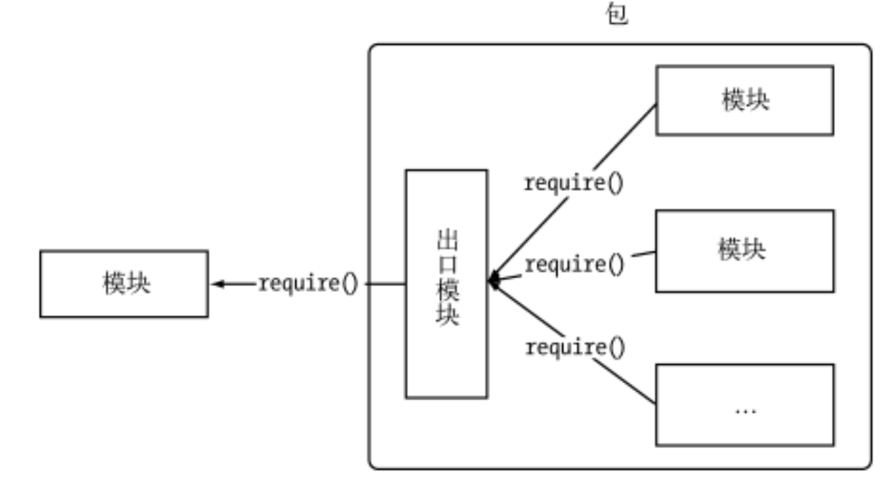

 

[TOC]


# Nodejs 包与 NPM 第三方模块安装和package.json 以及 CNPM

 

## 一 包

Nodejs 中除了它自己提供的**核心模块**外，我们可以**自定义模块**，也可以使用**第三方的模块**。Nodejs 中第三方模块由包组成，可以通过包来对一组具有相互依赖关系的模块进行统一管理。



完全符合 CommonJs 规范的包目录一般包含如下这些文件。

- package.json :包描述文件。

- bin :用于存放可执行二进制文件的目录。

- lib :用于存放 JavaScript 代码的目录。

- doc :用于存放文档的目录。
​


在 NodeJs 中通过 NPM 命令来下载第三方的模块(包)。

https://www.npmjs.com/package/silly-datetime

```
npm i silly-datetime –save
var sd = require('silly-datetime');
sd.format(new Date(), 'YYYY-MM-DD HH:mm');
```

  

## 二 NPM 

### 介绍

npm 是 **世界上最大的开放源代码 **的生态系统。我们可以通过 npm 下载各种各样的包,这些源代码(包)我们可以在 https://www.npmjs.com 找到。


**npm 是随同 NodeJS 一起安装的包管理工具，能解决 NodeJS 代码部署上的很多问题，**

常见的使用场景有 以下几种:

- 允许用户从 NPM 服务器下载别人编写的第三方包到本地使用。(silly-datetime)
-  允许用户从 NPM 服务器下载并安装别人编写的命令行程序(工具)到本地使用。(supervisor)
-  允许用户将自己编写的包或命令行程序上传到 NPM 服务器供别人使用。


### NPM 命令详解。

1.npm -v 查看 npm 版本

```
jerrydeMacBookPro: jerryye$ npm -v
5.6.0
```

2.使用 npm 命令安装模块

```
npm install Module Name

如安装 jq 模块: 
npm install jquery
```

3.npm uninstall moudleName 卸载模块

```
npm uninstall ModuleName
```

4.npm list 查看当前目录下已安装的 node 包

```
npm list
```

5.npm info jquery 查看 jquery 的版本

```
npm info 模块 //查看模块的版本
```

6.指定版本安装 

```
npm install jquery@1.8.2
```


## 三、package.json

package.json 定义了这个项目所需要的各种模块,以及项目的配置信息(比如名称、版本、许可证等元数据)

1、创建 package.json

```
npm init   这个会一步步让你填写信息
npm init –yes   这个就是全部默认
```

2、package.json 文件

```
{
  "name": "test",
  "version": "1.0.0",
  "description": "test",
  "main": "main.js",
  "keywords": [
    "test"
  ],
  "author": "wade",
  "license": "MIT",
  "dependencies": {
    "express": "^4.10.1"
  },
  "devDependencies": {
    "jslint": "^0.6.5"
  }
}  
```

3、安装模块并把模块写入 package.json(依赖)

```
npm install babel-cli --save-dev

npm install 模块 --save    

npm install 模块 --save-dev    
```

4、dependencies 与 devDependencies 之间的区别?

使用 npm install node_module –save 自动更新 dependencies 字段值;

使用 npm install node_module –save-dev 自动更新 devDependencies 字段值;

 

```
"dependencies": {
  "ejs": "^2.3.4",
  "express": "^4.13.3",
  "formidable": "^1.0.17"
}
```

^表示第一位版本号不变，后面两位取最新的

~表示前两位不变，最后一个取最新

*表示全部取最新

## 四、安装淘宝镜像

http://www.npmjs.org npm 包官网

https://npm.taobao.org/ 淘宝 npm 镜像官网

**淘宝 NPM 镜像**是一个完整 **npmjs.org** 镜像，你可以用此代替官方版本(只读)，同步频率目前为 10 分钟 一次以保证尽量与官方服务同步。

我们可以使用我们定制的 cnpm (gzip 压缩支持) 命令行工具代替默认的 npm:

```
npm install -g cnpm --registry=https://registry.npm.taobao.org
```

