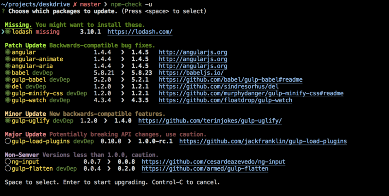
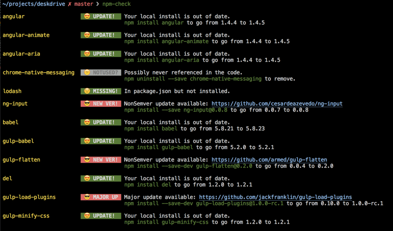
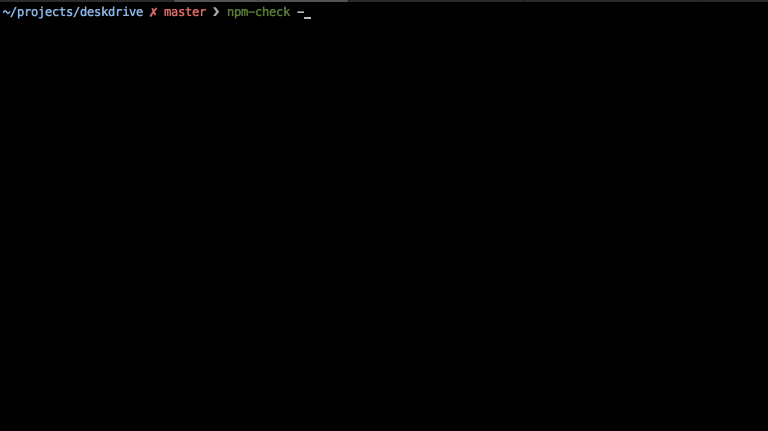
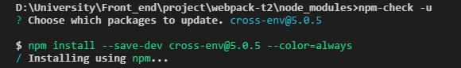
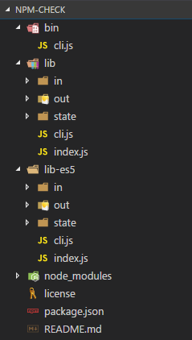
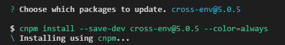
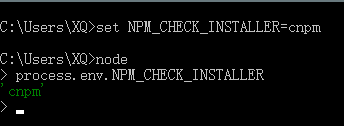
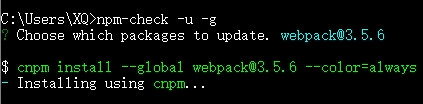

[TOC]


# npm模块管理进阶 — npm-check + cnpm 构建包更新环境

## 前言

近期在项目中准备更新一下`npm`依赖包，可一尝试，惊了！批量更新还真麻烦。各种包要挨个更新，就算直接更改`package.json`也挺费事。
于是度娘到了`npm-check`，然后琢磨了一下，结合`cnpm`构建了一个本人很满意的包更新环境。遂决定写一篇博文，分享给大家。
阅读本文需要一定`node`,`npm`,`webpack`基础（不高，挺低 <(￣ˇ￣)/）
本文为我个人理解，一家之言，如有不当或错误的地方欢迎大家指正，谢谢！ 
博文地址：[npm模块管理进阶 — npm-check + cnpm 构建包更新环境](http://xiongqi-xq.github.io/2017/09/09/npm-check-cnpm/)

## 1.[ npm-check](https://www.npmjs.com/package/npm-check)

`npm` 是node下的包管理工具，给我们提供了强大的包管理功能，简化了项目的代码部署过程。但是，`npm`也不是尽善尽美，批量更新时便很捉急。
`npm-check`便应运而生。
`npm-check`是一个`npm`包更新工具。它还可以检查项目的`npm`依赖包是否有更新，缺失，错误以及未使用等情况。其 几大主要优势如下：

```
1.提供图形化界面，还有emoji，点个赞（不用对着黑白界面简直良心啊！我也想用emoji写啊！:-)）
2.批量更新依赖包，还兼职检测包使用情况
3.项目下更新支持自动检测包的 "dependencies" 和"devDependencies"并更新"package.json"信息   ！
```



### 1.1 `npm-check`安装

```
> npm install -g npm-check //全局安装。项目下安装可自行选择
> npm install npm-check    //项目下安装，项目根目录执行
```

### 1.2 `npm-check`项目依赖包更新

（1）查看包更新信息，会有小黄脸提示你包的相关情况（需更新，缺失，错误以及未使用等）（表情包大牛。。。）

```
> npm-check
```



（2）更新包。分类别展示，使用空格选择包，然后enter开始更新。自动更新`package.json`内的相关包信息

```
> npm-check -u //-update
```



基础就是这样，下面是`npm-check`指令列表:

```
-u, --update       显示一个交互式UI，用于选择要更新的模块，并自动更新"package.json"内包版本号信息
-g, --global       检查全局下的包
-s, --skip-unused  忽略对未使用包的更新检查
-p, --production   忽略对"devDependencies"下的包的检查
-d, --dev-only     忽略对"dependencies"下的包的检查
-i, --ignore       忽略对指定包的检查.
-E, --save-exact   将确切的包版本存至"package.json"(注意，此命令将存储'x.y.z'而不是'^x.y.z')
```

### 1.3 `npm-check`的问题

`npm-check`更新包时是根据版本号动态生成更新语句并执行。其本质是仍然`npm install`指令：



所以，问题不是`npm install`，而是国内的问题。介于网络等因素，国内用户更倾向于使用`cnpm`,`cnpm`也比较稳定和快速。
下面就介绍如何使用让`npm-check`使用`cnpm`执行更新。

## 3.`npm-check` + `cnpm`

[cnpm](https://cnpmjs.org/) 是阿里提供的一个完整 [npmjs.org](https://www.npmjs.com/) 镜像，便于国内用户使用`npm`。这里就不过多赘述了。
准备:安装好`cnpm`,`npm-check`
本文将介绍两种方法将`cnpm`加入`npm-check`，以及其原理，具体如下。

------

### 3.1 两种方法简述

**1. 源码修改法**

(1) 找到`npm-check`包下的`"npm-check\lib\"`和`"npm-check\lib-es5\"`下的`cli.js`文件。
(2) 对文件内代码`"options"`的属性`"installer"`进行修改：

```
installer: process.env.NPM_CHECK_INSTALLER || 'npm'  //改前
installer: process.env.NPM_CHECK_INSTALLER || 'cnpm' //改后
```

**2.修改环境变量值**
将`NPM_CHECK_INSTALLER`设为`cnpm`。后文将介绍三种修改方法，效果有些差别。

### 3.2 两种方法原理

**1. 源码修改法**

`npm-check`目录结构如下。一眼就看见`"./lib"`和`"./lib-es5"`目录结构完全相同，是有什么原因吗？没错，后面看了各位就明白了。


首先最基础的，我们先来看`npm-check`的`"package.json"`。（里面`"dependencies"`等有些属性与本文无关,我删除了其内容，以免代码过长）

```
{
  "name": "npm-check",
  "version": "5.4.5",
  "description": "Check for outdated, incorrect, and unused dependencies.",
  "main": "lib",
  "bin": {
    "npm-check": "bin/cli.js"
  },
  "engines": {
    "node": ">=0.11.0"
  },
  "types": "./index.d.ts",
  "typings": "./index.d.ts",
  "scripts": {
    "lint": "xo ./lib/*.js",
    "test": "npm run lint && ./bin/cli.js || echo Exit Status: $?.",
    "transpile": "babel lib --out-dir lib-es5",
    "watch": "babel lib --out-dir lib-es5 --watch",
    "prepublish": "npm run transpile"
  },
  "xo": {
    "space": 4,
    "rules": {
      "no-warning-comments": [
        0
      ],
      "global-require": [
        0
      ]
    }
  },
  "repository": {
    "type": "git",
    "url": "https://github.com/dylang/npm-check.git"
  },
  "keywords": [],
  "author": {
    "name": "Dylan Greene",
    "email": "dylang@gmail.com"
  },
  "license": "MIT",
  "bugs": {
    "url": "https://github.com/dylang/npm-check/issues"
  },
  "homepage": "https://github.com/dylang/npm-check",
  "files": [
    "bin",
    "lib",
    "lib-es5"
  ],
  "dependencies": {},
  "devDependencies": {},
  "_from": "npm-check@5.4.5",
  "_resolved": "http://registry.npm.taobao.org/npm-check/download/npm-check-5.4.5.tgz"
}
```

可以看到`"bin"`属性值为`{"npm-check": "bin/cli.js"}`，其作用是将`"bin/cli.js"`链接到`"npm-check"`。
当在命令行执行`"npm-check"`，便会执行`"bin/cli.js"`。接着我们看看`"bin/cli.js"`到底有什么玄机。
在查看之前，你可能会觉得里面是一大串代码，看着就头晕，然而事实是，里面只有9行：

```
#!/usr/bin/env node

var isEs2015;
try {
    isEs2015 = new Function('() => {}');
} catch (e) {
    isEs2015 = false;
}
isEs2015 ? require('../lib/cli') : require('../lib-es5/cli');
```

代码的意思很明显，判断js环境是否支持es6(Es2015)。

```
isEs2015 = new Function('() => {}');
```

通过es6的箭头函数判断js环境，支持则`isEs2015`为`true`，导入`'../lib/cli'`,否则导入`'../lib-es5/cli'`。
所以上文提到的`"./lib"`和`"./lib-es5"`目录结构完全相同也就明白了，因为他们分别是`es6`和`es5`下`npm-check`的实现。
接下来我们就分析`"./lib/cli,js"`的源码，毕竟`es6`是趋势嘛，`"./lib-es5/cli.js"`异曲同工。
`"./lib/cli,js"`:

```
#!/usr/bin/env node
'use strict';

const meow = require('meow');
const updateNotifier = require('update-notifier');
const isCI = require('is-ci');
const createCallsiteRecord = require('callsite-record');
const pkg = require('../package.json');
const npmCheck = require('./index');
const staticOutput = require('./out/static-output');
const interactiveUpdate = require('./out/interactive-update');
const debug = require('./state/debug');
const pkgDir = require('pkg-dir');

updateNotifier({pkg}).notify();

const cli = meow({...});           //"npm-check -u,-g等指令的相关设计"

const options = {
    cwd: cli.input[0] || cli.flags.dir,
    update: cli.flags.update,
    global: cli.flags.global,
    skipUnused: cli.flags.skipUnused,
    ignoreDev: cli.flags.production,
    devOnly: cli.flags.devOnly,
    saveExact: cli.flags.saveExact,
    specials: cli.flags.specials,
    emoji: cli.flags.emoji,
    installer: process.env.NPM_CHECK_INSTALLER || 'npm',
    debug: cli.flags.debug,
    spinner: cli.flags.spinner,
    ignore: cli.flags.ignore
};

if (options.debug) {...}         //"是否显示调试输出"

npmCheck(options)                //"根据options的数据运行npm-check"
    .then(currentState => {...})
    .catch(err => {...});
```

具体代码过长，我以`...`代替了，我将对里面里面函数的理解注释在了后面，以作参考。
下面就是最重要的`"options"`对象：

```
const options = {
    cwd: cli.input[0] || cli.flags.dir,
    update: cli.flags.update,
    global: cli.flags.global,
    skipUnused: cli.flags.skipUnused,
    ignoreDev: cli.flags.production,
    devOnly: cli.flags.devOnly,
    saveExact: cli.flags.saveExact,
    specials: cli.flags.specials,
    emoji: cli.flags.emoji,
    installer: process.env.NPM_CHECK_INSTALLER || 'npm',
    debug: cli.flags.debug,
    spinner: cli.flags.spinner,
    ignore: cli.flags.ignore
};
```

里面定义的是 `npm-check` 运行时的一些默认配置。再看 `"installer"` 属性:

```
installer: process.env.NPM_CHECK_INSTALLER || 'npm'
```

这个值定义了 `npm-check` 在更新包时所使用的包管理工具：`process.env.NPM_CHECK_INSTALLER` 或者`npm` 。
`process.env.NPM_CHECK_INSTALLER` 是环境变量，与第二种方法有关，这里先不做介绍。
**因为所以process.env.NPM_CHECK_INSTALLER一般未定义，所以将取第二个值npm。将其改为cnpm即可使用cnpm install。**(`"./lib-es5"`同上)



再说一些：我在实际源码分析时还挺麻烦的，上面是为大家做介绍，比较简单。在这里简述一下我个人阅读源码之后的理解，供大家参考：

1. 首先`"./lib/out/install-packages.js"`中定义了`install()`函数，负责`npm-check`进行包更新信息分析并输出更新语句的功能，然后导出`install()`函数。
2. `"./lib/out/interactive-updates.js"`引入`install()`并加上对图形化界面的实现后导出。
3. 最后`"./lib/cli.js"`引入并结合`options`实现完整包更新的功能。

**2. 修改环境变量**

修改源码的方法毕竟不太好，修改环境变量则相对更优。
回到前面，`"./lib/cli,js"`里：

```
installer: process.env.NPM_CHECK_INSTALLER || 'npm'
```

要操作的就是 `process.env.NPM_CHECK_INSTALLER`

```
> 'process' : Node 的一个全局对象，提供当前 Node 进程的信息。
> 'process.env' : 存储着"当前Shell"的环境变量。
通常的做法是，新建一个环境变量"NODE_ENV"，用它确定当前所处的开发阶段；
生产阶段设为production，开发阶段设为develop或staging；
然后在脚本中读取process.env.NODE_ENV判断开发情况。
```

`process.env.NPM_CHECK_INSTALLER`就是`NPM_CHECK_INSTALLER`变量。
因为这是一个自定义变量，所以缺省环境是不存在这个值的，修改源码法才能成功。当定义了这个变量，`installer`的第二个参数便失效了。（当然，`||`规则，若`NPM_CHECK_INSTALLE`为`false`结果的值，第二个参数仍会生效）

2.1 `node`变量设置法

```
> set NPM_CHECK_INSTALLER=cnpm //win端，cnpm不要加引号，不然是string值，是错误的
```



进入node查看，设置成功。之后执行`npm-check`更新时使用的便是`cnpm`。



注意：此设置方法下环境变量的生命周期为**当前shell**。关闭终端或者用另一个shell等都读取不到此设置，环境不同！

2.2 项目`"package.json"`配置

此方法针对具体项目进行配置，在一个项目里进行一次配置即可。另外大家也可以自行进行优化。
`"package.json"`中的`"scripts"`对象可以自定义脚本命令。其键是运行的事件名，值是要运行的命令，通过 `npm run ***`运行。将`"scripts"`增加新属性`"nc-u"`如下:

```
"scripts": {
    "start": "webpack-dev-server",
    "nc-u":"set NPM_CHECK_INSTALLER=cnpm&& npm-check -u"
  }
```

使用`npm run nc-u`即可一步执行。有几点需要注意：
1.`"nc-u"`自然是自己命名，合乎规范的都可以;
2.`"set NPM_CHECK_INSTALLER=cnpm&& npm-check -u"`也很明了。先执行`set NPM_CHECK_INSTALLER=cnpm`，再执行`npm-check -u`。
3.注意`NPM_CHECK_INSTALLER=cnpm&&`中`&&`需紧跟`cnpm`,如`&&`前有空格，则空格也会赋值给`NPM_CHECK_INSTALLER`，执行到更新包时会出错。
4.**脚本命令中环境变量值的生命周期在命令执行期间**。此命令执行完，`NPM_CHECK_INSTALLER`便会被回收，还原为`undefined`，不污染全局。

2.3 项目`"package.json"`配置进阶 — 使用[cross-env](https://www.npmjs.com/package/cross-env)

上面2.2配置中使用`&&`,`set`等是因为window环境需要，如果转为`Mac`那便会出错了，不同平台还有诸多细节不同。怎样才能跨平台使用呢？这时候我们就可以使用`cross-env`。
`cross-env`是一个解决跨平台设置`"scripts"`的工具，使用之后便不用考虑平台问题了。基本大部分项目都默认添加了`cross-env`。

```
> npm install --save-dev cross-env //本地安装，写入依赖
```

```
//package.json

"scripts": {
    "start": "webpack-dev-server",
    "nc-u":"cross-env NPM_CHECK_INSTALLER=cnpm npm-check -u"
  },
  "devDependencies": {
    "cross-env": "^5.0.5"
  }
```

在句首加上`cross-env`即可，执行时`cross-env`会对指令进行处理。
注意：
**使用cross-env时使用&&会改变前后语句环境**，即每一语句段都有自己的环境，即环境变量设置会失效。慎用`&&`。

## 4.总结

本文首先简单介绍了`npm-check`及其用法，然后介绍了如何结合`cnpm`进行`cnpm install`以及方法的原理。
至此，结合了`npm-check`模块更新工具和`cnpm`国内镜像，在模块更新的操作和速度上都已获得提升，模块更新环境搭建完毕！

## 5.后记

断断续续写了也快一天了，写完之后校对，一下子都快1点钟了，感觉还在早上刚开始写的时候一样。总算是写完了这篇博文。
其实这是我第一篇正式意义上的博文，莫名地感觉有种莫名的感觉，写完之后还有点不舍..W(￣_￣)W，但总归是完成了自己的写作，还是很开心的！
初次写作，还有许多遗憾的地方未能做好，甚是可惜。特别是看了`npm-check`后，自己特别想用几个小黄脸表情:-)！ 但是不支持啊啊啊啊！憾
最后，初次写作，有不当或错误的地方希望各位见谅，更欢迎大家指出，让我能改正。
另外大家觉得不错的话，希望能点个赞，谢谢！


https://segmentfault.com/a/1190000011085967#articleHeader8